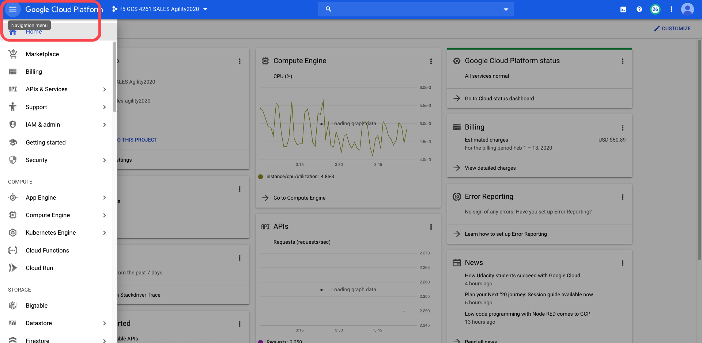
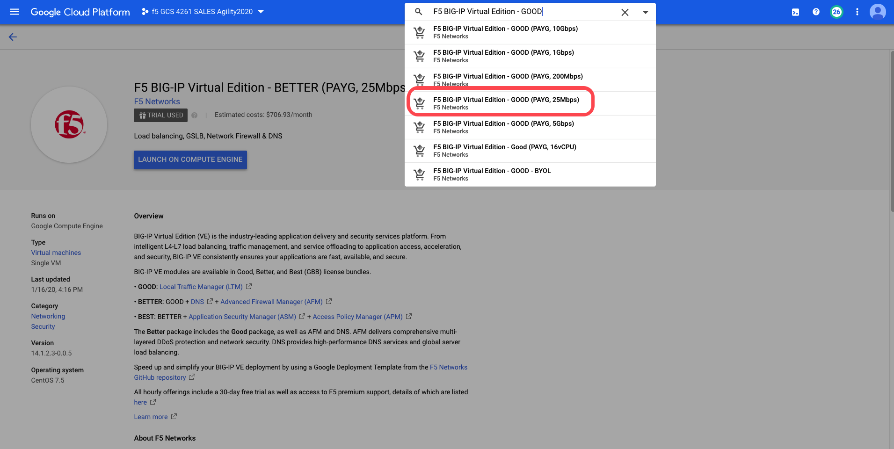
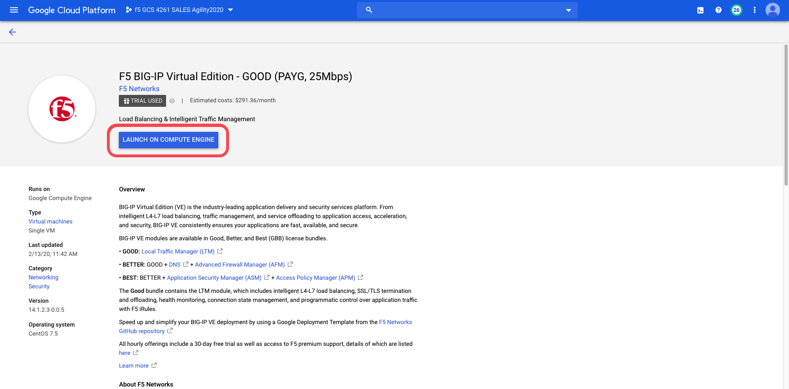
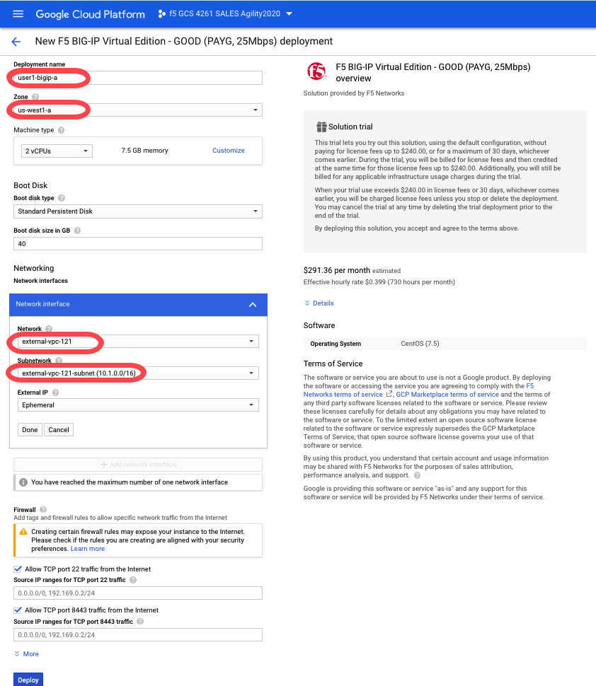
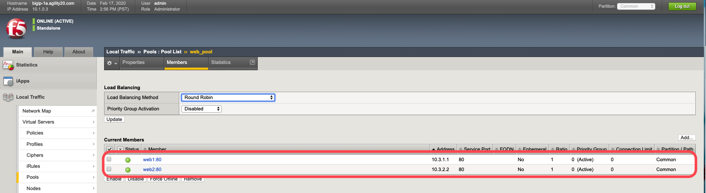
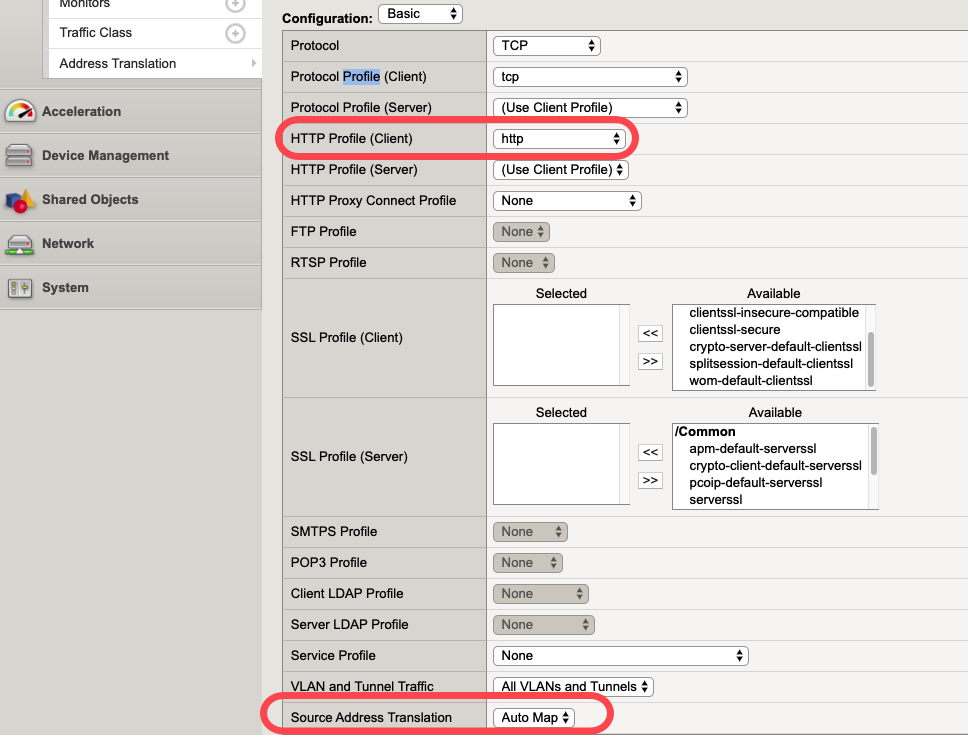
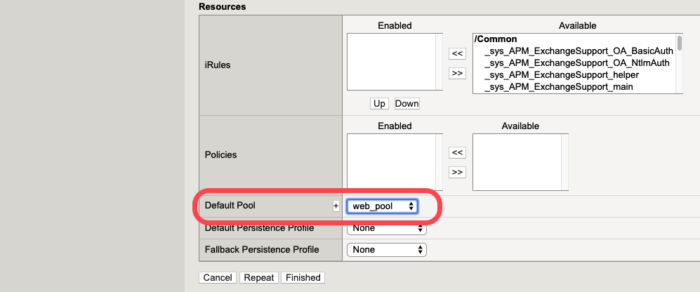

Task 1: Deploy BIGIP-A using Google Cloud Console
==================================================

In this lab we will deploy only **BIGIP-A** using configuration utility (webUI). Below is the summary steps you will be taking to deploy BIG-IP in GCP.
When completed, you should be able to send traffic to your application servers through BIG-IP VE.

Summary steps
-------------

1.	Deploy BIG-IP VE from GCP's Marketplace
2.	Setup initial configuration on BIGIP VE
3.  Create a pool and a virtual server

Step1 - Deploy BIG-IP VE from GCP's Marketplace
-----------------------------------------------

1.1 Login to Google Cloud Console at https://console.cloud.google.com using provided credentials

1.2 In the Google Cloud Console, in the top left corner, click the Navigation menu icon. Choose **Marketplace** from the dropdown.

1.3 In the Search box, type **F5 BIG-IP Virtual Edition - GOOD** and choose **(PAYG, 25Mbps)**

1.4 Click Launch on Compute Engine.

1.5 Enter the following information and leave the rest default. Then click Deploy.

================ =====================================================
Field               Value
================ =====================================================
Deployment Name     labuser"x"-bigip-a  (user specific)
Zone                us-west1-a
Network             external-vpc-121
Subnetwork          external-vpc-121-subnet (10.1.0.0/16)
================ =====================================================

1.6 Once completed. Deployment Manager will show as below.

.. image:: ./images/task1/task1-deployment-status.png

Step2 - Setup initial configuration on BIGIP VE
------------------------------------------------
In this single_NIC setup, all access to the BIG-IP VE is through the same IP address and virtual network interface (vNIC). When you first boot BIG-IP VE, the system automatically creates networking objects (vNIC 1.0, an internal VLAN, and an internal self IP address) for you, and sets the port for the BIG-IP Configuration utility to 8443.

2.1 The first time you boot BIG-IP VE, you must connect to the instance and create a strong admin password. You will use the admin account and password to access the BIG-IP Configuration utility.

This management interface may be accessible to the Internet, so the password must be strong.

2.1 Use an SSH tool to connect to the BIG-IP VE instance as admin. To ensure you are at the tmsh command prompt, type **tmsh**.

2.2 Use an SSH tool to connect to the BIG-IP VE instance as admin.

.. code-block:: bash

   modify auth password admin

2.3 Type the new password **Bigip@agility** and press Enter. The terminal screen displays the message:

.. code-block:: bash

   changing password for admin

   new password:

2.4 Type the new password and press Enter. The terminal screen displays the message:

.. code-block:: bash

   confirm password

2.5 Change the hostname to **bigip-"x"a.agility20.com**

.. code-block:: bash

    modify sys global-settings hostname bigip-29a.agility20.com

2.7 Ensure that the system retains the changes:

.. code-block:: bash

   save sys config

2.8 Open a web browser and log in to the BIGIP Configuration utility by using the external IP address and port 8443.
    For example: **https://10.1.1.x:8443**.
    The username is admin and the password is the one you set previously.

2.9 Click **Activate** and license the BIG-IP with one of the evaluation keys provided to you.

.. image:: ./images/task1/licensing2.png

2.10 Choose **Resource Provisioning** screen. Default is fine. Click submit.

.. image:: ./images/task1/module-provision1.png

Step3 - Create a pool and a virtual server
------------------------------------------------

3.1 In BIG-IP Configuration utility, for example: **https://10.1.1.x:8443**.

3.2 Create a pool with two members. On the Main tab, click **Local Traffic -> Pools**. Click **Create** per below.

========================== ===========================
Field                        Value
========================== ===========================
Name                         web_pool
Health Monitors              http
Node Name                    web1, web2
Address                      10.3.1.1, 10.3.2.1
Service Port                 80
========================== ===========================

3.3 In the **Name** field, type **web_pool**. Names must begin with a letter, be fewer than 63 characters, and can contain only letters, numbers, and the underscore (_) character.

.. image:: ./images/task1/pool1.png

3.4 Verify all pool members are healthy **Local Traffic -> Pools:Pool List ->web_pool -> Members**.

3.5  Now we will create a virtual server that listens for packets destined for BIGIP's IP address.
     In BIG-IP Configuration utility, **Local Traffic -> Virtual Servers**. Click **Create**.

========================== ===========================
Field                        Value
========================== ===========================
Name                         vs_web
Destination Address/Mask     10.1.1.x/16
Service Port                 80
HTTP Profile                 http
Source Address Translation   Auto Map
Default Pool                 web_pool
========================== ===========================

.. image:: ./images/task1/vs1.png

3.6 You can test the application now. Open a browser **http://10.1.1.x**.
You should see a webpage with **Web Server 1!** or **Web Server 2!**.

.. image:: ./images/task1/verify.png

Task 1 is completed :)
--------------------------
