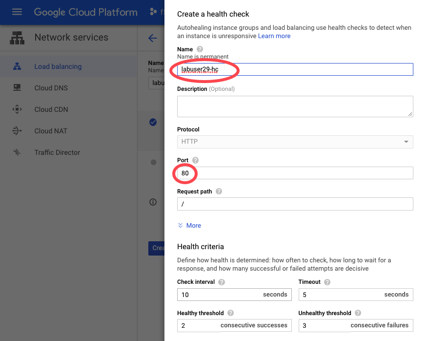
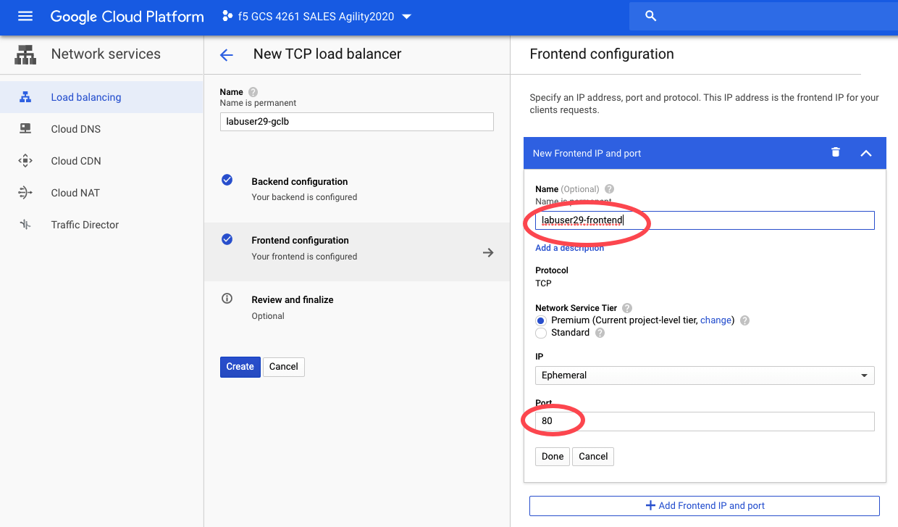
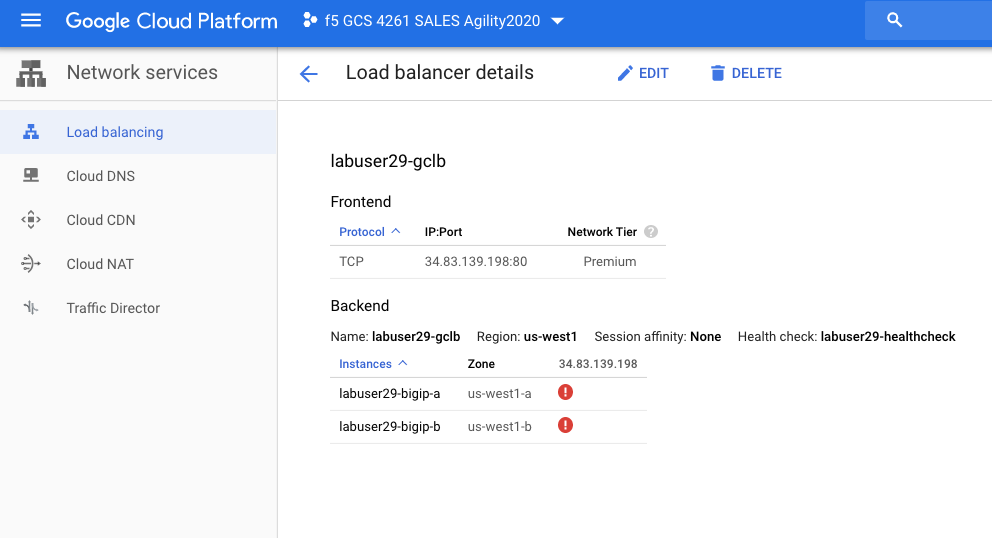
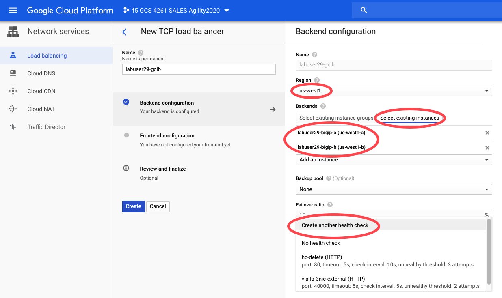

Task 3: High Availability using Google Cloud Load Balancer
==========================================================

In this lab we will deploy Google Cloud Network Load Balancer to
front-end the BIGIP pair you created on earlier tasks. Below is the
summary steps.

Summary
-------

1. Deploy Google Cloud Network Load Balancer
2. Modify the BIGIPs to use Google Cloud Load Balancer for high
   availability

Step1 - Deploy Google Cloud Network Load Balancer
-------------------------------------------------

1.1 Login to Google Cloud Console at https://console.cloud.google.com
using provided credentials

1.2 In the Google Cloud Console, in the top left corner, click the
Navigation menu icon. Choose **NETWORKING->Network services->Load
balancing**.

.. figure:: ./images/task3/gclb0.png
   :alt: img1

1.3 Click **CREATE LOAD BALANCER**

1.4 We will use Layer 4 network load balancing. Choose **TCP Load
Balancing**

.. figure:: ./images/task3/gclb1.png
   :alt: img2

1.5 You will create External load balancer in a single region
(us-west1). Default setting is fine for this step. Click **Continue**

.. figure:: ./images/task3/gclb2.png
   :alt: img3

1.6 Name the load balancer as **labuserX-gclb** (e.g. labuser29-gclb).
Click **Backend configuration**

+-----------------------------+---------------------------------------+
| Field                       | Value                                 |
+=============================+=======================================+
| Name                        | labuserX-gclb (e.g. labuser29-gclb)   |
+-----------------------------+---------------------------------------+
| Select existing instances   | labuserX-bigip-a, labuserX-bigip-b    |
+-----------------------------+---------------------------------------+
| Session affinity            | Client IP and protocol                |
+-----------------------------+---------------------------------------+

On **Health check** dropdown, choose **Create another health check**.
|img4|

1.7 Use below for **Health check** setting, leave the rest as default.

+---------+-----------------------------------+
| Field   | Value                             |
+=========+===================================+
| Name    | labuserX-hc (e.g. labuser29-hc)   |
+---------+-----------------------------------+
| Port    | 80                                |
+---------+-----------------------------------+

1.8 Use below for **Frontend configuration** setting, leave the rest as
default.

+---------+-----------------------------------------------+
| Field   | Value                                         |
+=========+===============================================+
| Name    | labuserX-frontend (e.g. labuser29-frontend)   |
+---------+-----------------------------------------------+
| Port    | 80                                            |
+---------+-----------------------------------------------+

1.9 Choose **Review and finalize** and verify the setting. And click
**Create**.It will take 2-3 minutes to complete creating.

.. figure:: ./images/task3/gclb6.png
   :alt: img7

1.10 Click the load balancer you just created. Record the frontend ip
(public ip) of the load balancer. Observe both backends BIGIPs are shown
as red due to health check failed.

Step2 - Modify the BIGIPs to use Google Cloud Load Balancer for high availability
---------------------------------------------------------------------------------

2.1 RDP to window jumphost at 35.197.78.160 using provided credentials.
Once logged in to RDP, open a web browser and log in to the BIGIP-A
configuration utility by using the external IP address and port 8443.

For example: https://10.1.1.x:8443 (e.g. 10.1.1.29:8443). The username
is admin and the password is the one you set previously.

2.2 Now we will edit a virtual server that listens for packets destined
for BIGIP's IP address to GCP load balancer frontend ip address.

In BIG-IP Configuration utility, **Local Traffic -> Virtual Servers**.
Click **vs\_web**. Edit the **Destination Address/Mask** to the front
end ip address (public ip) you recorded on step 1.10.

Click **Update**.

.. figure:: ./images/task3/gclb7.png
   :alt: img9

2.3 In the Google Cloud Console, in the top left corner, click the
Navigation menu icon. Choose **NETWORKING->Network services->Load
balancing**.

Click the load balancer you created. Observe both backends BIGIPs are
shown as Active (green) now.

.. figure:: ./images/task3/gclb8.png
   :alt: img10

2.4 You can test applicaiton traffic is now flowing via GCP load
balancer. Open a browser **http://< GCP load balancer frontend ip>**.
You should see a webpage with Web Server 1! or Web Server 2!.

2.5 To test failover, disable virutal server vs-web on one of the
BIGIPs.

Task 3 is completed here :)
---------------------------

