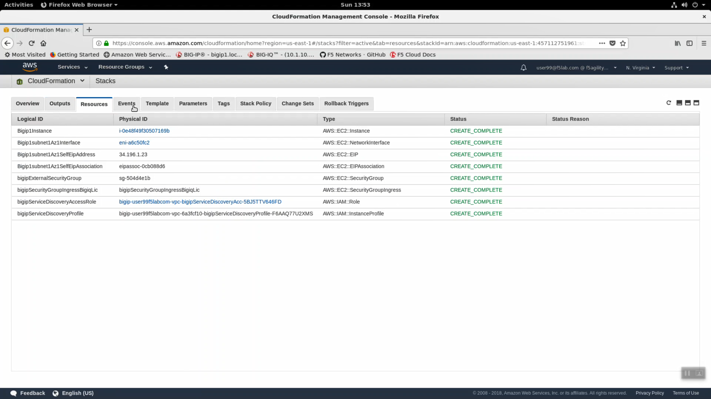
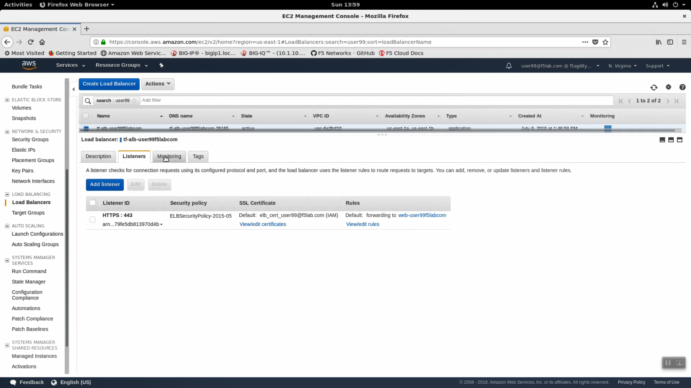

Explore the F5 / AWS lab environment
------------------------------------

1. From the Linux desktop, click "Activities" in the upper-left-hand corner to launch the Dock.

.. image:: ./images/0_terminal.png
  :scale: 50%

2. Launch the Firefox browser. Click on the bookmark for the Amazon AWS Console link in the upper-left-hand corner. Login with emailid as the username and shortUrl as password.

+--------------------------+------------------------------------------------------+
| Parameter                | value                                                |
+==========================+======================================================+
| Account:                 | f5agility2018                                        |
+--------------------------+------------------------------------------------------+
| User Name:               | userxx@f5lab.com, change xx to your student number   |
+--------------------------+------------------------------------------------------+
| Password:                | sames as shortUrl / echo $shortUrl                   |
+--------------------------+------------------------------------------------------+

.. image:: ./images/1_aws_console_login.png
  :scale: 50%

.. attention::

   In the upper right-hand corner, ensure you are in the correct region. For example: N. Virginia region (us-east-1) is the default.

3. Navigate to Services => Management Tools => CloudFormation. In the search field type your user account name (i.e user99). You should see your CloudFormation deployment details.

- Click the Events tab. The F5 CloudFormation template records every successful or failed event here. Look for the final "CREATE_COMPLETE" at the top. This indicates all went well.

.. image:: ./images/2_cft_events.png
  :scale: 50%

- Click on the Parameters tab. We used Terraform to stuff all of the necessary parameters into the CloudFormation template. Here you can see the CloudFormation parameter name and value provided.

.. image:: ./images/3_cft_parameters.png
  :scale: 50%

- Click on the Outputs tab. When CloudFormation deployments complete successfully, they can export key value pairs you can use to integrate other automation tools. For example, you can query these CloudFormation outputs to find out to which region, availability zone, private IPs, public IPs your F5 Big-IP Virtual Edition instance has been assigned.

- Click on the Resources tab. Here we see a map (resource type to unique id) of all the AWS resources that were deployed from the CloudFormation template.

4. Navigate to Services => Compute => EC2 => INSTANCES => Instances. Enter your username in the search field (i.e. user99). The web application is hosted on webaz1.0 in one availability zone and webaz2.0 in another availability zone. Highlight web-az1.0. In the "Description" tab below, note the availability zone. Highlight web-az2.0 and do the same.

.. image:: ./images/6_aws_console_search_filter.png
  :scale: 50%

5. A single Big-IP Virtual Edition is running on an AWS m4.xlarge instance. Highlight your Big-IP, expand the "Description" tab below. Your instance details are here including:

   - Instance type
   - Elastic IP
   - Key pair name
   - Private IPs
   - VPC ID
   - Network interface

.. image:: ./images/7_ec2_description.png
  :scale: 50%

.. attention::

   We deployed a single-NIC Big-IP. A curious difference from traditional datacenter two and three NIC deployments is that single-NIC cloud instances will often share the same IP address for management, self-ip and virtual server. In our deployment: tcp 22 to ssh to the self-ip for management, tcp 8443 to https to the config utility for management, and tcp 80, 443 will eventually be the virtual server / listener for http/https application traffic.

6.  Cloud-init. Version 13 of Big-IP supports cloud-init. Right click on BIGIP1 => Instance Settings => View/Change User Data. Cloud-init is the industry standard way to inject commands into an F5 cloud image to automate all aspects of the on-boarding process: https://cloud-init.io/.

.. image:: ./images/8_f5_user_data.png
  :scale: 50%

7. Services => Compute => EC2 => LOAD BALANCING => Load Balancers. In the search filter enter your username. You should see two load balancers. One named tf-alb-\* is your newly created AWS application load balancer. Highlight the 'Description' tab. Note:

- Scheme: internet-facing
- Type: application
- AWS WAF Web ACL: has no web acl applied.

.. image:: ./images/9_alb.png
  :scale: 50%

- Highlight the Listeners tab. A listener is ready to receive traffic on HTTPS: 443. A TLS Certificate was installed as part of our deployment and the ALB is terminating TLS.

- Select the other load-balancer named tf-elb-asg-\*. This is a standard TCP load balancer. Note Type: classic. This load-balancer is not in service yet.

.. image:: ./images/11_elb_for_bigip_ce.png
  :scale: 50%

8. Navigate to Services => Networking & Content Deliver => VPC. click on VPCs. Enter your username in the search filter (i.e. user99). This is the Virtual Private Cloud (VPC) that has been dedicated to your lab environment.

.. image:: ./images/12_vpc.png
  :scale: 50%

- Select the Summary tab. You can see the IPv4 CIDR assigned is 10.0.0.0/16.

.. attention::

   There are two separate environments in this lab. Your simulated on-premises datacenter is hosted in Ravello and consists of:

   - Big-IP
   - Big-IQ
   - Data Collection Device (part of every Big-IQ deployment).
   - Linux Jumphost
   - Docker Host

   Your AWS environment is built when you run `terraform apply` and destroyed when you run `terraform destroy`. Your on-premises datacenter has been assigned 10.1.0.0/16 to not conflict with your AWS environment which has been assigned 10.0.0.0/16.

9. From the VPC Dashboard, Click on "Virtual Private Gateway" in the left-hand navigation pane. Enter your username in the search filter (i.e. user99). A virtual Private Gateway has been created and attached to your VPC. We will later use this Virtual Private Gateway to create an IPSec tunnel between our on-premises environment and our AWS VPC.

.. image:: ./images/13_vpn_gateway.png
  :scale: 50%
  