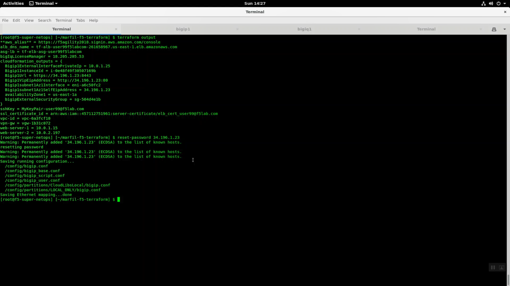
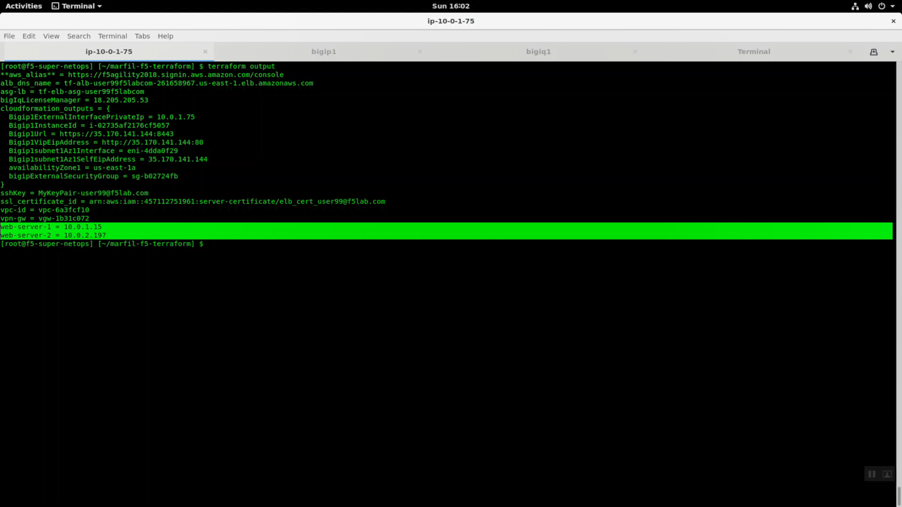
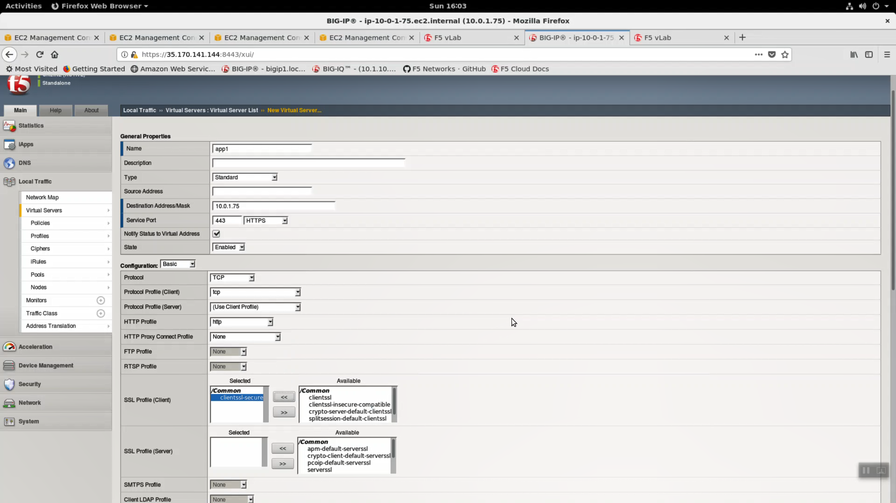
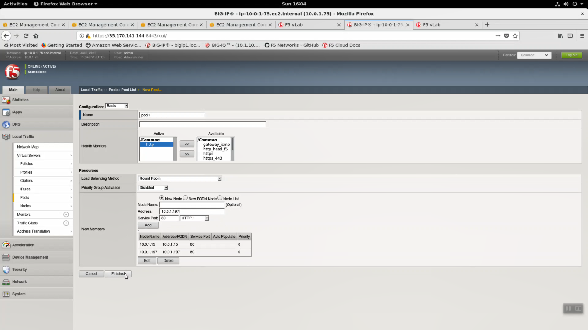
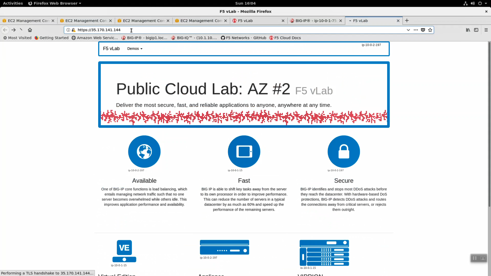

Create a Virtual Server on Big-IP VE the Old Fashioned Way
----------------------------------------------------------

1. From the Linux terminal tab with the ssh session open to the Super-NetOps Docker container:

.. code-block:: bash

   terraform output

...Note both the Bigip1subnet1Az1SelfEipAddress and BigipUrl values.

2. Big-IP Virtual Edition appliances deployed to public cloud are initially accessible only via ssh key. You have to create an admin account and password before you can configure this Big-IP from the Configuration utility (Web UI). Run the `reset-password` script to create an admin account. 

.. attention::
   
   Replace x.x.x.x with the terraform output value of Bigip1subnet1Az1SelfEipAddress. Take a close look at the example screenshot.

.. code-block:: bash

   reset-password x.x.x.x

3. Note the BigipURL value. Copy and paste into a web browser. Be mindful of HTTPS: port 8443 for management!

.. attention:: This lab makes use of insecure self-signed certificates. Bypass the warnings by clicking on "Confirm Security Exception".

.. image:: ./images/2_TLS_warning.png
  :scale: 50%

4. Login to your F5 Big-IP VE running in AWS. Username: admin and Password: the value of shortUrl for your class.

.. image:: ./images/3_waf_config_login_8443.png
  :scale: 50%

5. From the Super-NetOps terminal:

.. code-block:: bash

   terraform output

...Note the Bigip1ExternalInterfacePrivateIp value and both web-server-# values. Bigip1ExternalInterfacePrivateIp will be the IP address of your virtual server on the Big-IP VE and the web-server-#'s will be the pool members.

6. From the Big-IP Configuration utility (Web UI), navigate to Local Traffic => Virtual Servers => Create new virtual server.

+------------------------------------------+-------------------------------------------------------------------+
| Parameter                                | value                                                             |
+==========================================+===================================================================+
| Name                                     | app1                                                              |
+------------------------------------------+-------------------------------------------------------------------+
| Destination Address/Mask                 | terraform output value of Bigip1ExternalInterfacePrivateIp        |
+------------------------------------------+-------------------------------------------------------------------+
| Service Port                             | 443 / HTTPS                                                       |
+------------------------------------------+-------------------------------------------------------------------+
| HTTP Profile                             | http                                                              |
+------------------------------------------+-------------------------------------------------------------------+
| SSL Profile (Client)                     | clientssl-secure                                                  |
+------------------------------------------+-------------------------------------------------------------------+
| Source Address Translation               |  Auto Map                                                         |
+------------------------------------------+-------------------------------------------------------------------+
| Default Pool                             |  \+ to create pool1                                               |
+------------------------------------------+-------------------------------------------------------------------+

.. image:: ./images/6_virtual_server_part2.png
  :scale: 50%

+------------------------------------------+-------------------------------------------------------------------+
| Parameter                                | value                                                             |
+==========================================+===================================================================+
| Name                                     | pool1                                                             |
+------------------------------------------+-------------------------------------------------------------------+
| Health Monitors                          | http                                                              |
+------------------------------------------+-------------------------------------------------------------------+
| New Members                              | terraform output values of web-server-1 and web-server-2          |
+------------------------------------------+-------------------------------------------------------------------+
| Service Port                             | 80 / HTTP                                                         |
+------------------------------------------+-------------------------------------------------------------------+

Click Finished to complete the creation of Pool pool1.

Click Finished to complete the creation of Virtual Server app1.

.. image:: ./images/8_finished.png
  :scale: 50%

7. From the Linux terminal tab with the ssh session open to the Super-NetOps docker container:

.. code-block:: bash

   terraform output

...Note the BigipUrl value. HTTPS to the BigipUrl **without** explicit port number (default 443). Your Big-IP is protecting traffic to/from our sample application.

Single NIC / Single-IP deployments work well in public cloud topologies. In this lab, we connected to the Big-IP over a single IP address to:

1. ssh on tcp port 22 to create an admin account
2. https on tcp port 8443 for config management
3. https on tcp 443 to process traffic
