Create an IPSec VPN between an F5 Big-IP appliance and an AWS Virtual Private Gateway
-------------------------------------------------------------------------------------

From the Linux terminal app, open a new tab. Invoke the "bigip" shell alias command to ssh to your on-premises bigip1.

.. code-block:: bash

   bigip
   default

From bigip1, use dig to discover the public IP address assigned to your bigip1.

.. code-block:: bash

   dig -b 10.1.20.11 TXT +short o-o.myaddr.l.google.com @ns1.google.com

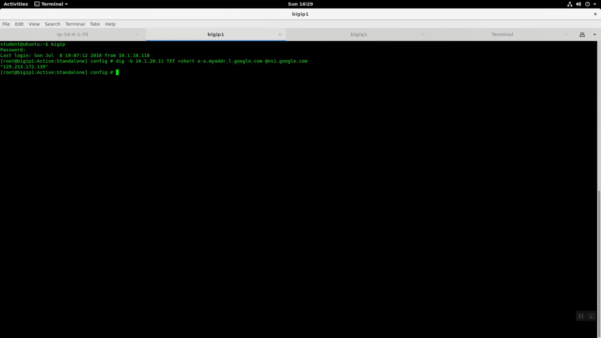

In the AWS web console, navigate to Services => Networking & Content Delivery => VPC. Click on VPCs. From the VPC Dashboard, in the left-hand navigation pane, click on Virtual Private Gateways. Enter your username in the search filter (i.e. user99). A Virtual Private Gateway has been created and attached to your VPC. We will now establish an IPSec VPN tunnel between our on-premises environment and our AWS VPC.

.. image:: ./images/2_vpn_gateway.png
  :scale: 50%

Click on Customer Gateways => Create Customer Gateway.

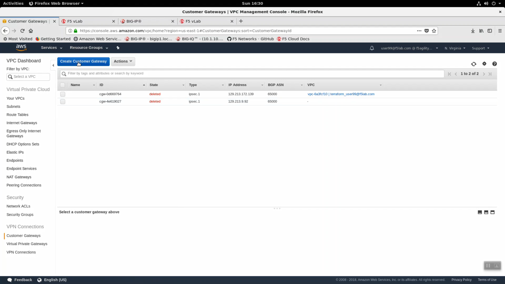

Create Customer Gateway.

- Name: userXX-cgw, replace userXX with the unique user id assigned to you in class. The example in the screenshot is for user99.
- Routing: Static
- IP Address\*: This is the public IP address of your on-premises Big-IP VE. From the bigip1 terminal, review the output of the dig command below.

.. code-block:: bash

   dig -b 10.1.20.11 TXT +short o-o.myaddr.l.google.com @ns1.google.com

Click "Create Customer Gateway"

.. image:: ./images/4_create_customer_gateway_2.png
  :scale: 50%

Create Customer Gateway Request Succeeded. Note the Customer Gateway ID in the format cgw-xxxxxxxxx. You will need this id in the next step.

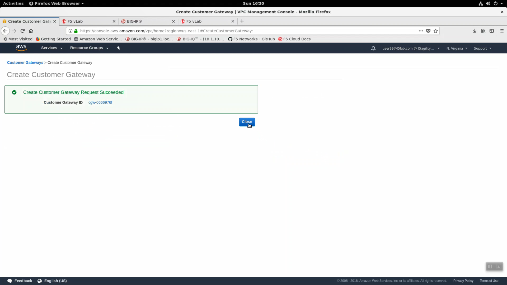

From the VPC Dashboard, in the left-hand navigation pane, click on VPN Connections. Click on "Create VPN Connection".

.. image:: ./images/6_create_vpn_connection_1.png
  :scale: 50%

+-------------------------------+--------------------------------------------------------+
| Parameter                     | value                                                  |
+===============================+========================================================+
| Name tag                      | userXX-vpn where userXX is your unique user id         |
+-------------------------------+--------------------------------------------------------+
| Virtual Private Gateway       | vgw-xxxxxxxx attached to your VPC.                     |
+-------------------------------+--------------------------------------------------------+
| Customer Gateway              | Existing                                               |
+-------------------------------+--------------------------------------------------------+
| Customer Gateway ID           | cgw-xxxxxxxxx we created in the previous step.         |
+-------------------------------+--------------------------------------------------------+
| Routing Options               | Static                                                 |
+-------------------------------+--------------------------------------------------------+
| Static IP Prefixes            | 10.1.0.0/16                                            |
+-------------------------------+--------------------------------------------------------+

Leave all Tunnel Options to default "Generated by Amazon". Click "Create VPN Connection".

.. image:: ./images/7_create_vpn_connection_2.png
  :scale: 50%

Create VPN Connection Succeeded.

.. image:: ./images/8_create_vpn_connection_3.png
  :scale: 50%  

From the VPC Dashboard, in the left-hand navigation pane, click on VPN Connections. Your userXX should still be in the search field, if not, enter your userXX in the search field. You will see the VPN Connection you just created in state "Pending". Click the "Status" tab. Both tunnels are status: DOWN.

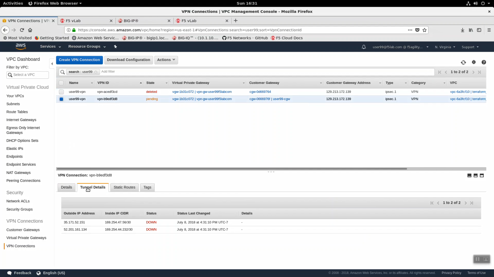

Click on "Download Configuration"

- Vendor: F5 Networks, Inc.
- Platform: BIG-IP
- Software: v12.0.0+

Click on "Download". By default, the config file will be downloaded to your /home/student/Downloads/ directory.

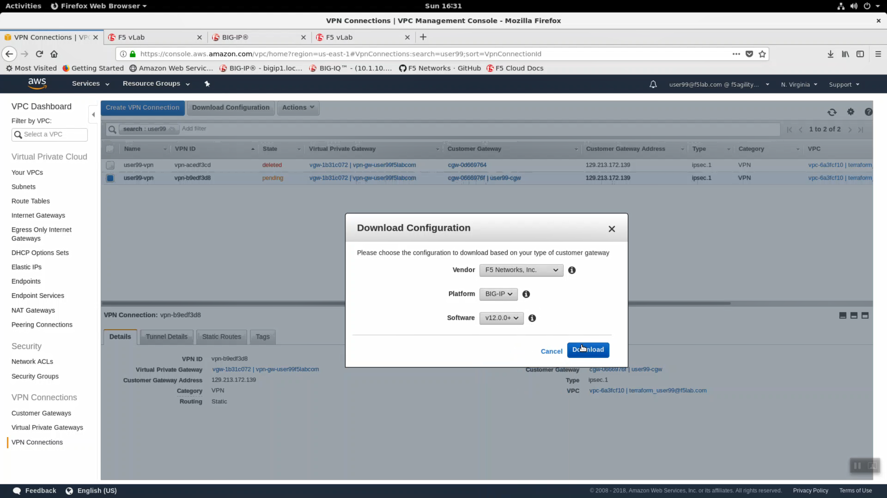

From the Linux RDP session, click on "Activities" in the upper-left-hand corner to launch the Dock. Launch FileZilla.

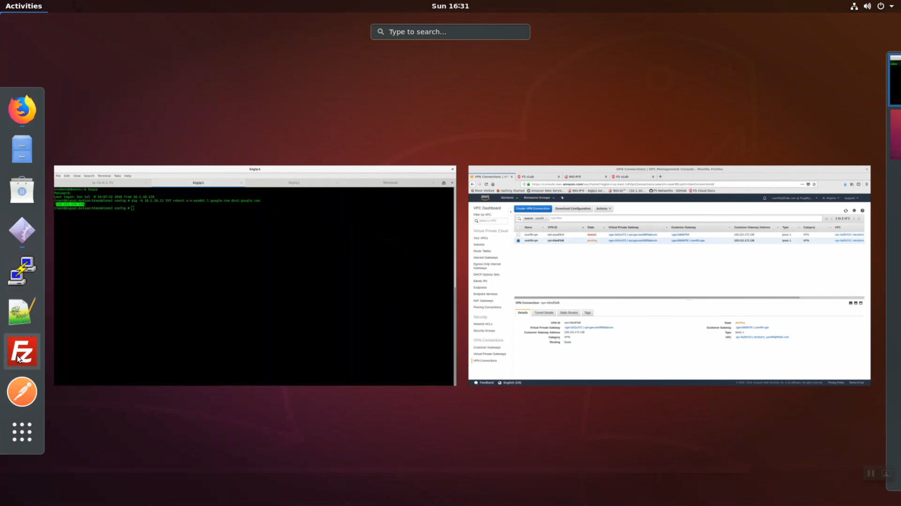

From FileZilla, launch Site Manager. An entry for bigip1 has been prepared for you. Connect to bigip1. You will use SFTP (Secure FTP runs over the SSH protocol / TCP 22) to transfer the AWS generated VPN config file to your on-premises bigip1 and import the config.

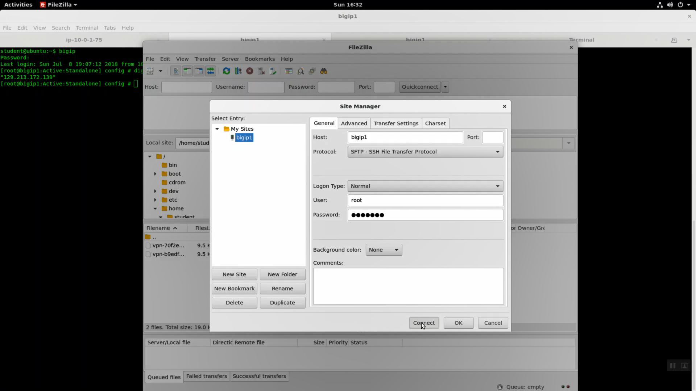

Right-click on the downloaded vpn-xxxxxxxxx.txt config and Upload. By default, the vpn-xxxxxxxxx.txt config will land in your bigip1 /root/ directory.

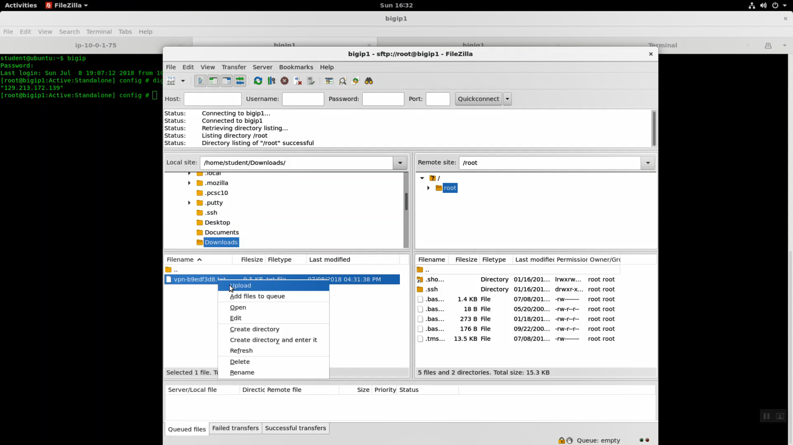

Back to your bigip1 ssh session terminal window. If you don't have a bigip ssh session running, invoke the command alias "bigip" to automatically connect. Replace vpn-xxxxxxxx.txt with your unique vpn config file. Use tab completion to save error-prone keystrokes.

.. code-block:: bash

   cd /root
   ls
   tmsh < vpn-xxxxxxxx.txt

.. image:: ./images/14_apply_vpn_config.png
  :scale: 50%

Because the bigip1 is not directly connected to the Internet, but behind a public IP NAT, we need to make a few tweaks to the imported vpn configuration before the IPSec tunnel is up and running.

Login to the https Configuration utility (Web UI) of bigip1 with default admin / admin credentials. The Firefox and Chrome browsers on the Linux jumphost have bookmarks prepared for you.

Network => Tunnels => tunnel-vpn-xxxxxxx-0

.. attention::
   
   Make sure you are on bigip1. This is your simulated on-premises Big-IP.

.. image:: ./images/14b_change_tunnel_addresses_bigip1.png
  :scale: 50%

Change Local Address to 10.1.20.11. Update.

.. image:: ./images/15_change_local_address_tunnel_0.png
  :scale: 50%

Do the same for the second tunnel. Network => Tunnels => tunnel-vpn-xxxxxxx-1

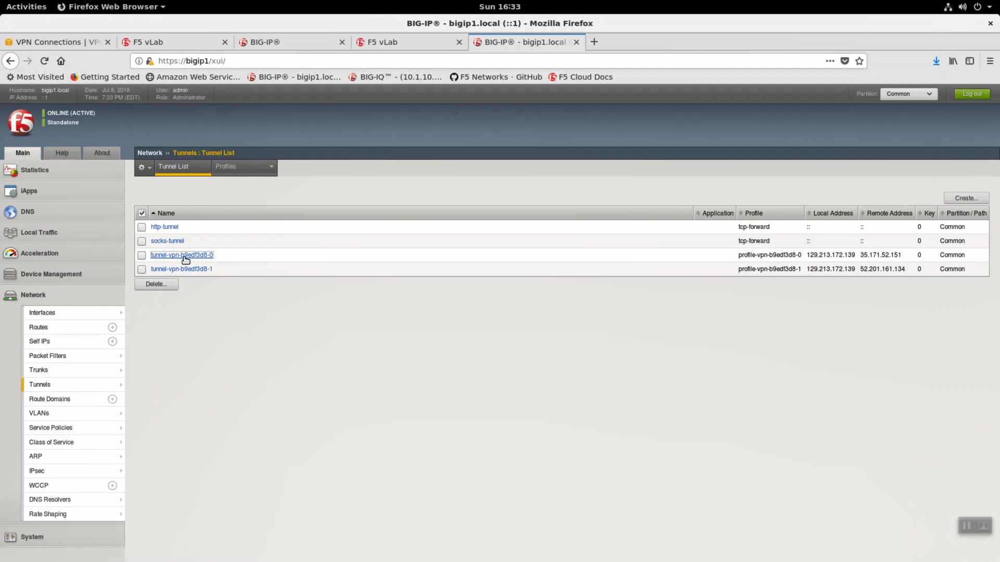

Change Local Address to 10.1.20.11. Update.

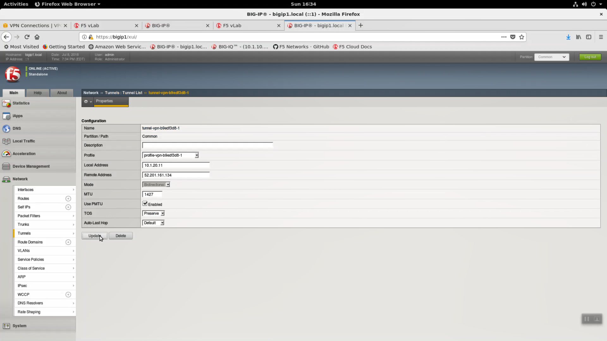

Network => IPsec => peer-vpn-xxxxxxxx-0

.. image:: ./images/18_ipsec_ike_peers.png
  :scale: 50%

Change NAT Traversal to "On".

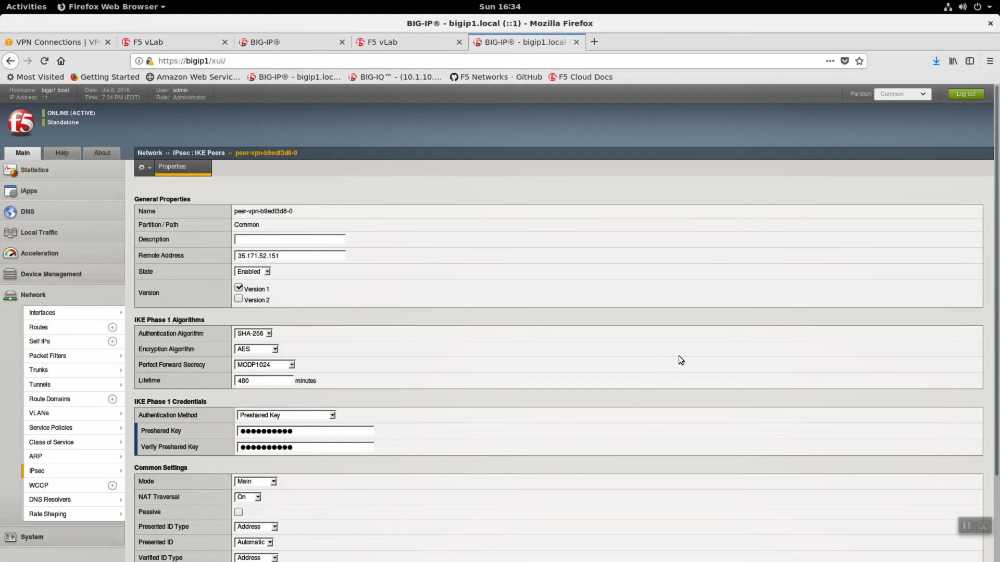

Do the same for the second IPsec peer. Network => IPsec => peer-vpn-xxxxxxxx-1

.. image:: ./images/18_ipsec_ike_peers.png
  :scale: 50%

Change NAT Traversal to "On".

.. image:: ./images/20_ipsec_ike_peer1-nat-t.png
  :scale: 50%

Create a route so bigip1 knows to route all traffic destined to AWS 10.0.0.0/16 via the IPSec tunnel. Network => Routers => aws-vpn. The aws-vpn route exists, change the VLAN / Tunnel to tunnel-vpn-xxxxxxxx-0. Update.

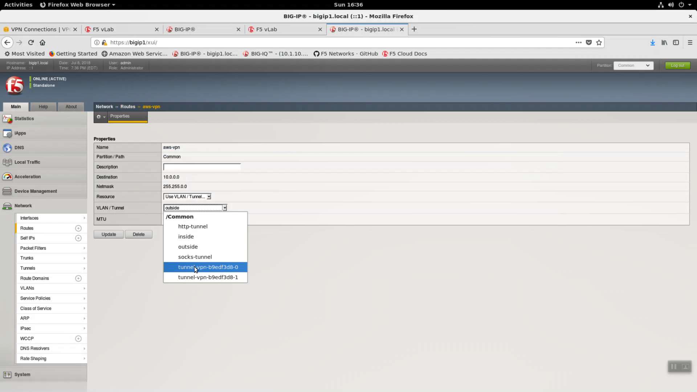

From the VPC Dashboard, in the left-hand navigation pane, click on VPN Connections. Your userXX should still be in the search field, if not, enter your userXX in the search field. You will see the VPN Connection you just created in state "Pending". Click the "Status" tab. One of your tunnels is now Status: UP.

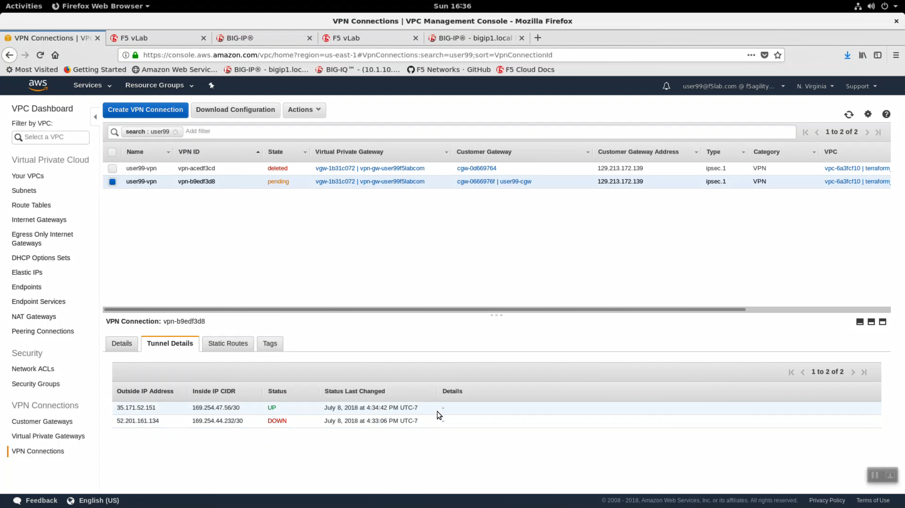

To test the tunnel, you connect to our example application behind the Big-IP VE hosted in AWS, but over the private 10.0.x.x IP address. From your snops terminal run "terraform output" and note the BigipExternalInterfacePrivateIP and both web-sever-x values.

.. code-block:: bash

   terraform output

.. image:: ./images/24_terraform_output_bigip_privateip.png
  :scale: 50%

In a browser, https to BigipExternalInterfacePrivateIP and confirm your VPN tunnel is up.

.. image:: ./images/25_https_app1_privateip.png
  :scale: 50%

From your Linux Desktop terminal (but not the Super-NetOps Container!) you will also be able to ping the web servers over their private IP addresses.

.. image:: ./images/27_ping_web_server_privateips.png
  :scale: 50%

To troubleshoot your IPSec tunnel, from a Big-IP terminal:

.. code-block:: bash
   
   tail -f /var/log/racoon.log

To confirm your IPSec tunnel status on a Big-IP:

.. code-block:: bash

   racoonctl -ll show-sa isakmp
   racoonctl -ll show-sa ipsec
   tmsh show net ipsec ipsec-sa all-properties

.. attention::

   A working IPSec VPN tunnel to AWS is a prerequisite for the rest of the lab so work with your fellow students or instructor to troubleshoot before moving on to the next section.