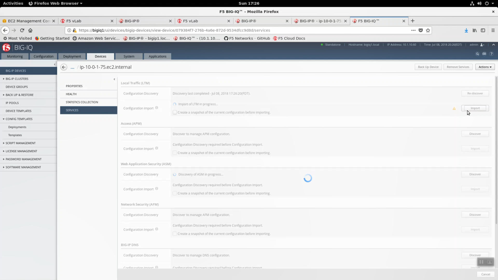
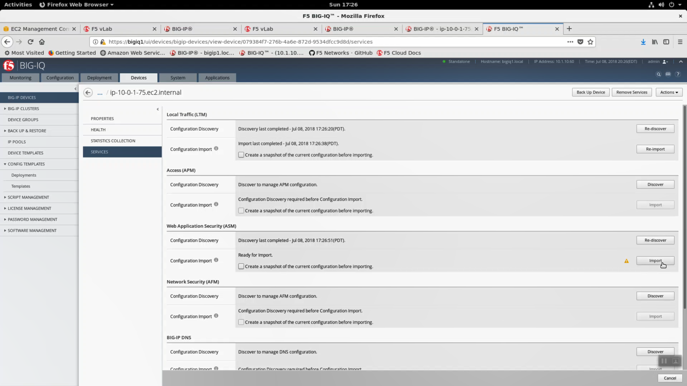
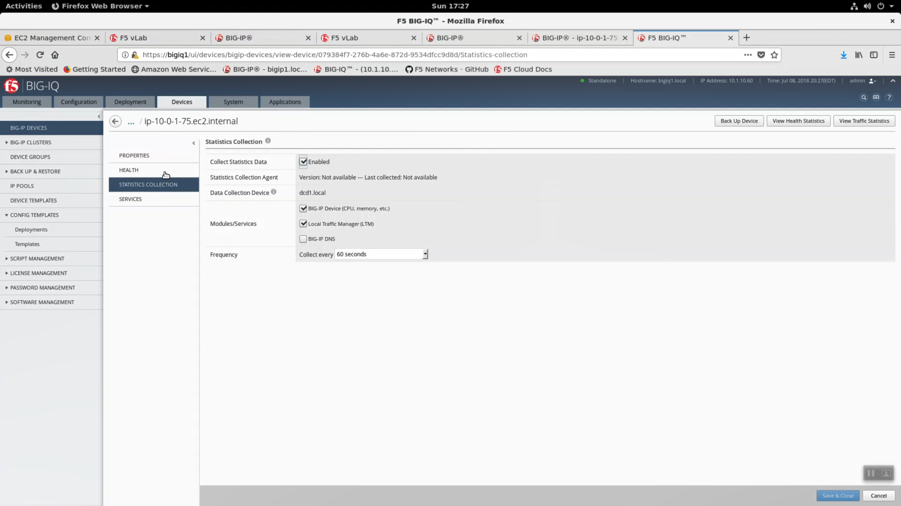

Import Big-IP VE devices to Big-IQ 6.0
--------------------------------------

You will now import the existing Big-IP VE in AWS in to Big-IQ for central management. From your Super-NetOps terminal, copy the IP address value of Bigip1ExternalInterfacePrivateIp. Big-IQ will manage your AWS-hosted Big-IP device over the previously configured IPSec tunnel. Alternatively, you can host Big-IQ in AWS.

.. code-block:: bash

   terraform output
   
.. image:: ./images/24_terraform_output_bigip_privateip.png
  :scale: 50%

Connectivity requirements for the Big-IQ system are kept current here:
https://support.f5.com/csp/article/K15612

Login to the Big-IP https Configuration utility (Web UI) of the AWS hosted Big-IP VE. **Delete the "app1" virtual server.**

.. image:: ./images/1_delete_app1.png
  :scale: 50%

Open a new web browser tab. Login to on-premises Big-IQ 6.0 which is bookmarked in both Firefox and Chrome on your Linux desktop. Default credentials: admin / admin.

.. image:: ./images/2_login_bigiq.png
  :scale: 50%

Devices tab => BIG-IP DEVICES => Add Device.

IP Address: paste in the IP value of Bigip1ExternalInterfacePrivateIp
Port: 8443
User Name: admin
Password: shortUrl value

Cluster Display Name: None.

Click "Add"

.. image:: ./images/3_add_device_part1.png
  :scale: 50%

Add-device pop-up.

Select:
 - Local Traffic(LTM) - Required
 - Web application Security (ASM)
 - BIG-IP Device (CPU, memory, etc.)
 - Local Traffic (LTM)

Click "Continue"

.. image:: ./images/4_add_device_part2.png
  :scale: 50%

After a few seconds, device discovery completes. Click on "complete import tasks" alert.

.. image:: ./images/5_complete_import_tasks.png
  :scale: 50%

Finish the Local Traffic (LTM) import task. Click on "Import".

Finish the Web Application Security (ASM) import task. Click on "Import"

Select "STATISTICS COLLECTION" and enable:

- Collect Statistics Data
- Module/Services: Big-IP Device (CPU, memory, etc.)
- Module/Services: Local Traffic Manager (LTM)

Click "Save & Close"

