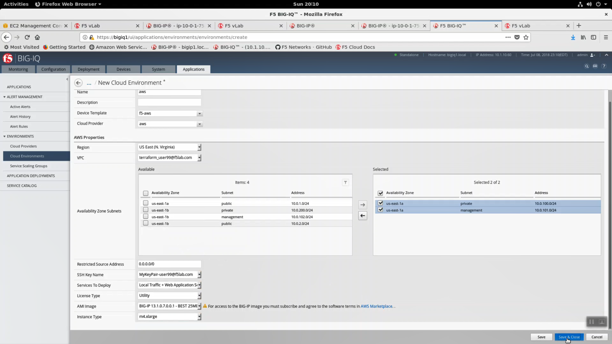
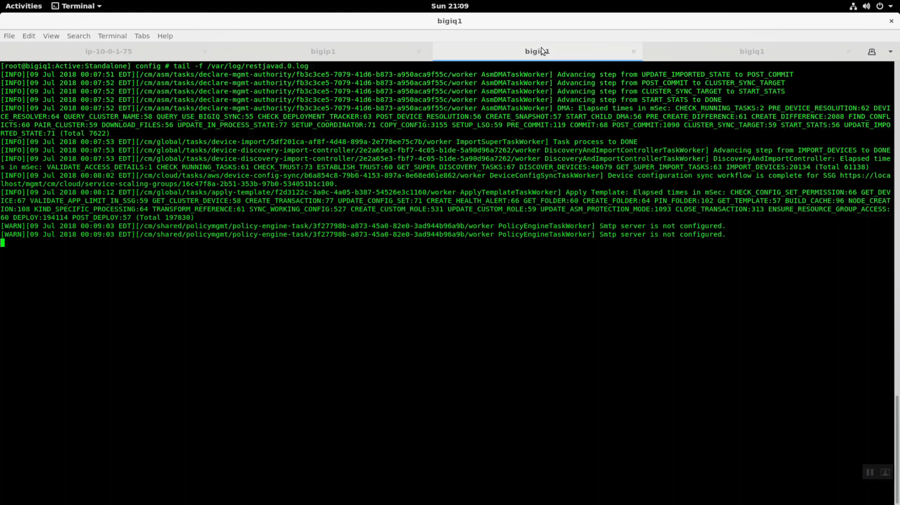

Create a Big-IQ Cloud Environment
---------------------------------

In Big-IQ, Applications => Environments => Cloud Environments => Create New Cloud Environment.

- Name: aws
- Device Template: f5-aws
- Cloud Provider: aws

AWS Properties

- Region: US East (N. Virginia)
- VPC: terraform_userXX@f5lab.com where userXX is the user id uniquely assigned to you at the start of the lab.
- Availability Zone Subnets: Select the two subnets in the screenshot below.
- Restricted Source Address: 0.0.0.0/0
- SSH Key Name: MyKeyPair-userXX@f5lab.com where userXX is the user id uniquely assigned to you at the start of the lab.
- Services to Deploy: Local Traffic + Web Application Security + Application Visibility and Reporting
- License Type: Utility
- AMI image BIG-IP 13.1.0.7.0.0.1 - BEST 25MB
- Instance Type: m4.xlarge

Click "Save & Close"

If you haven't done so already, open a new terminal tab for Big-IQ. Invoke the 'bigiq' shell alias command to open an ssh session to bigiq1. Tail restjavad.0.log to track the status of all cloud environment, service scaling group, and application deployments from Big-IQ. If deployments fail, this is the first place to look to troubleshoot.

.. code-block:: bash

   bigiq
   default
   tail -f /var/log/restjavad.0.log

