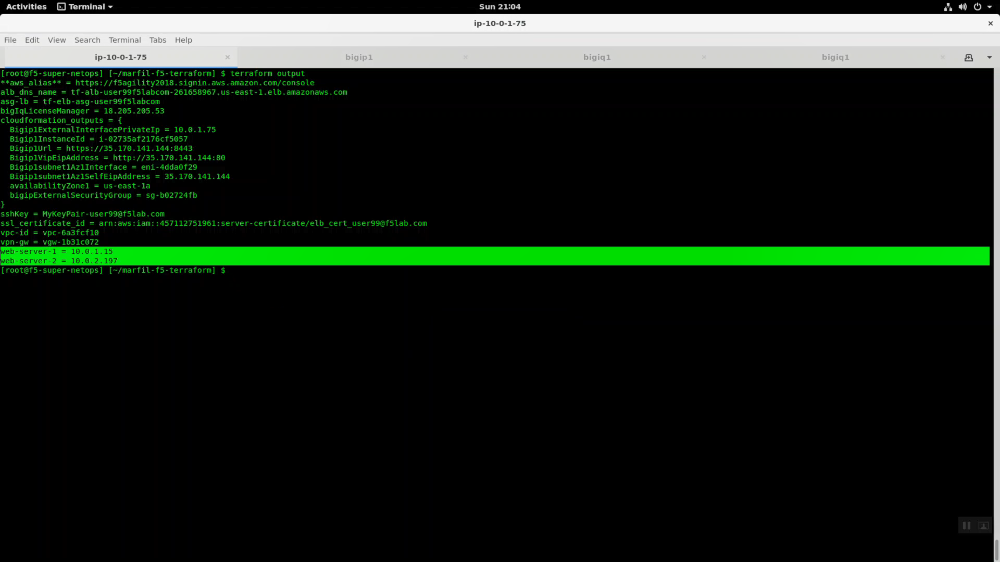

Create a Service Scaling Group Application
------------------------------------------

From your Super-NetOps terminal run “terraform output” and note the asg-lb and both web-sever-x values. You will need these values to create an application in Big-IQ and complete this task.

.. code-block:: bash

   terraform output

.. image:: ./images/1_elb_for_ssg_app.png
  :scale: 50%

From Big-IQ, Applications => APPLICATIONS => Create Application

Select a Service Template
- Template: Default-AWS-f5-HTTPS-WAF-lb-template

General Properties
- Name: app2
- Domain Names: app2.f5lab.com

Select a Traffic Service Environment
- Environment: Select Service Scaling Group
- Service Scaling Group: userXX-ssg1 created previously

AWS ELB Settings

- Name of Classic Load Balancer: cut and paste the terraform output asg-lb value here.
- Listeners: TCP: 80 TCP: 80
- Listeners: TCP 443 TCP: 443

.. warning::

   The AWS ELB must exist first for the Application deployment to succeed, but Big-IQ creates the listeners. If conflicting listeners exist (same protocol/port) then application deployment will fail.

Click Create.

.. image:: ./images/2_create_ssg_app_1.png
  :scale: 50%

.. image:: ./images/2b_create_ssg_app_2.png
  :scale: 50%

This step will create a virtual server with IP address 0.0.0.0 and network mask 0.0.0.0.

From the Big-IQ terminal, track logs for warnings, errors and failures.

.. code-block:: bash

   tail -f /var/log/restjavad.0.log

.. image:: ./images/3_bigiq_tail_logs.png
  :scale: 50%

After a few minutes, app2 has been created and marked with a green healthy icon. Note Security: Protection mode: Protected; Transparent. An LTM only deployment has no Protection mode indicated. You can see at a glance if the application has a WAF policy protecting it and whether the policy is in transparent or blocking mode.

.. image:: ./images/4_app_deployed.png
  :scale: 50%
