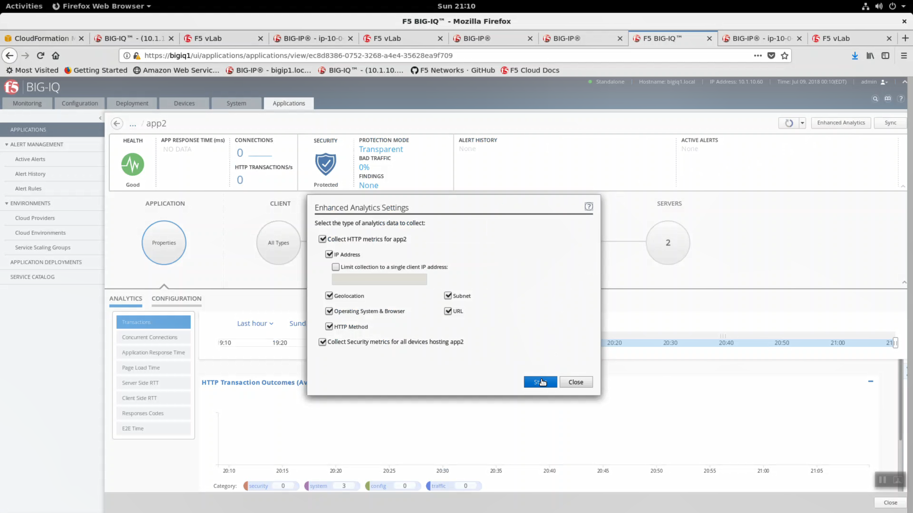
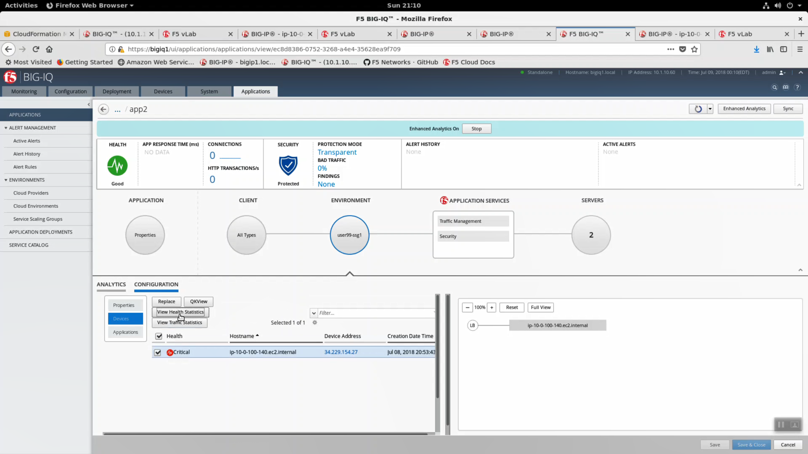
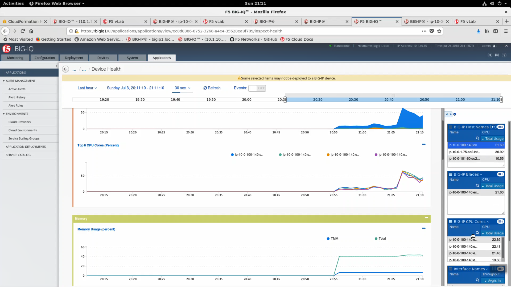
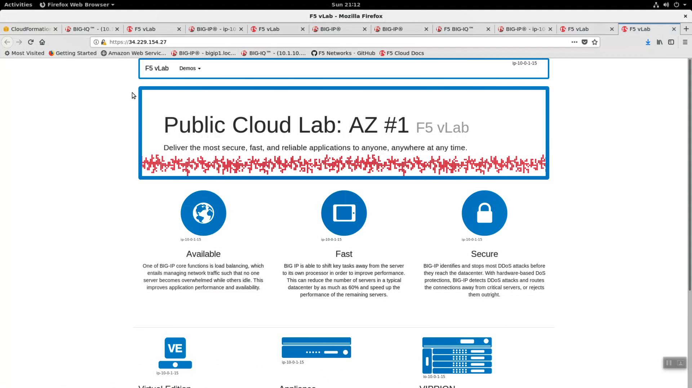

Enable Enhanced Analytics
-------------------------

From Big-IQ, click on app2. Enable Enhanced Analytics. Match the settings in the screenshot below. Click Start.

From Big-IQ, navigate to ENVIRONMENT => CONFIGURATION => Device => [View Health Statistics]. You can monitor the health status of the device based on custom thresholds here (cpu % exceeded, etc.)

Note the Device Address. This is the same address assigned as the public IP of the virtual server. You can https to this address to see our sample application. You can generate a modest amount of traffic by hitting the new application yourself with a few https requests by refreshing your browser with the [F5] key.

