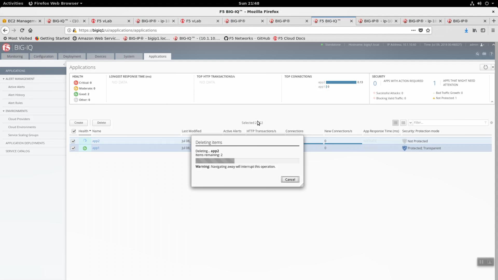
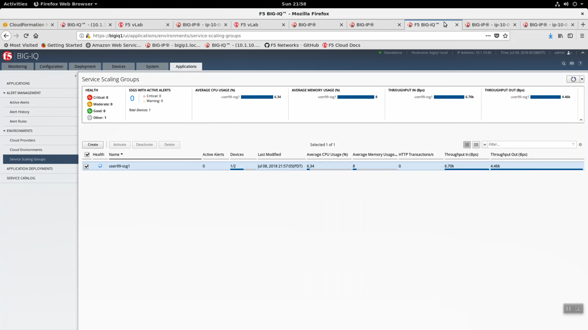
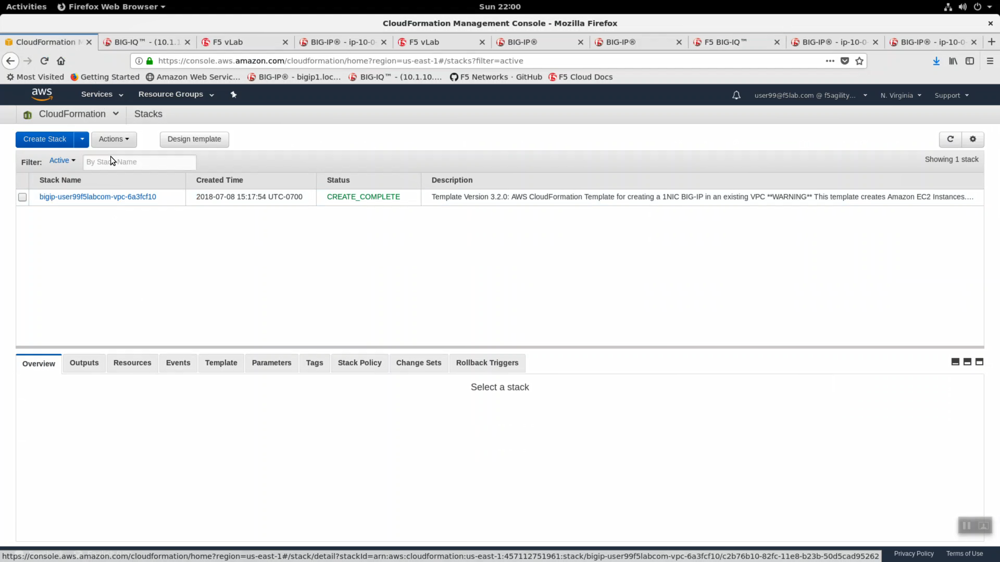
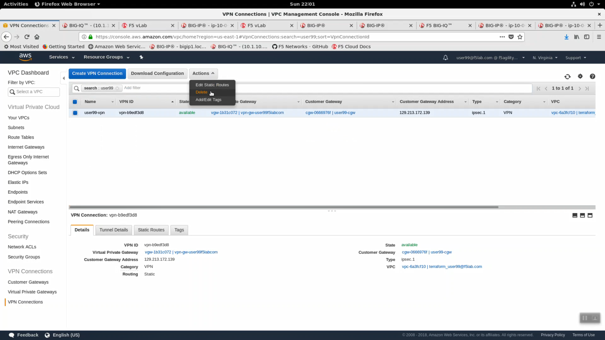
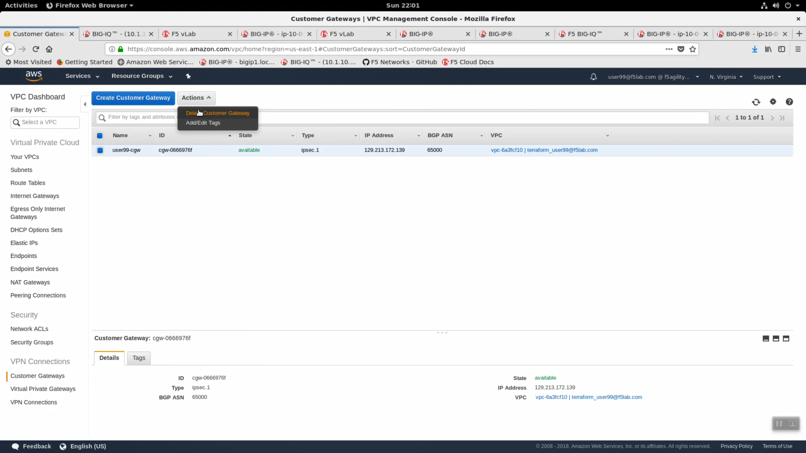

Clean up the lab environment
----------------------------

.. attention::
   
   Please clean-up.
   
From Big-IQ, delete app1, app2 and userxx-ssg1.

In the AWS console, delete VPN Connection and Customer Gateway.

From the Super-NetOps terminal, run terraform destroy.

.. code-block:: bash

   terraform destroy --force

.. image:: ./images/6_terraform_destroy.png
  :scale: 50%

.. image:: ./images/7_terraform_destroy_done.png
  :scale: 50%

Confirm all of your instances were terminated.

.. image:: ./images/8_aws_terminated.png
  :scale: 50%

Fin.