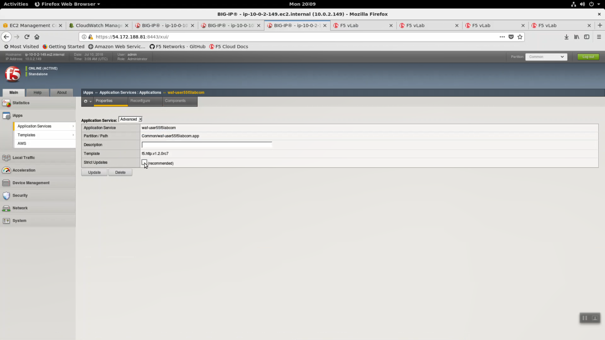
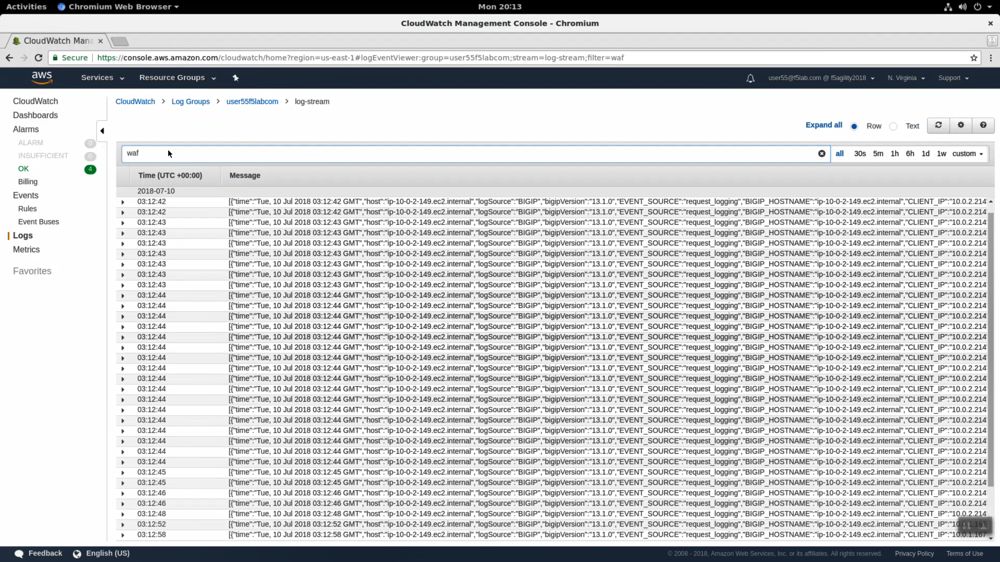

WAF HTTP Request and Security Logging to CloudWatch
===================================================

HTTPS to the Configuration Utility (Web UI) of the BIG-IP Autoscale Instance: waf...

iApps => Application Services => waf=userxxf5labcom.

.. image:: ./images/21a_disable_strict_updates.png
  :scale: 50%

Properties => UNCHECK "Strict Updates". [Update].

Create a new cloud_logger iApp. iApps => Application Services => Name: `cloudwatch`. Template: `f5.cloud_logger.v1.0.0`. Click [Finished].

+--------------------------------------------------------------+----------------------------------+
| Question                                                     | value                            |
+==============================================================+==================================+
| Name                                                         | cloudwatch                       |
+--------------------------------------------------------------+----------------------------------+
| Template                                                     | f5.cloud_logger.v1.0.0           |
+--------------------------------------------------------------+----------------------------------+
| Which AWS region is the provider located in?                 | us-east-1                        |
+--------------------------------------------------------------+----------------------------------+
| What is the access key you want to use for the API calls?    | value of $AWS_ACCESS_KEY_ID      |
+--------------------------------------------------------------+----------------------------------+
| What is the secret key you want to use for the API calls?    | value of $AWS_SECRET_ACCESS_KEY  |
+--------------------------------------------------------------+----------------------------------+
| What is the AWS CloudWatch Logs group name?                  | log group name i.e. user55labcom |
+--------------------------------------------------------------+----------------------------------+
| What is the AWS CloudWatrch Logs group's stream name?        | log-stream                       |
+--------------------------------------------------------------+----------------------------------+
| Do you want to enable ASM logging?                           | Enable ASM logging               |
+--------------------------------------------------------------+----------------------------------+
| What ASM requests do you want to log?                        | Log all requests (verbose)       |
+--------------------------------------------------------------+----------------------------------+
| Do you want to include ASM DOS logging?                      | Include DOS protection logging   |
+--------------------------------------------------------------+----------------------------------+
| Do you want to enable LTM Request logging?                   | Enable LTM request logging       |
+--------------------------------------------------------------+----------------------------------+
| What Request parameters do you want to send in the log?      | leave defaults                   |
+--------------------------------------------------------------+----------------------------------+

Click [Finished].

.. image:: ./images/22_cloud_logging_waf.png
  :scale: 50%

Local Traffic => Virtual Server => waf-userXXf5labcom_vs.

.. image:: ./images/24_request_logging_waf.png
  :scale: 50%

Change Request Logging Profile to `cloudwatch_remote_logging`.

.. image:: ./images/25_request_logging_waf.png
  :scale: 50%

Click [Update].

.. image:: ./images/26_request_logging_update.png
  :scale: 50%

Local Traffic => Virtual Server => waf-userXXf5labcom_vs => Security => Policies.

.. image:: ./images/26a_request_logging_security.png
  :scale: 50%

Log Profile. Select `cloudwatch_remote_logging`. Click [Update].

.. image:: ./images/26b_request_logging_security.png
  :scale: 50%

From the Super-NetOps terminal, run the lab-info utility.

.. code-block:: bash

   lab-info
   
HTTPS to the WAF ELB URL. Refresh the browser with <CTRL+F5> for 15 seconds to generate a modest amount of traffic.

.. image:: ./images/28_refresh_waf_url.png
  :scale: 50%

Back in the CloudWatch console. Use the search term `waf` to see logs coming from your F5 WAF.

