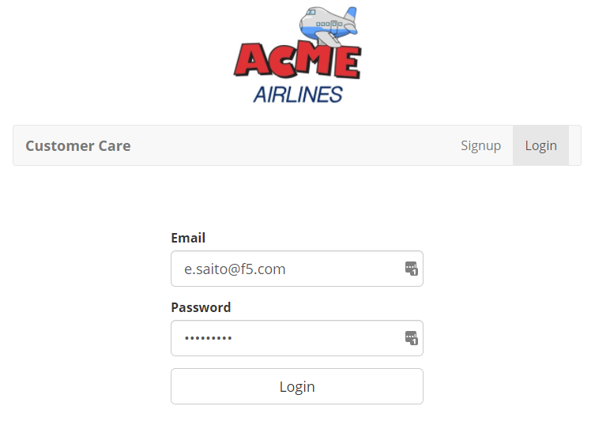

Test your Configuration
-----------------------

Using your local computer Browser (NOT the RDP Session). Browse https://careX.acmelatamlab.f5.com

|image21|

Click on Signup to create a new account. Use your real email address so
you can receive the validation email. Check your email and activate your
account.

Before logging in, click anywhere in the page and click “Inspect” and
then select the Network tab.

If your configuration is ok, you should see something like the picture
below. Look at the AWS Cognito login process.

|image22|

Select the last “notes” request. Make sure it is using the Custom API
Gateway Domain we configured in the last tasks.

|image23|

.. |image22| image:: image22.png
.. |image23| image:: image23.png
