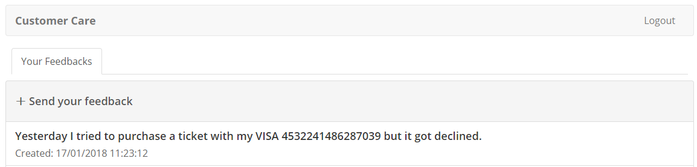

Information Leakage
-------------------

Here we’ll simulate an information leakage. Usually this happens after
an attack or my misuse and misconfiguration of systems. For instance,
an employee should not have access to a customer’s credit card. But a
security device could have a false positive and log the request to be
analyzed. The credit card information will be there open to anyone
with access to that log.
In the case of Acme Air, they didn’t think that someone would give his
credit card in a feedback. But that is exactly what happened. Acme Air
employee will have access to that information in the same application.

1. Click on “Send your Feedback”

2. Create a message using this fake Visa credit card 4532241486287039.

   .. CAUTION::
      DO NOT use your real credit card number!

   Click Create

   |image30|

3. As expected the message is open to whoever has access to that
   information in the system.

   |image31|

.. |image30| image:: image30.png

