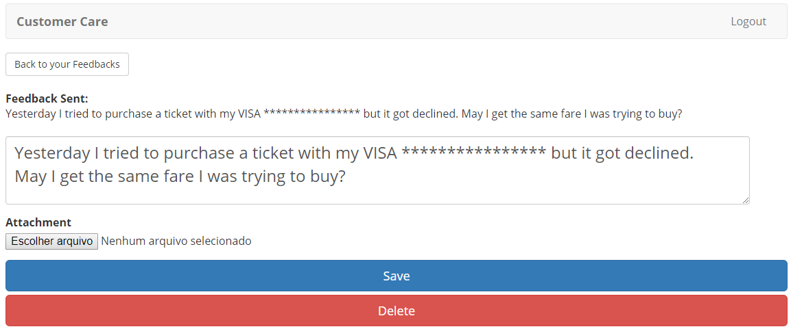

Checking the Data Guard protection
----------------------------------

1. Go to your application ( https://careX.acmelatamlab.f5.com )

2. Refresh your screen

3. Notice that the Credit Card is masked

   |image43|

4. Click on the Feedback. Check if every occurrence of the Credit Card
   is masked:

   |image44|

5. Click “Back to your Feedbacks”

.. |image43| image:: image43.png

