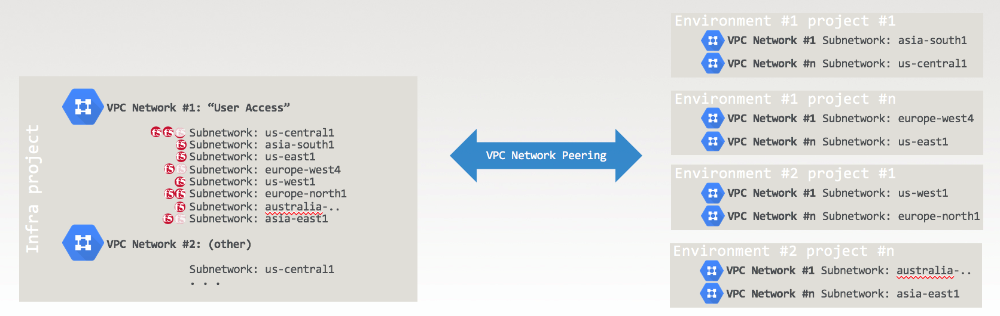
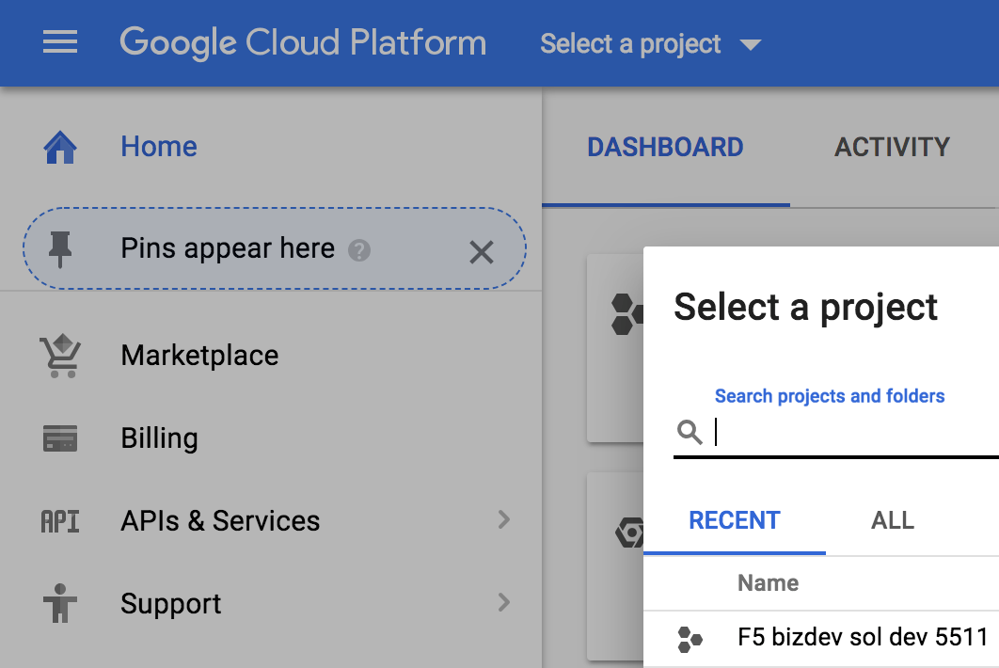
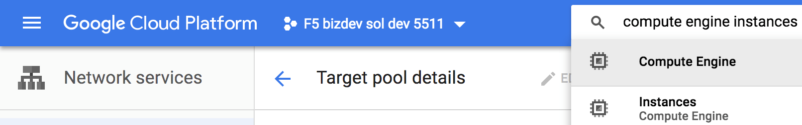
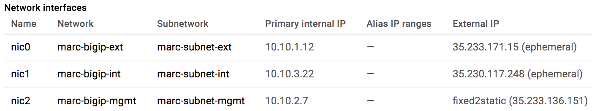
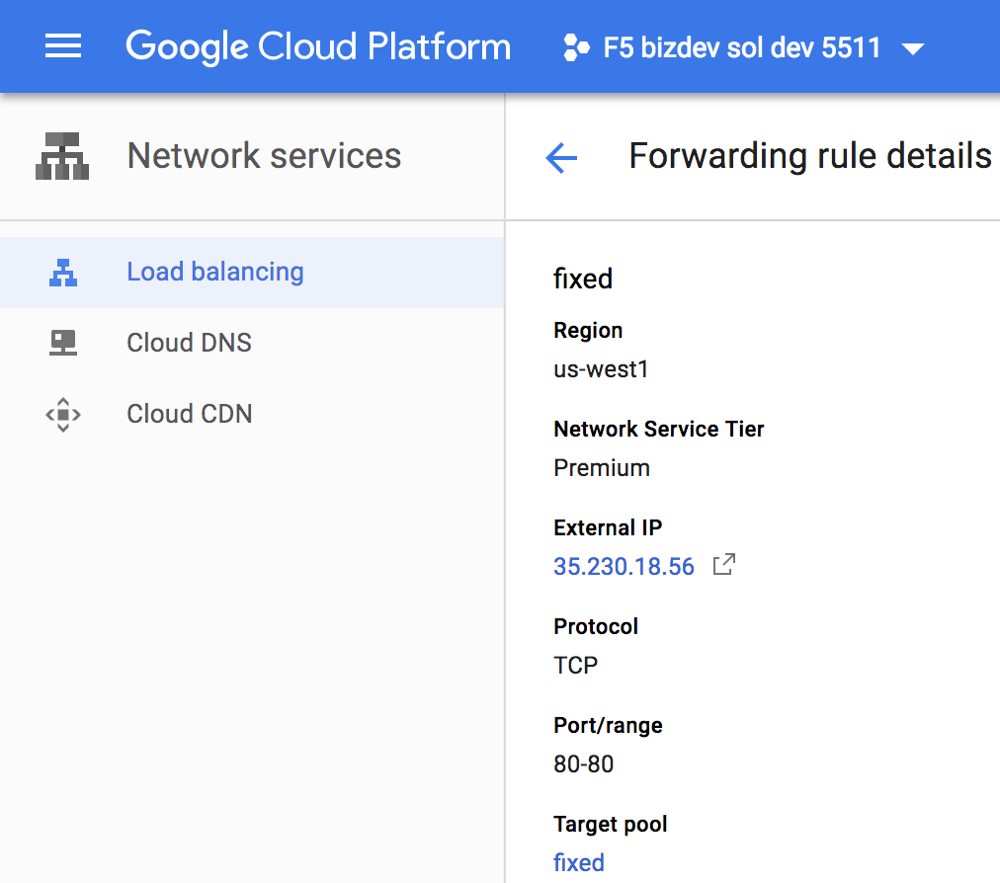
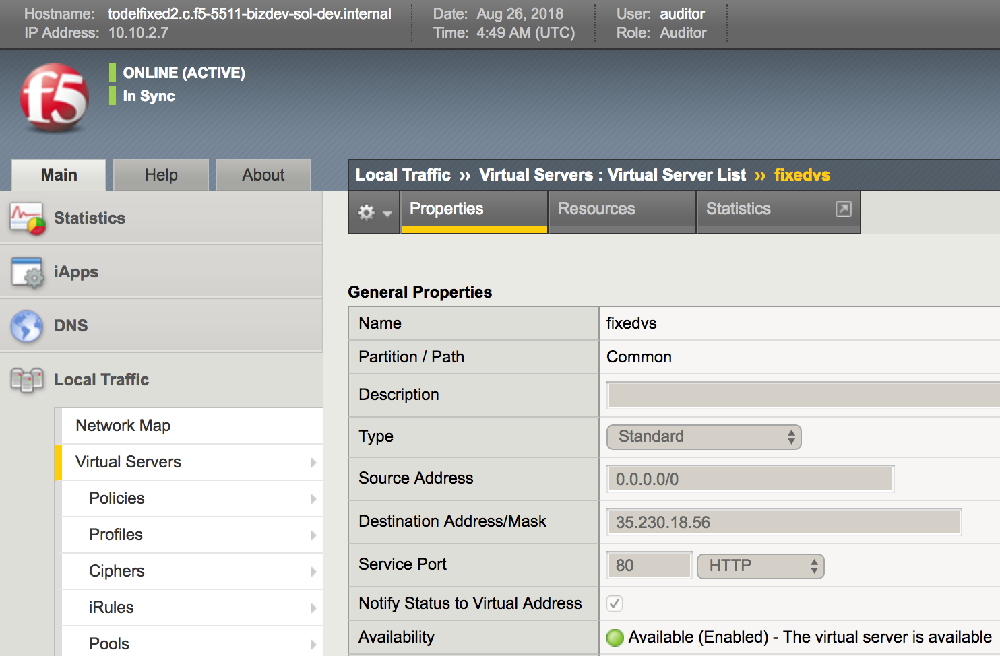

Reference Architecture
======================

  
.. image:: ./images/image2.png
  :scale: 50%

Lab Topology
------------

We use a simplified version of the above reference architecture, with one forwarding rule:
35.230.18.56 => target pool of two 3-NIC F5 BIG-IPs.
(We’ll also deploy 1-NIC F5 BIG-IP via deployment templates in a lab exercise at the end of this document)

Connect to https://console.cloud.google.com/ as gcpreadonly@gmail.com

Select the project as shown below
  

Search “load balancing” and select “Load balancing Network services” as shown below.
  
.. image:: ./images/image4.png
  :scale: 50%
 
Click on “advanced menu” at the bottom of the screen.

.. image:: ./images/image5.png
  :scale: 50%
  
Click on “Forwarding rules” and click on the “fixed” forwarding rule.

.. image:: ./images/image6.png
  :scale: 50%

This is our forwarding rule (see below):  HTTP traffic to 35.230.18.56 is forwarded to a target pool of F5 BIG-IPs.  
  
.. image:: ./images/image7.png
  :scale: 50%

Click on the target pool  “fixed” in the above screen to check it contains 2 F5 BIG-IPs. 

Note that the target pool references the F5 BIG-IP using their instances names (not their IP addresses).

Note the names of the two F5 BIG-IP instances under “VM instances” 

.. image:: ./images/image8.png
  :scale: 50%

Search “compute engine instances” and select “Instances - Compute Engine” as shown below.

Filter by “fixed” as shown below to get to our two F5 BIG-IP instances.

.. image:: ./images/image10.png
  :scale: 50%
  
Click on each of the F5 BIG-IP instances above.  Check “Network interfaces” at bottom of the screen.

For the first F5 BIG-IP:
  
.. image:: ./images/image11.png
  :scale: 50%
  
For the second F5 BIG-IP:

Connect to the F5 BIG-IP management interfaces (Note that the management interface is the last NIC in the screenshots above).

So, connect to https://35.230.52.52 and https://35.233.136.151

Note that both F5 BIG-IPs in the target pool have a virtual server listening to the GCP public IP used by our forwarding rule.
  

  

  
.. image:: ./images/image15.png
  :scale: 50%
  
