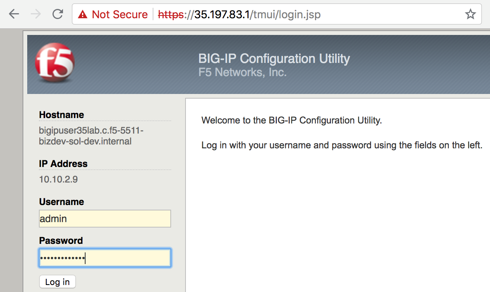
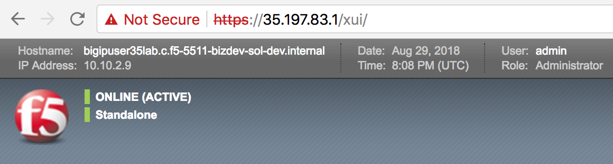

Hands-on Labs
=============

Google deployment templates used to deploy the F5 BIG-IPs
https://bit.ly/2LDV0Nw

Replace X with the number provided to you by the proctor

Connect as ssh -i userX userX@<instance-X>
(<instance-X is an IP address that will be provided to you by the proctor; each student will get his/her own IP address)

Lab 1. Deploy 3-NIC F5 BIG-IP using deployment templates
--------------------------------------------------------

.. code-block:: bash

   curl -L https://bit.ly/2wwDu8i -o lab_f5_gdm_template.zip
   unzip lab_f5_gdm_template.zip
   nano f5-existing-stack-byol-3nic-changedmgmt-bigip.yaml

...and replace the license with the one provided by the proctor.

Replace X with the number provided to you by the proctor:

.. code-block:: bash

   gcloud deployment-manager deployments create bigipuserXlab --config f5-existing-stack-byol-3nic-changedmgmt-bigip.yaml
   

Example for user 35

.. code-block:: bash

   
   user35@instance-35:~$ gcloud deployment-manager deployments create bigipuser35lab --config f5-existing-stack-byol-3nic-changedmgmt-bigip.yaml

If you get an error saying that the deployment already exists , you just need to change the deployment name (“bigipuser35lab” in the example above).

.. attention ::
   Please just keep “bigipuserX” (replace X with the number assigned to you by the proctor) as part of the name so that we can quickly identify your instances.

After 2 minutes or so, search “compute engine instances” and select “Instances – Compute Engine” as shown below.

.. image:: ./images/image16.png
  :scale: 50%

Filter by “userX” to find your 3-NIC F5 BIG-IP instance.

Example for user 35:

.. image:: ./images/image17.png
  :scale: 50%
  
Click on the instance name (“bigipuser35lab” in the example above) to find the F5 BIG-IP’s management IP. 

.. image:: ./images/image18.png
  :scale: 50%

Write down the management IP of your 3-NIC F5 BIG-IP (screenshot above).

You can now connect to F5 BIG-IP management GUI using https:<F5 BIG-IP’s public IP in GCP> as admin. The password is the one set by the Google deployment template.

  

Short procedure to deploy F5 active/active and active/standby
(not part of the hands-on labs)

1. Deploy 2 F5 BIG-IP using Google deployment templates

  1a. Download the Google deployment templates

  .. code-block:: bash

     curl -L https://bit.ly/2wwDu8i -o lab_f5_gdm_template.zip
     unzip lab_f5_gdm_template.zip

 
  1b. Edit f5-existing-stack-byol-3nic-changedmgmt-bigip.yaml to fit your environment
 
  1c. Deploy two F5 BIG-IPs

  .. code-block:: bash

     gcloud deployment-manager deployments create marcactive1 --config f5-existing-stack-byol-3nic-changedmgmt-bigip.yaml
     gcloud deployment-manager deployments create marcactive2 --config f5-existing-stack-byol-3nic-changedmgmt-bigip.yaml
 
 
2. Get the F5 BIG-IPs’ IP addresses

  .. code-block:: bash

     gcloud compute instances list --filter="NAME~.*marcactive*"

  .. code-block:: bash

     NAME         ZONE        MACHINE_TYPE   PREEMPTIBLE  INTERNAL_IP                       EXTERNAL_IP                                 STATUS
     marcactive1  us-west1-a  n1-standard-4               10.10.1.17,10.10.3.26,10.10.2.12  35.197.61.85,35.233.218.10,35.203.135.211   RUNNING
     marcactive2  us-west1-a  n1-standard-4               10.10.1.18,10.10.3.27,10.10.2.13  35.227.174.29,35.227.157.60,104.198.105.51  RUNNING

   
The Google deployment template we used above creates F5 BIG-IPs with NICs in the following order: external, internal and management. So, 10.10.1.x is F5 BIG-IP external, 10.10.3.x is F5 BIG-IP internal, 10.10.2.x is F5 BIG-IP management

3. Connect to and configure the first F5 BIG-IP

   .. code-block:: bash

      ssh -i <private key> admin@35.203.135.211
      bash
      SOAPLicenseClient --basekey <license key>

   
At this point, you should see: [admin@marcactive1:Active:Standalone] ~ #
 

   .. code-block:: bash

      tmsh mv cm device bigip1 marcactive1.example.com
      tmsh modify sys global-settings hostname marcactive1.example.com
      tmsh modify cm device marcactive1.example.com configsync-ip 10.10.3.26
      tmsh modify /net self self_internal allow-service all
      tmsh save sys config
 
.. attention ::
   In a prod env, “allow custom” specifying just the ports you need would be best. These ports are shown at https://support.f5.com/csp/article/K13946

Extract:

Device group members should be able to communicate over ports 443, 4353, 1026 (UDP), and 22 (recommended).
BIG-IP ASM requires the following additional Policy Sync TCP ports: 6123-6128.
6699 is also for communication channel between peers.

4. Connect to and configure the second F5 BIG-IP

.. code-block:: bash

   ssh -i <private key> admin@104.198.105.51
   bash
   SOAPLicenseClient --basekey <license key>

 
At this point, you should see: [admin@marcactive2:Active:Standalone] ~ #
 
.. code-block:: bash

   tmsh mv cm device bigip1 marcactive2.example.com
   tmsh modify sys global-settings hostname marcactive2.example.com
   tmsh modify cm device marcactive2.example.com configsync-ip 10.10.3.27
   tmsh modify /net self self_internal allow-service all
   tmsh save sys config
   
 
5. Create the trust domain

   On the first F5 BIG-IP:

   .. code-block:: bash

      tmsh modify cm trust-domain /Common/Root add-device { device-ip 10.10.2.13 device-name marcactive2.example.com username admin password <password> ca-device true }
   

.. attention ::
   Escape any special characters in the password.
 
At this point, you should see:

.. code-block:: bash

   [admin@marcactive1:Active:In Sync (Trust Domain Only)] ~ #
   [admin@marcactive2:Active:In Sync (Trust Domain Only)] ~ #
 
NOTE: 
We use the BIG-IP management IP to create the trust domain (10.10.2.x in this example).
The actual communication for failover and configsync uses the BIG-IP internal IP (10.10.3.x in this example).
 
6. Create the device group

   On the first F5 BIG-IP:

.. code-block:: bash

   tmsh create  cm device-group MarcSyncFailover devices add { marcactive1.example.com marcactive2.example.com } type sync-failover save-on-auto-sync true

   
.. attention ::

   The above command create a device group of type “sync-failover” as expected but doesn’t seem to set “sync type” = “automatic with incremental sync”. You can do this from the Configuration utility, navigate to Device Management > Device Groups, select the device group from the list, and change the Sync Type setting to Automatic with Incremental Sync).
 
 
At this point, you should see:

.. code-block:: bash

   [admin@marcactive1:Active:Awaiting Initial Sync] ~ #
   [admin@marcactive2:Active:Awaiting Initial Sync] ~ #
 
 
7. Start the initial sync

   On the first F5 BIG-IP:

.. code-block:: bash

   tmsh run cm config-sync to-group MarcSyncFailover
 
 
8. On both F5 BIG-IP, run

.. code-block:: bash

   tmsh save sys config

At this point, you should see:

   .. code-block:: bash

      [admin@marcactive1:Active:In Sync] ~ #
      [admin@marcactive2:Active:In Sync] ~ #
 
 
9. If you want to make this cluster active/standby :

   On the first F5 BIG-IP:

.. code-block:: bash

   tmsh modify /cm device marcactive1.example.com unicast-address {{ ip 10.10.3.26 }}
   tmsh modify /cm device marcactive2.example.com unicast-address {{ ip 10.10.3.27 }}
 
 
10. If you want to make this cluster active/active again

On the first F5 BIG-IP:

  .. code-block:: bash

     tmsh modify /cm device marcactive1.example.com unicast-address none
   
On the second F5 BIG-IP:

  .. code-block:: bash

     tmsh modify /cm device marcactive2.example.com unicast-address none