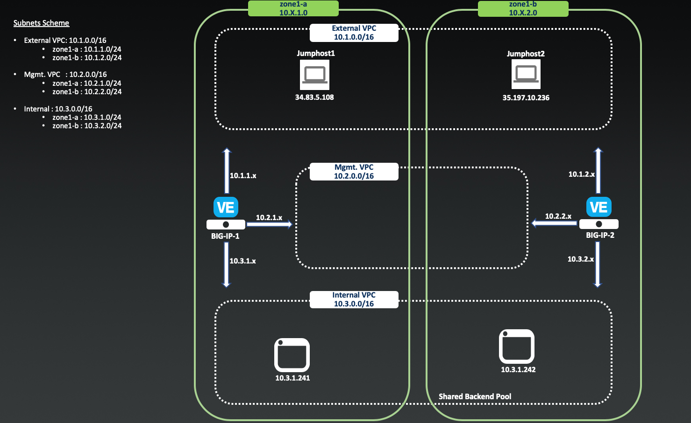

Getting Started
---------------

This lab provides an overview of API based failover. We start with deploying an API based failover 3 NIC google cloud formation template.

We then build on this lab by introducing the F5 Cloud Failover Extension and seeing how this integrated with the 3 NIC API based failover 
template that we have already deployed.

Please follow the instructions provided by the instructor to access your lab.

To access your dedicated student lab environment, you will require a web browser and Remote Desktop Protocol (RDP) client software. The web browser will be used to access lab google cloud environment. The RDP client will be used to connect to the Jump Host, where you will be able to access the BIG-IP management interfaces (HTTPS, SSH).

#. Establish an RDP connection to your Jump Host and login with the following credentials:
User: **labuserx**
Password: **labuserxpassword**

#. Open up the windows google cloud command prompt.

#. Open up visual studio code.

Lab Topology
~~~~~~~~~~~~

|image000|  

The following components have been included in your lab environment:

- 1 x Windows Jumphost- Server 2016
- 2 x Test Web Servers

Lab Components
^^^^^^^^^^^^^^

The following table lists VLANS, IP Addresses and Credentials for all
components:

+------------------------+-------------------------+------------------------------+
| Component              | VLAN/IP Address(es)     | Credentials                  | 
+========================+=========================+==============================+
| jumpbox.f5lab.local    | - Management <ephemeral>| - labuserx/labuserx password | 
|                        |                         |                              | 
+------------------------+-------------------------+------------------------------+
| web server             | - IP 10.3.x.x           |                              |  
+------------------------+-------------------------+------------------------------+
     

