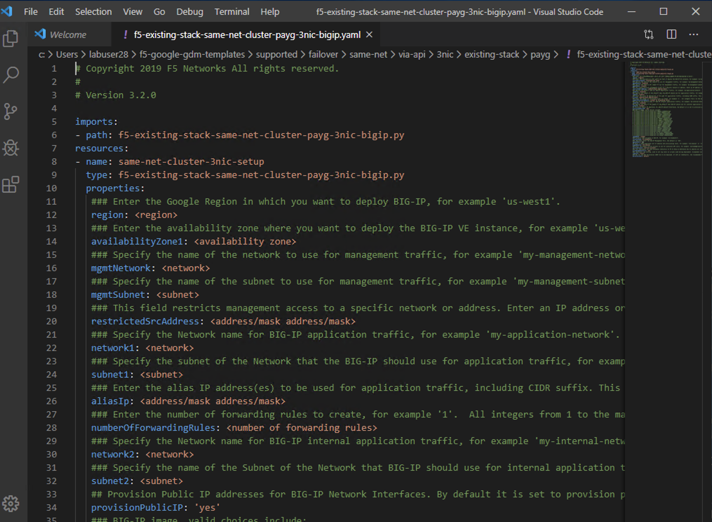
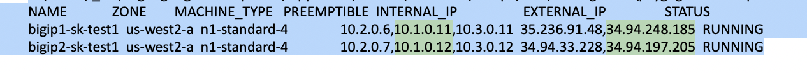

Exercise 1: Deploying the GDM 3NIC Api Based Failover Template
==============================================================

Objective:
----------

-  Deploy an API based failiver pair of BIG-IPs in google cloud.

-  Familiarize yourself with the YAML configuration file that is used to deploy the template in google cloud.

Lab Requirements:
-----------------

-  All Lab requirements will be noted in the tasks that follow

-  Estimated completion time: 30 minutes

Excercise 1: Deploying The GDM template
---------------------------------------

Task Deploying the BigIP VE templates.
~~~~~~~~~~~~~~~~~~~~~~~~~~~~~~~~~~~~~~~~

#. Open a windows command line.

Navigate to 

c:\\Users\\labuserX

Use the git command to clone the google cloud templates.

Type the following..

git clone https://github.com/dudesweet/f5-google-gdm-templates.git

|image013|

2. Change directory to.. 

C:\\Users\\labuserX\\f5-google-gdm-templates\\supported\\failover\\same-net\\via-api\\3nic\\existing-stack\\payg

meaning your particular home directory for your student number. Should be c:\\Users\\labuserX

~/f5-google-gdm-templates/supported/failover/same-net/via-api/3nic/existing-stack/payg

3. Copy your student specific YAML file from

   **C:\\Users\\Public\\Documents\\**
   
   File will be of the pattern **f5-existing-stack-same-net-cluster-payg-3nic-bigip.sample.working.labuserX.yaml**
   
   You need to copy the file to:-
   
   **C:Users\\labuserxx\\f5-google-gdm-templates\\supported\\failover\\same-net\\via-api\\3nic\\existing-stack\\payg\\**   
   
#. Open VS Code

Review the file 

C:\Users\\labuserX\\f5-google-gdm-templates\\supported\\failover\\same-net\\via-api\\3nic\\existing-stack\\payg\\f5-existing-stack-same-net-cluster-payg-3nic-bigip.yaml

|image014|

Review the Following Values in the YAML file

properties:

- region: **'us-west1'**

- availabilityZone1: **'us-west1-a'**

- availabilityZone2: **'us-west1-b'**

- mgmtNetwork: **'management-vpc-221'**

- mgmtSubnet: **'management-vpc-221-subnet'**

- restrictedSrcAddress: **'0.0.0.0/0'**

- network1: **'external-vpc-221'**

- network1SharedVpc: **'None'**

- subnet1: **'external-vpc-221-subnet'**

- aliasIp: **'This Value is assigned on a per student basis'**

- numberOfForwardingRules: **1**

- network2: **'internal-vpc-221'**

- subnet2: **'internal-vpc-221-subnet'**

- provisionPublicIP: **'yes'**

- imageName: **'f5-bigip-15-0-1-0-0-11-payg-best-1gbps-190803012348'**
 
- ntpserver:Commment out **#ntpServer: <server server>**

- timezone: Comment out **#timezone: <timezone>**

- serviceAccount: **agility221@f5-gcs-4261-sales-agility2020.iam.gserviceaccount.com**

**Note that the service account should NOT be in quotes**

**After you have made changes to the YAML file. Save it in VSCode File/Save.**

**Note the file C:\\Users\\Public\\Documents\\studentsubs for student specific \\29 subnet assignments for aliasIP**

5. Run the command…

**gcloud deployment-manager deployments create <name of deployment> --config <name of yaml file> --description <description>**

For example...

**gcloud deployment-manager deployments create labuserx --config f5-existing-stack-same-net-cluster-payg-3nic-bigip.sample.yaml --description labuserx**

**If the deployment fails you should delete, fix the yaml file and re-create the deployment**

Example deployment deletion.

Where X is the number of the labuser type the command.

**gcloud deployment-manager deployments delete labuserX**

NOTE:After you run the template create it will take **at least 15 minutes** for the BigIPs to come up… before you can SSH to the boxes.

Note once the template is done.. you will see something like…

|image001|

You will now need IP addresses in order to SSH to the particular instances that you have created.

In the jumpbox type.

**gcloud compute instances list --filter=labuserX**

Note the template will create “ephemeral” ip addresses. These can be made static in a real world deployment through the google template.

Note the IP addresses.

** In the output the first IP is External, the second Mgmt,  and the third Internal. **
**The ephemeral  IP's for the management interface are the last IP addresses in the list.**

|image020|

You will use these IP addresses in order to connect to your resources in google…

Task – Configure BIG-IP Pair
~~~~~~~~~~~~~~~~~~~~~~~~~~~~~~~

1. Use PUTTY to Login to the first bigip and create a user. 

As the boxes are in a sync failover group the changes with be synced across both units so you can make changes on one box and they will be synched to the other box.

Use Putty to login to the each bigIP as **admin**

    
**Note you will need a key to login ot the admin server**
**The key is called "labusers" amd it is located in C:\\Users\\Public\\Documents**
**Putty is installed on the jumphost**
**You will need to set the private key in putty under 'SSH\Auth'**

    |image021|

2. You are going to create a user that you can use to login on both Big-IP units.

-	Disables password-based ssh for the default accounts (this means the BIG-IP web GUI can’t be accessed either) – add steps for creating non-key account: 

   **create auth user user1 password G40dp4ssw0rd! partition-access add { all-partitions { role admin } }**

   **modify auth user user1 shell bash**

   **save sys config**

|image002|

You will now be able to use this username and password in order to login to TMUI.

Task – Testing
~~~~~~~~~~~~~~~~~~~~~~~~~~~~~~~

You can use the same IP address that was used to access the BIG-IP in the putty session.

TMUI can be reached by typing 

https://<IPOFTMUI>

You can use the user1 that we created in order to login to the Big-IPSs. 

|image003|
 
Lab 1 is now Complete.
-----------------------

.. |image001| image:: media/image001.png
   :width: 6.14in
   :height: 2.31in
.. |image002| image:: media/image002.png
   :width: 6.49in
   :height: 4.19in
.. |image003| image:: media/image003.png
   :width: 6.49in
   :height: 6.33in
.. |image013| image:: media/image013.png
   :width: 13.57in
   :height: 2.51in

.. |image021| image:: media/image21.png
   :width: 6.28in
   :height: 6.1in
