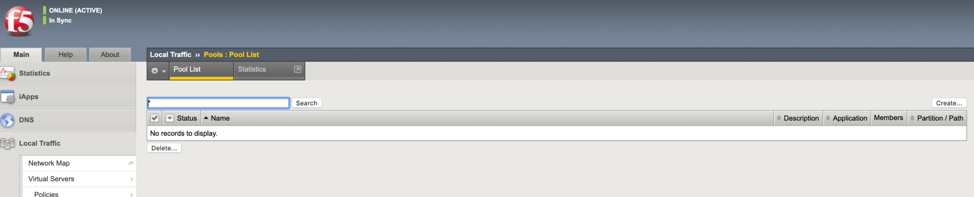
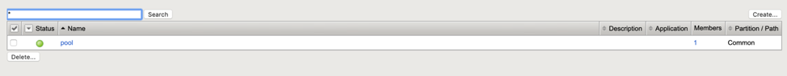
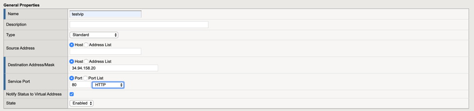
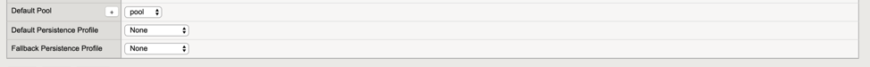
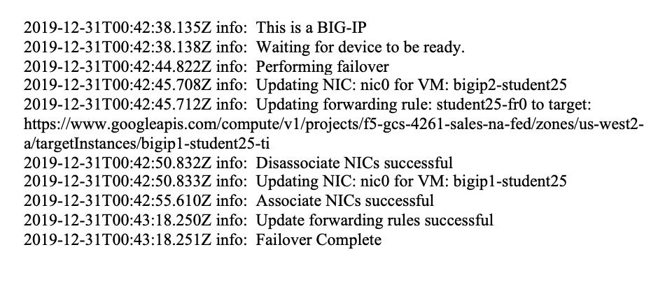
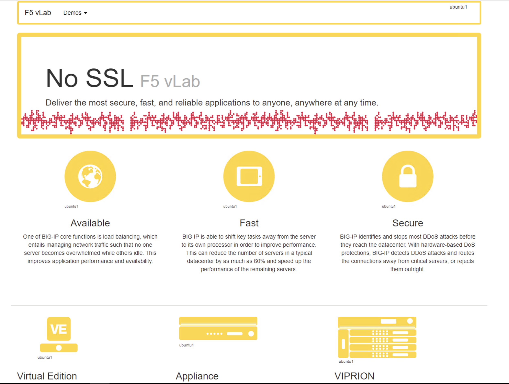

Lab 2: Create VIP and Test Failover
====================================================

The purpose of this lab is to test failover after deploying your API based failover google cloud template.

Objective:
----------

-  Gain an understanding of how API base failover functions for BIG-IP in google cloud.

Lab Requirements:
-----------------

-  Completed Lab1 "Deploying GDM Template"

-  Estimated completion time: 25 minutes

Excercise 2: Create VIP and Test
--------------------------------

Task – Create a Test VIP
~~~~~~~~~~~~~~~~~~~~~~~~~~~~~~~

#.	Create Pool 

Navigate to **Local Traffic  ››  Pools : Pool List**.
Click the “Create” button on the top right.

 
|image004|

You will use the “internal IP address of the web server for your pool member IP”

Create a pool with two members. On the Main tab, click **Local Traffic  ››  Pools : Pool List**. Click **Create** per below.

+-------------------+---------------------------------------+
| Field             | Value                                 |
+===================+=======================================+
| Name              | pool                                  |
+-------------------+---------------------------------------+
| Health Monitors   | http                                  |
+-------------------+---------------------------------------+
| Node Name         | web1, web2                            |
+-------------------+---------------------------------------+
| Address           | 10.3.1.241, 10.3.1.242                |
+-------------------+---------------------------------------+
| Service Port      | 80                                    |
+-------------------+---------------------------------------+

In the **Name** field, type **pool**. Two backend web servers
are pre-configured in the GCP environment.

-Click “Finished”

|image005|

Verify all pool members are healthy **Local Traffic -> Pools:Pool
List ->pool -> Members**.

2. 	Now we will create a virtual server that listens for packets
destined for the BIG-IP's IP address. 

**The VIP should use the forwarding IP that was created.**

Note the forwarding IP..

Click on local traffic/Virtual Servers/Virtual Address List

Note the **PUBLIC** IP address.

 |image007|

In BIG-IP Configuration utility,
**Local Traffic -> Virtual Servers**. Click **Create**.

+------------------------------+--------------------------+
| Field                        | Value                    |
+==============================+==========================+
| Name                         | testvip                  |
+------------------------------+--------------------------+
| Destination Address/Mask     | **PUBLIC IP address**    |
+------------------------------+--------------------------+
| Service Port                 | 80                       |
+------------------------------+--------------------------+
| HTTP Profile (Client)        | http                     |
+------------------------------+--------------------------+
| Source Address Translation   | Auto Map                 |
+------------------------------+--------------------------+
| Default Pool                 | pool                     |
+------------------------------+--------------------------+

 
|image008|

|image009|
 

Your end state should similar to the below.

|image010|

Task – Test Failover
~~~~~~~~~~~~~~~~~~~~~~~~~~~~~~~

1. Open a browser and navigate to http://yourvip 

Note the VIP uses the forwarding IP that was created by the template.

You should see the WebPage come up.

|image22|

2. Perform a failover while tailing the failover log.

To test.

**On each BIG-IP**

- ssh to box as user
- in TMSH type **run util bash** to get to a bash command line
- **tail –f /var/log/restnoded/restnoded.log**
- In TMUI go to devices/device management/ and select “force to standby on the active unit”d) 
   
- Watch logs.

You should see something like the following in the log files.:

| Mon, 01 Jun 2020 21:44:46 GMT - info: [f5-cloud-failover] Performing failover - execute
| Mon, 01 Jun 2020 21:44:47 GMT - info: [f5-cloud-failover] Performing Failover - discovery
| Mon, 01 Jun 2020 21:44:48 GMT - info: [f5-cloud-failover] Performing Failover - update
| Mon, 01 Jun 2020 21:44:48 GMT - info: [f5-cloud-failover] No route operations to run
| Mon, 01 Jun 2020 21:44:49 GMT - info: [f5-cloud-failover] Disassociate NICs successful.
| Mon, 01 Jun 2020 21:44:49 GMT - info: [f5-cloud-failover] Updated forwarding rules successfully
| Mon, 01 Jun 2020 21:44:49 GMT - info: [f5-cloud-failover] Associate NICs successful.
| Mon, 01 Jun 2020 21:44:49 GMT - info: [f5-cloud-failover] Failover complete

The lab is now Completed.
-------------------------

.. |image005| image:: media/image005.png
   :width: 6.49in
   :height: 5.71in

.. |image007| image:: media/image007.png
   :width: 6.49in
   :height: 1.18in

.. |image010| image:: media/image010.png
   :width: 6.49in
   :height: 0.69in

