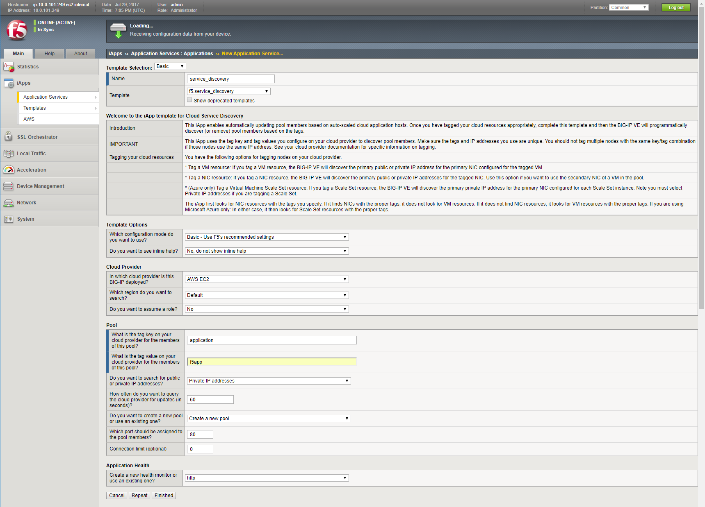

Deploy the Service Discovery iApp on a BigIP Cluster across two Availability Zones
----------------------------------------------------------------------------------
1. Login to the active Big-IP1 configuration utility (web ui). Using the examples in our lab-info output: https://34.232.9.141.

#. Navigate to iApps. The "HA_Across_AZs" iApp will already be deployed in the Common partition and is automatically configured when you deploy the HA CloudFormation template across availability zones.

.. image:: ./images/service-discovery1.png
  :scale: 50%

3. The Service Discovery iApp will automatically discover and populate nodes in the cloud based on tags.

#. From the configuration utility (web ui) of Big-IP1. iApps => Application Services => Create...

+----------------------------------------------------------------------------+----------------------------------+
| Question                                                                   | value                            |
+============================================================================+==================================+
| Name                                                                       | service_discovery                |
+----------------------------------------------------------------------------+----------------------------------+
| Template                                                                   | f5.service.discovery             |
+----------------------------------------------------------------------------+----------------------------------+
| Pool                                                                                                          |
+----------------------------------------------------------------------------+----------------------------------+
| What is the tag key on your cloud provider for the members of this pool?   | findme                           |
+----------------------------------------------------------------------------+----------------------------------+
| What is the tag value on your cloud provider for the members of this pool? | web                              |
+----------------------------------------------------------------------------+----------------------------------+
| Do you want to create a new pool or use an existing one?                   | Create new pool...               |
+----------------------------------------------------------------------------+----------------------------------+
| Application Health                                                                                            |
+----------------------------------------------------------------------------+----------------------------------+
| Create a new health monitor or use an existing one?                        | http                             |
+----------------------------------------------------------------------------+----------------------------------+

**Finished**

5. Local Traffic => Pools => track the newly created service_discovery_pool. Within 60 seconds it should light up green. The service_discovery iApp has discovered and auto-populated the service_discovery_pool with two web servers.

.. image:: ./images/service-discovery3.png
  :scale: 50%
