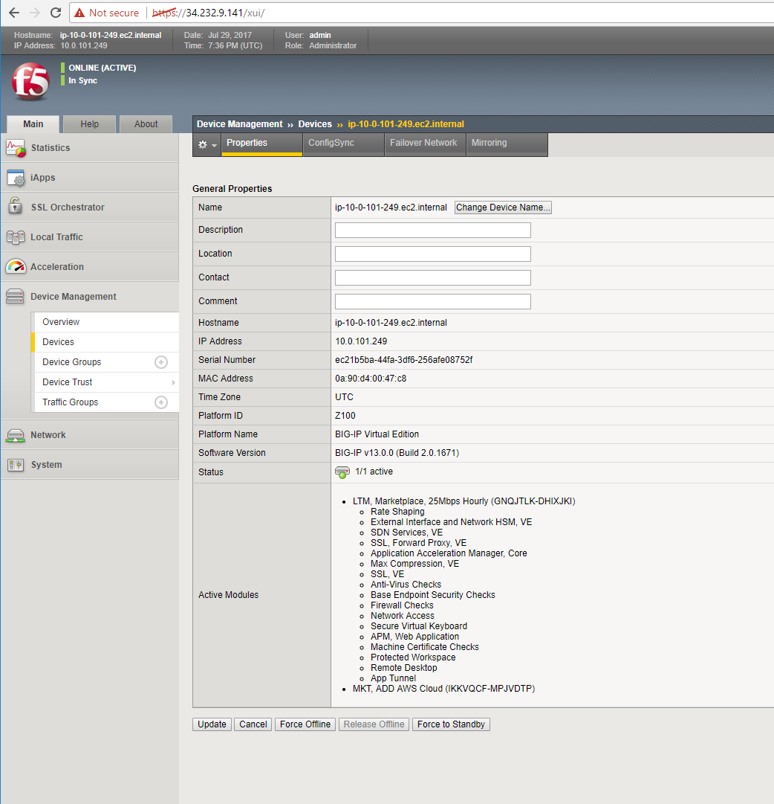

Deploy an AWS High-Availability-aware virtual server across two Availability Zones
----------------------------------------------------------------------------------

1. Run the lab-info utility. This is a quick way to gather the details you'll need to configure the AWS high-availability-aware TCP virtual server.

#. Login to the active Big-IP1 configuration utility (web ui). Using the examples in our lab-info output: https://34.232.9.141.

#. The "HA_Across_AZs" iApp will already be deployed in the Common partition.

#. The "service_discovery" iApp will already be deployed as well.

#. Download the latest iApp package from https://s3.amazonaws.com/f5-marfil/iapps-1.0.0.468.0.zip.

#. Extract \\TCP\Release_Candidates\\f5.tcp.v1.0.0rc2.tmpl. This is the tested version of the iApp.

#. iApps -> Templates -> import. Import f5.tcp.v1.0.0rc2.tmpl to the primary BigIP. The secondary BigIP should pick up the configuration change automatically.

#. Deploy an iApp using the f5.tcp.v1.0.0rc2.tmpl template.

#. Configure iApp: Select "Advanced" from "Template Selection".

#. Traffic Group: UNCHECK "Inherit traffic group from current partition / path"

+--------------------------------------------------------------------------------------------------------------+----------------------------------+
| Question                                                                                                     | value                            |
+==============================================================================================================+==================================+
| Name:                                                                                                        | virtual_server_1                 |
+--------------------------------------------------------------------------------------------------------------+----------------------------------+
| High Availability. What IP address do you want to use for the virtual server?                                | VIP IP of Big-IP1                |
+--------------------------------------------------------------------------------------------------------------+----------------------------------+
| What is the associated service port?                                                                         | HTTP (80)                        |
+--------------------------------------------------------------------------------------------------------------+----------------------------------+
| What IP address do you wish to use for the TCP virtual server in the other data center or availability zone? | VIP IP of Big-IP2                |
+--------------------------------------------------------------------------------------------------------------+----------------------------------+
| Do you want to create a new pool or use an existing one?                                                     | service_discovery_pool           |
+--------------------------------------------------------------------------------------------------------------+----------------------------------+

.. note:: The preconfigured HA_Across_AZs iApp has both IP addresses for the virtual servers prepopulated. The virtual server IP addresses configured here must match the virtual server IP address configured in the HA_Across_AZs iApp.

**Finished**

.. image:: ./images/cross-az-ha1.png
  :scale: 50%

11. Login to the standby BigIP configuration utility (web ui) and confirm the changes are in sync.

12. Run the lab-info and look for the "Elastic IP" belonging to the active Big-IP virtual_server_1 we just created.

.. code-block:: bash

   lab-info

13. Hit the example site behind virtual_server_1 from the Linux shell or a web browser. From a web browser, note the AZ # that is serving up the example web site.

.. code-block:: bash

   curl -I http://52.6.236.56

...watch for HTTP/1.1 200 OK status code. This is a sign that things went well

.. code-block:: bash

   HTTP/1.1 200 OK
   Accept-Ranges: bytes
   Content-Type: text/html
   Date: Sat, 29 Jul 2017 15:50:12 GMT
   Set-Cookie: TS01e70004=01eeb64b413ca1778c867b0174b4a4e8901d5361c37a2ef5634917272e2f6f9b77d14ed447d3903a5e45d1aeb723a0af78bd798f1a; Path=/
   X-COLOR: a0bf37
   Connection: keep-alive

...from a web browser:

.. image:: ./images/ha-example-site2.png
  :scale: 50%

14. From the Big-IP configuration utility let's simulate an availability zone failure. Navigate to Local Traffic -> Pools -> Pool List -> service_discover_pool -> Members -> Select the primary pool member and "Force Offline"

.. image:: ./images/pool-member-offline.png
  :scale: 50%

15. Navigate to Device management -> Devices -> click on the active unit and "Force Offline".

16. Cross Availability Zone begins.

.. code-block:: bash

   lab-info

.. code-block:: bash

   curl -I http://52.6.236.56

...watch for HTTP/1.1 200 OK status code. This is a sign that things went well

.. code-block:: bash

   HTTP/1.1 200 OK
   Accept-Ranges: bytes
   Content-Type: text/html
   Date: Sat, 29 Jul 2017 15:50:12 GMT
   Set-Cookie: TS01e70004=01eeb64b413ca1778c867b0174b4a4e8901d5361c37a2ef5634917272e2f6f9b77d14ed447d3903a5e45d1aeb723a0af78bd798f1a; Path=/
   X-COLOR: a0bf37
   Connection: keep-alive

17. Note the example web site behind virtual_server_1 is now being served up from another availability zone!

.. image:: ./images/ha-example-site1.png
  :scale: 50%

.. note::
   
   Traditional HA failover relies on Layer 2 connectivity and a heartbeat to trigger a fail-over event and move a 'floating IP' to a new active unit. There is no Layer 2 connectivity in the cloud across availability zones. The Big-IP will detect an availability zone outage or trouble with a Big-IP VE and the elastic IP will 'float' over to the new active device as you just saw.
