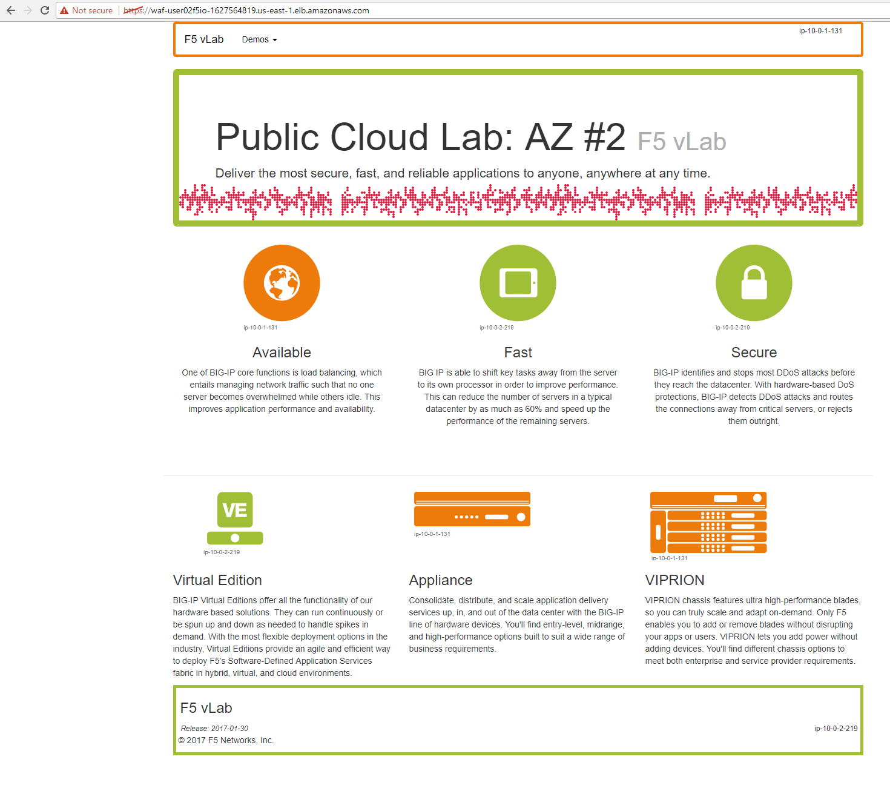

Autoscale WAF
-------------

1. From the f5-super-netops container test out application behind the auto-scale waf is up. Replace the example https url with the one specific to your lab. See lab-info.

.. code-block:: bash

   curl -kI https://waf-user01f5io-499431932.us-east-1.elb.amazonaws.com

.. code-block:: bash

   HTTP/1.1 200 OK
   Accept-Ranges: bytes
   Content-Type: text/html
   Date: Sat, 29 Jul 2017 15:50:12 GMT
   Set-Cookie: TS01e70004=01eeb64b413ca1778c867b0174b4a4e8901d5361c37a2ef5634917272e2f6f9b77d14ed447d3903a5e45d1aeb723a0af78bd798f1a; Path=/
   X-COLOR: a0bf37
   Connection: keep-alive

...The HTTP/1.1 200 OK status code is a sign that things went well. You can hit the example site behind the F5 WAF with a web browser.

2. Navigate to Services => AUTO SCALING => Auto Scaling Groups. Filter on your username and select your waf-userxx... auto scaling group.

3. Select the 'Instances' tab below, and select your Instance ID (there should be only one). If your instance is "Protected from... Scale in" then it will always stay up regardless of scale up/down thresholds configured. It's common to keep a single minimum WAF instance running at all times and scale the 2nd, 3rd, Nth WAF during surges.

.. image:: ./images/autoscale-pending.png
  :scale: 50%

4. Select the Scaling Polices tab. These policies were deployed via the CloudFormation template and can be changed via the CloudFormation template.

.. image:: ./images/autoscale-policy2.png
  :scale: 50%

5. Login to the active BIG-IP Autoscale Instance MGMT IP **on port 8443** configuration utility (web ui). Using the examples in our lab-info output in earlier tasks: https://52.207.200.169:8443

.. code-block:: bash

   lab-info

6. In the Big-IP Configuration utility (Web UI) navigate to Security -> Application Security -> Security Policies -> Active Polices. A "linux-high" policy was deployed via CloudFormation template and is in Enforcment Mode: Blocking.

.. image:: ./images/waf-policy.png
  :scale: 50%

7. From the f5-super-netops container, let's launch some traffic against the application behind our WAF and watch it autoscale to service the surge! Replace the https://waf-userxx... in the command below with the one in the output of lab-info and don't miss that critical forward slash / at the end!

.. code-block:: bash

   base64 /dev/urandom | head -c 3000 > payload
   ab -t 120 -c 200 -c 5 -T 'multipart/form-data; boundary=1234567890' -p payload https://waf-user11f5democom-xxxxxxxxx.us-east-1.elb.amazonaws.com/

8. Services => Compute => EC2 => INSTANCES => Instances. Filter on your username and after 60 seconds (the lowest configurable time threshold) hit refresh to see your 2nd autoscale WAF instance starting.

.. image:: ./images/autoscale-initializing.png
  :scale: 50%
