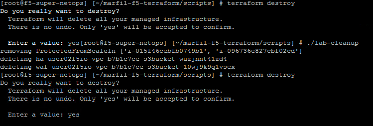

Destroy environment
-------------------

1. Run the lab-cleanup script.

.. code-block:: bash

   lab-cleanup

2. Followed by "terraform destroy". Confirm destroy with 'yes' when prompted.

.. code-block:: bash

   terraform destroy

3. The end.

.. note:: Many thanks to Yevgeniy Brikman for his excellent *Terraform: Up and Running: Writing Infrastructure as Code 1st Edition* that helped me get started. http://shop.oreilly.com/product/0636920061939.dos