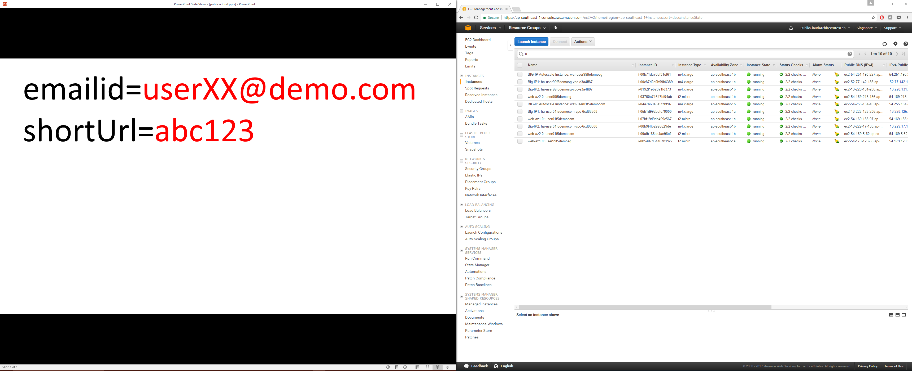

Troubleshooting Guide
=====================

To help all students get past the first part of the lab, Walk through 2.1.1 - 2.1.6 in front of the class for all to see. Then leave your shared screen up on the monitor like this:

terraform apply fails
---------------------

If a student's 'terraform apply' operation fails, the best thing to do is to shutdown the docker container, assign a new student number, and start all over. This is always a sign that we've reached the AWS API limits because of too many simultaneous labs coming on line at once and AWS is throttling: https://forums.aws.amazon.com/thread.jspa?messageID=720883

For example, if tragically, user20@f5demo.com failed to complete 'terraform apply'

CTRL+p+q to exit the container, then stop and remove the container and start fresh as user120@f5demo.com

.. code-block:: bash

   docker stop $(docker ps -lq)
   docker rm $(docker ps -lq)

   docker run -p 8080:80 -p 2222:22 -it -e SNOPS_AUTOCLONE=0 f5devcentral/f5-super-netops-container:base

   export emailid=user120@f5demo.com
   ...

...continue with Task 2.1.4 from here.

emailid format
--------------
If the student accidentally deviates from the emailid format it's no big deal, as long as it's unique and a standard email format <name@domain.suffix> there will be no problem. If the student forgets the emailid you can always verify from the working directory:

.. code-block:: bash

  basename `ls *.emailid` .emailid

Wrong shortUrl
--------------
If the student enters the wrong shortUrl, the start script will install all of the prerequisite software but eventually abort with error message: "Invalid shortUrl.  Aborting." In this case you need only export shortUrl= with the right value and re-run the start script. For example if the valid shortUrl=seattle-dumplings.

.. code-block:: bash

  export shortUrl=seattle-dumplings
  source ./start

I don't see any instances in AWS console
----------------------------------------
Student is in the wrong region. If this happens more than once (this gotcha is in the documentation) you can take the opportunity to explain to the class: regions vs. availability zones.

Accidently exit and stop the super-netops container
---------------------------------------------------
If the student accidentally exits and as a result stops the super-netops docker container, they will have to restart and attach to the super-netops container. From the Linux host:

.. code-block:: bash
   
  docker start $(docker ps -lq)
  docker attach $(docker ps -lq)
  source ~/.profile

...or alternatively you can start the super-netops container, but instead of attaching to the container console, you can ssh to the container. This makes it impossible to accidentally stop the container.

.. code-block:: bash

  docker start $(docker ps -lq)
  ssh -p 2222 snops@localhost
  default
  su -
  default

2.3.5 Autoscale WAF not triggering
----------------------------------
This is difficult to calibrate. You can have fun and ensure success by asking multiple students to use the apache-bench tool (ab) to gang up on a single WAF instance instead of each student trying to trigger auto-scale in their own environment. You can then show the auto scale event on your shared screen.

Test lab and confirm AWS limits beforehand
------------------------------------------
https://github.com/TonyMarfil/aws-lab-tools

Misc.
-----

+ Login to existing bucket and cleanup.

+ BigIP not coming up licensed.