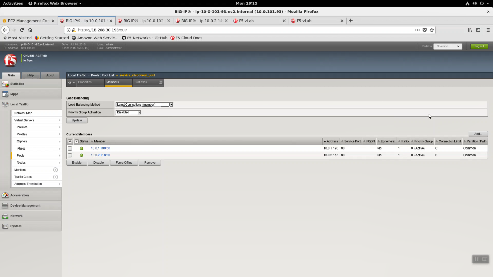

Deploy the Service Discovery iApp on a BigIP Cluster across two Availability Zones
----------------------------------------------------------------------------------

From the Super-NetOps terminal, run the handy lab-info utility. Copy the Big-IP1 MGMT IP.

.. code-block:: bash

   lab-info

The Service Discovery iApp will automatically discover and populate nodes in the cloud based on tags. Open a new browser tab and HTTPS to the MGMT IP. Login to the Big-IP Configuration utility (Web UI). 

- Username: admin
- Password: value for <shortURl> will be unique to your lab.

Navigate to iApps => Application Services. Create a new iApp deployment:

- Name: service_discovery
- Template: choose f5.service_discovery from the dropdown.

Click [Finished}

.. image:: ./images/1_sd_iapp.png
  :scale: 50%

+----------------------------------------------------------------------------+----------------------------------+
| Question                                                                   | value                            |
+============================================================================+==================================+
| Name                                                                       | service_discovery                |
+----------------------------------------------------------------------------+----------------------------------+
| Template                                                                   | f5.service.discovery             |
+----------------------------------------------------------------------------+----------------------------------+
| Pool                                                                                                          |
+----------------------------------------------------------------------------+----------------------------------+
| What is the tag key on your cloud provider for the members of this pool?   | findme                           |
+----------------------------------------------------------------------------+----------------------------------+
| What is the tag value on your cloud provider for the members of this pool? | web                              |
+----------------------------------------------------------------------------+----------------------------------+
| Do you want to create a new pool or use an existing one?                   | Create new pool...               |
+----------------------------------------------------------------------------+----------------------------------+
| Application Health                                                                                            |
+----------------------------------------------------------------------------+----------------------------------+
| Create a new health monitor or use an existing one?                        | http                             |
+----------------------------------------------------------------------------+----------------------------------+

**Finished**

.. image:: ./images/2_sd_iapp.png
  :scale: 50%

.. image:: ./images/3_sd_iapp.png
  :scale: 50%

Local Traffic => Pools => track the newly created service_discovery_pool. Within 60 seconds it should light up green. The service_discovery iApp has discovered and auto-populated the service_discovery_pool with two web servers.

