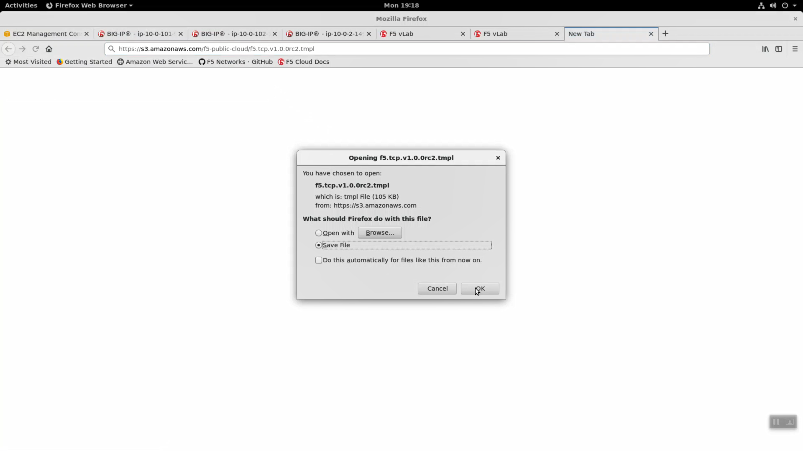
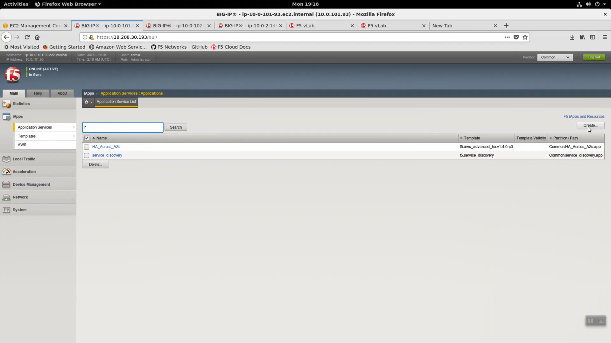
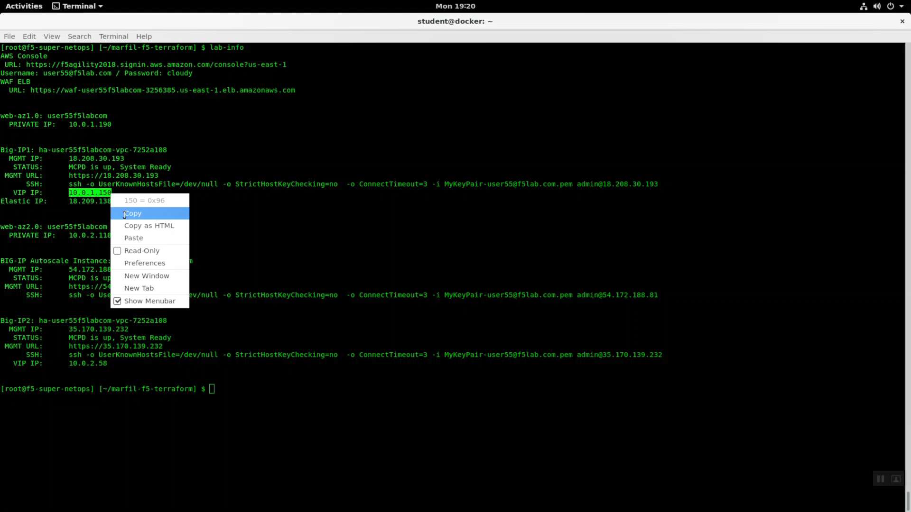
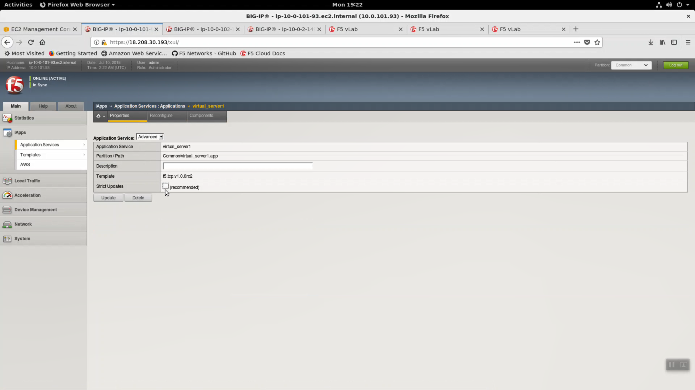
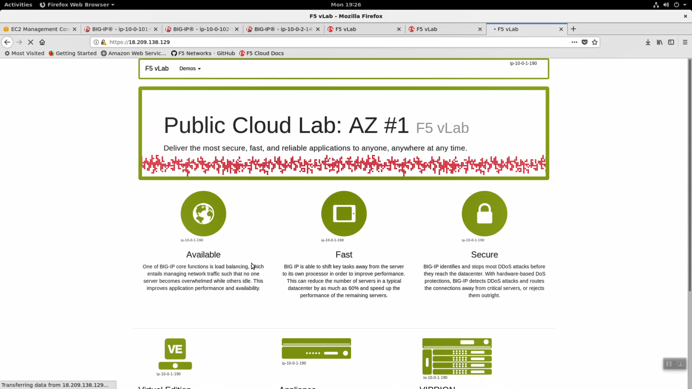

Deploy an AWS High-Availability-aware virtual server across two Availability Zones
----------------------------------------------------------------------------------

Login to the active Big-IP1 Configuration utility (Web UI).
The "HA_Across_AZs" iApp will already be deployed in the Common partition.

Download the latest tcp iApp template from https://s3.amazonaws.com/f5-public-cloud/f5.tcp.v1.0.0rc2.tmpl.

iApps -> Templates -> import. Import f5.tcp.v1.0.0rc2.tmpl to the primary BigIP. The secondary BigIP should pick up the configuration change automatically.

.. image:: ./images/3_open_tcp_iapp.png
  :scale: 50%

.. image:: ./images/4_upload_tcp_iapp.png
  :scale: 50%

Deploy an iApp using the f5.tcp.v1.0.0rc2.tmpl template.

iApps => Application Serves => Select f5.tcp.v1.0.0rc2 template from the dropdown. Name: virtual_server_1.

Configure iApp: Select "Advanced" from "Template Selection".

.. image:: ./images/5_tcp_iapp_dropdown.png
  :scale: 50%

Traffic Group: UNCHECK "Inherit traffic group from current partition / path"

+--------------------------------------------------------------------------------------------------------------+----------------------------------+
| Question                                                                                                     | value                            |
+==============================================================================================================+==================================+
| Name:                                                                                                        | virtual_server_1                 |
+--------------------------------------------------------------------------------------------------------------+----------------------------------+
| Inherit traffic group from current partition / path                                                          | **uncheck**                      |
+--------------------------------------------------------------------------------------------------------------+----------------------------------+
| High Availability. What IP address do you want to use for the virtual server?                                | VIP IP of Big-IP1                |
+--------------------------------------------------------------------------------------------------------------+----------------------------------+
| What is the associated service port?                                                                         | HTTP (80)                        |
+--------------------------------------------------------------------------------------------------------------+----------------------------------+
| What IP address do you wish to use for the TCP virtual server in the other data center or availability zone? | VIP IP of Big-IP2                |
+--------------------------------------------------------------------------------------------------------------+----------------------------------+
| Do you want to create a new pool or use an existing one?                                                     | service_discovery_pool           |
+--------------------------------------------------------------------------------------------------------------+----------------------------------+

From the Super-NetOps terminal. Invoke ``terraform output`` and copy the value for Big-IP1 => VIP IP. Use this value in the iApp as explained in the chart above.

From the Super-NetOps terminal. Invoke ``terraform output`` and copy the value for Big-IP2 => VIP IP. Use this value in the iApp as explained in the chart above.

.. image:: ./images/7_terraform_copy_vip2.png
  :scale: 50%

.. image:: ./images/8_vs_finish.png
  :scale: 50%

The iApp will create two virtual servers on *both* Big-IP's. The iApp deployment on Big-IP1 will automatically and immediately sync to Big-IP2.

.. image:: ./images/9_two_vs.png
  :scale: 50%

From the Super-NetOps terminal. Invoke ``terraform output`` and copy the value for the primary Big-IP's Elastic IP. Open a browser tab and HTTP to this Elastic IP.

.. image:: ./images/10_http_vs.png
  :scale: 50%

In order to enable request logging and apply a client SSL profile, let's re-configure our TCP / Fast L4 virtual server to a Standard virtual server with an http profile applied.

iApps => Application Services => select the "virtual_server_1" iApp we just deployed.

.. image:: ./images/11_select_iapp.png
  :scale: 50%

Properties => uncheck/disable "Strict Updates"

Local Traffic => Virtual Servers => virtual_server1. Change only the values below and leave the rest as they are.

+----------------------------------------------------------------------------------+---------------------+
| Question                                                                         | value               |
+==================================================================================+=====================+
| Type                                                                             | Standard            |
+----------------------------------------------------------------------------------+---------------------+
| Service Port                                                                     | 443 / HTTPS         |
+----------------------------------------------------------------------------------+---------------------+
| HTTP Profile                                                                     | http                |
+----------------------------------------------------------------------------------+---------------------+
| SSL Profile (Client)                                                             | clientssl           |
+----------------------------------------------------------------------------------+---------------------+

[Update]

.. image:: ./images/13_vs_changes_1.png
  :scale: 50%

.. image:: ./images/14_vs_changes_2.png
  :scale: 50%

From the Super-NetOps terminal. Invoke ``terraform output`` and copy the value for the primary Big-IP's Elastic IP. Let's test the http profile and clientssl profile are working. Open a browser tab and HTTPS (different than before, when we accessed our example application via HTTP) to this Elastic IP.

