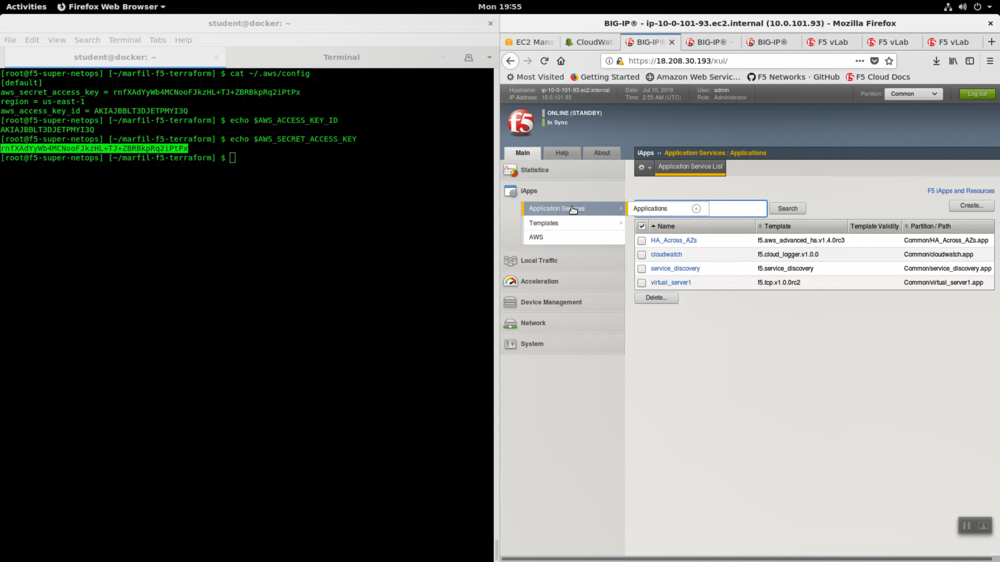
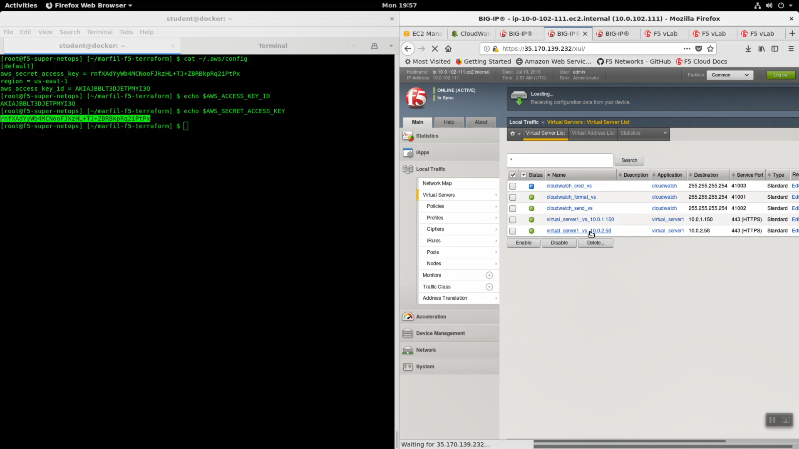
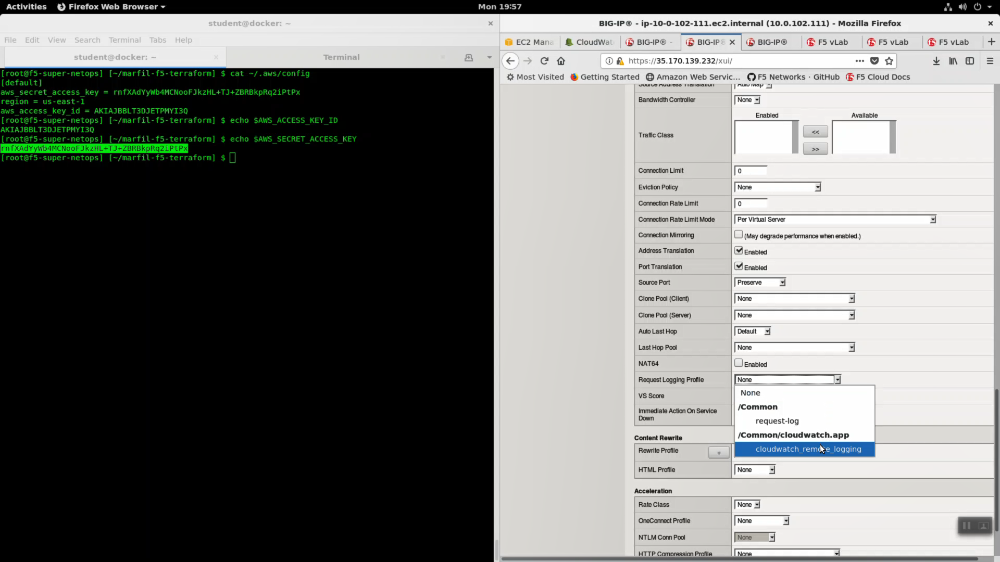
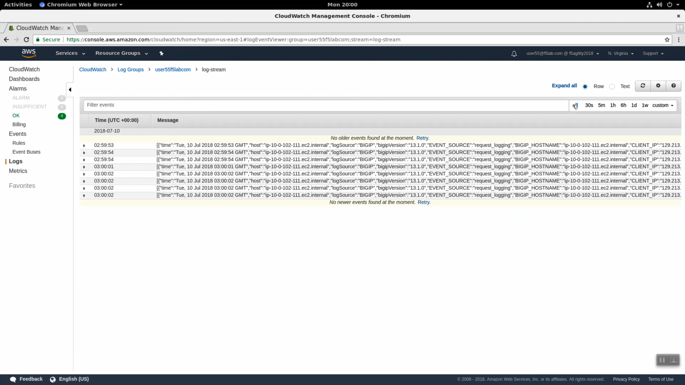

LTM Request Logging to CloudWatch
=================================

From the Super-NetOps terminal, run the handy lab-info utility. Confirm that "MCPD is up, System Ready" for all three of your instances.

.. code-block:: bash

   lab-info

From the AWS management console, navigate to Services => Management Tools => CloudWatch => Log Groups. In the search filter enter your username (i.e. user55). Terraform created a Log Group for you.

.. image:: ./images/1_log-stream.png
  :scale: 50%

Click on your log group. Click on your log stream named "log-stream". Notice the Message column has no messages.

.. image:: ./images/2_log-stream.png
  :scale: 50%

Right-click and copy your log group name (i.e. user55labcom). **Save in notepad or your preferred text editor / note taking method for later use.**

.. image:: ./images/3_copy_log-stream.png
  :scale: 50%

For convenience working through the next few steps, split your screen into two halves: Super-NetOps terminal on the left and the Firefox or Chrome browser on the right. On a standard Windows US/English Windows keyboard you can split the screen with <Windows Key + left arrow> and <Windows Key + right arrow>.

From your Super-NetOps terminal, there are multiple ways to see your AWS access keys. You can echo the environment variables:

.. code-block:: bash

   echo $AWS_ACCESS_KEY_ID
   echo $AWS_SECRET_ACCESS_KEY

...or you can cat the hidden ~/.aws/config file:

.. code-block:: bash

   cat ~/.aws/config

Copy your AWS_ACCESS_KEY_ID and AWS_SECRET_ACCESS_KEY values. **Save in notepad or your preferred text editor / note taking method for later use.**

Create a new cloud_logger iApp. HTTPS to the Configuration Utility (Web UI) of Big-IP1 (assuming that is the ACTIVE device and not STANDBY).

iApps => Application Services => Name: `cloudwatch`. Template: `f5.cloud_logger.v1.0.0`. Click [Finished].

.. image:: ./images/4_create_iapp.png
  :scale: 50%

.. image:: ./images/5_create_iapp.png
  :scale: 50%

+--------------------------------------------------------------+----------------------------------+
| Question                                                     | value                            |
+==============================================================+==================================+
| Name                                                         | cloudwatch                       |
+--------------------------------------------------------------+----------------------------------+
| Template                                                     | f5.cloud_logger.v1.0.0           |
+--------------------------------------------------------------+----------------------------------+
| Which AWS region is the provider located in?                 | us-east-1                        |
+--------------------------------------------------------------+----------------------------------+
| What is the access key you want to use for the API calls?    | value of $AWS_ACCESS_KEY_ID      |
+--------------------------------------------------------------+----------------------------------+
| What is the secret key you want to use for the API calls?    | value of $AWS_SECRET_ACCESS_KEY  |
+--------------------------------------------------------------+----------------------------------+
| What is the AWS CloudWatch Logs group name?                  | log group name i.e. user55labcom |
+--------------------------------------------------------------+----------------------------------+
| What is the AWS CloudWatch Logs group's stream name?         | log-stream                       |
+--------------------------------------------------------------+----------------------------------+
| Do you want to enable LTM Request logging?                   | Enable LTM request logging       |
+--------------------------------------------------------------+----------------------------------+

.. image:: ./images/6_copy_access_keys.png
  :scale: 50%

Click [Finished].

.. image:: ./images/7_cloud_logging_iapp_finished.png
  :scale: 50%

The logging components have been created!

.. image:: ./images/7_cloud_logging_iapp_created.png
  :scale: 50%

HTTPS to the Configuration Utility (Web UI) of Big-IP2 (if that is the standby). Look in the upper left-hand corner. Confirm you are on the STANDBY. All of the iApp changes are kept in sync between active and standby devices. 

HTTPS to the Configuration Utility (Web UI) of Big-IP1 (assuming that is the ACTIVE device and not STANDBY).

iApps => Application Services => virtual_server1.

.. attention::

   Before completing the next few steps, DISABLE STRICT UPDATES for the f5.tcp.v1.0.0rc2 iApp named virtual_server1 in our example.

Local Traffic => Virtual Servers => virtual_server1_vs.10.0.1.x.

- Choose "Advanced" from the dropdown.
- Select SSL Profile(Client): clientssl
- Change HTTP Profile to "http"
- Request Logging Profile: cloudwatch_remote_logging

Click [Update].

.. image:: ./images/9_1st_virtual.png
  :scale: 50%

.. image:: ./images/10_virtual_advanced.png
  :scale: 50%

.. image:: ./images/11_request_logging_profile.png
  :scale: 50%

.. image:: ./images/12_1st_virtual_update.png
  :scale: 50%

Do the same for the second virtual server. Local Traffic => Virtual Servers => virtual_server1_vs.10.0.1.x.

- Choose "Advanced" from the dropdown.
- Select SSL Profile(Client): clientssl
- Change HTTP Profile to "http"
- Request Logging Profile: cloudwatch_remote_logging

Click [Update].

.. image:: ./images/15_2nd_virtual_update.png
  :scale: 50%

Run the `lab-info` command. Note the Elastic IP.

.. code-block:: bash

   lab-info

.. image:: ./images/16_elastic_ip_for_testing.png
  :scale: 50%

HTTPS to the Elastic IP to test request logging. Refresh with [F5] key for 15 seconds to generate a modest amount of traffic.

.. image:: ./images/17_refresh_https.png
  :scale: 50%

.. attention::

   Some lab testers reported an incompatibility issue with Mozilla Firefox on Linux and the AWS CloudWatch console. If Firefox doesn't render the CloudWatch console, switch to Google Chrome for this part of the lab.
   
From the AWS Console, Services => Management Tools => CloudWatch => Log Groups. Select your log group and log-stream.

.. image:: ./images/18_log-stream.png
  :scale: 50%

You will see the http request logs.

Expand a log entry to see more detail.

.. image:: ./images/19_log-stream_expand.png
  :scale: 50%

Copy the CLIENT_IP of a request and use this CLIENT_IP in the "Filter events" search filter. In production you would filter search results by attributes such as CLIENT-IP to home in on relevant logs.

.. image:: ./images/20_log-stream_filter1.png
  :scale: 50%

.. image:: ./images/21_log-stream_filter2.png
  :scale: 50%
