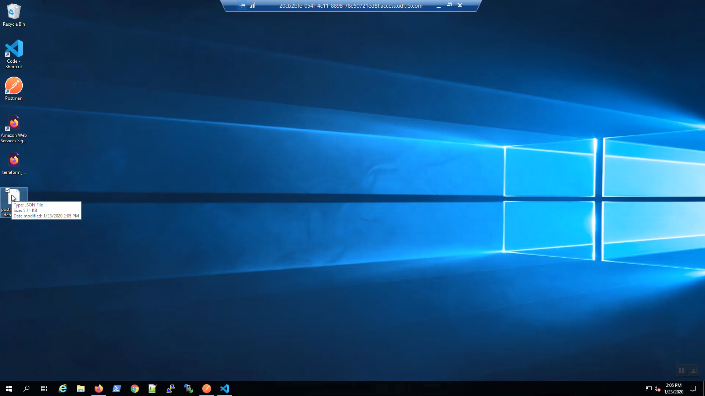
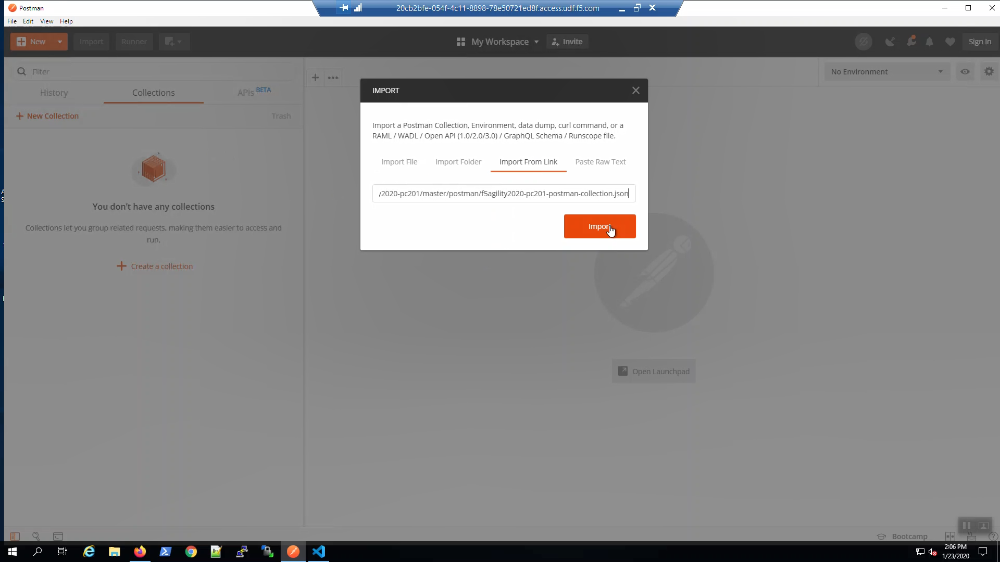
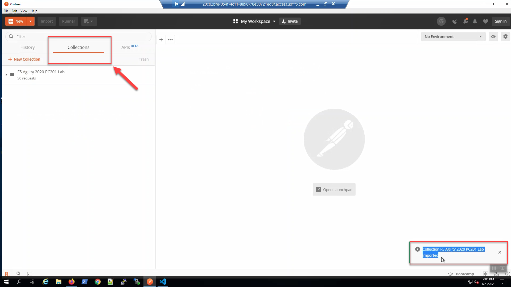
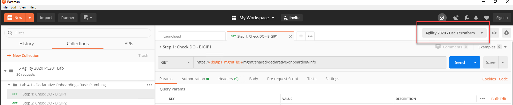

Prepare Postman
---------------

From the Visual Studio Code Terminal, copy the postman_rendered.json file to the desktop. This file contains the environment variables for a Postman collection.

.. code-block:: bash

   cp ./postman_rendered.json /mnt/c/Users/Administrator/Desktop/

.. image:: ./images/1_postman_rendered.png
	   :scale: 50%

The postman_rendered.json file was copied to the Windows desktop.

Open Postman. Click the wrench icon in the upper-right-hand corner to review Settings. Ensure that "SSL certificate verification" is turned "OFF". Close Settings.

.. image:: ./images/6_postman_ssl_cert_verification_off.png
	   :scale: 50%

Click "Import" in the upper-left-hand corner. Choose "Import From Link". Import the Postman Collection for this lab from:

.. code-block:: bash

   https://raw.githubusercontent.com/TonyMarfil/f5agility2020-pc201/master/postman/f5agility2020-pc201-postman-collection.json

Confirm the **F5 Agility 2020 PC201 Lab** Collection has been imported.

In the upper-right-hand corner. To the far right of the "No Environment" drop-down menu. Click on the gear icon and "Import from File".
Navigate to \\This PC\\Desktop\\postman_rendered.json => [Open].

.. image:: ./images/5_postman_import_environment.png
	   :scale: 50%

Confirm the environment was successfully imported. Choose "Agility 2020 - Use Terraform to..." from the Environment drop-down menu in the upper-right-hand corner.

Install iControl LX Extensions
-------------------------------

iControl LX Extensions are delivered as TMOS-independent RPM files. You *can* automatically install iControl LX packages using cloud-init and would probably do so in production to save this step.

More info:

https://clouddocs.f5.com/cloud/public/v1/shared/cloudinit.html

We'll install manually in this lab to emphasize the role each iControl LX package plays.

F5 Application Services 3 Extension
^^^^^^^^^^^^^^^^^^^^^^^^^^^^^^^^^^^

Big-IP1 => iApps => Package ManagementLX => [Browse] => This PC\\Downloads\\iControl_LX\\f5-appsvcs… Upload the f5-appsvc… package.

Do the same for Big-IP2.

.. image:: ./images/7_bigip_install_as3.png
	   :scale: 50%

.. note::

   Application Services 3 Extension (AS3) is a flexible, low-overhead mechanism for managing application-specific configurations on a BIG-IP system. AS3 uses a declarative model: you provide a JSON declaration rather than a set of imperative commands.

F5 Cloud Failover Extension
^^^^^^^^^^^^^^^^^^^^^^^^^^^

Big-IP1 => iApps => Package ManagementLX => [Browse] => This PC\\Downloads\\iControl_LX\\f5-cloud-failover… Upload the f5-cloud-failover… package.

Do the same for Big-IP2.

.. image:: ./images/8_bigip_install_cloud_failover.png
	   :scale: 50%

.. note::

   The F5 Cloud Failover Extension (CFE) provides L3 failover functionality in cloud environments, effectively replacing Gratuitous ARP (GARP). Cloud Failover Extension uses a declarative model: you provide a JSON declaration using a single REST API call. 

F5 Declarative Onboarding Extension
^^^^^^^^^^^^^^^^^^^^^^^^^^^^^^^^^^^

Big-IP1 => iApps => Package ManagementLX => [Browse] => This PC\\Downloads\\iControl_LX\\f5-declarative-onboarding… Upload the f5-declarative-onboarding… package.

Do the same for Big-IP2

.. image:: ./images/9_bigip_install_declarative_onboarding.png
	   :scale: 50%

.. note::

   F5 Declarative onboarding uses a declarative model to initially configure a BIG-IP device with all of the required settings to get up and running. This includes system settings such as licensing and provisioning, network settings such as VLANs and Self IPs, and clustering settings if you are using more than one BIG-IP system.

F5 Telemetry Streaming Extension
^^^^^^^^^^^^^^^^^^^^^^^^^^^^^^^^

Big-IP1 => iApps => Package ManagementLX => [Browse] => This PC\\Downloads\\iControl_LX\\f5-telemetry-streaming… Upload the f5-telemetry-streaming… package.

Do the same for Big-IP2
	   
.. image:: ./images/10_bigip_install_telemetry_streaming.png
	   :scale: 50%

.. note::

   Installing the Telemetry Streaming Extension on BIG-IP enables you to declaratively aggregate, normalize, and forward statistics and events from the BIG-IP to a consumer application by POSTing a single TS JSON declaration to TS’s declarative REST API endpoint.

Big-IP1 => iApps => Package Management LX => confirm all five packages installed. Note: f5-service-discovery comes with the f5-appsvcs package.

.. image:: ./images/11_bigip1_icontrol_lx_all.png
	   :scale: 50%

Do the same for Big-IP2.

.. image:: ./images/12_bigip2_icontrol_lx_all.png
	   :scale: 50%

From Postman, choose the "Agility 2020 - Use Terraform" environment in the upper-right hand corner.

From Postman, select "Step 1: Check DO - BIGIP1" request.
Click "Send".
The Status is 200 OK and the Body response will indicate the AS3 version.

.. image:: ./images/13_postman_bigip1_get_do.png
	   :scale: 50%

From Postman, select "Step 2: Check DO - BIGIP2" request.
Click "Send".
The Status is 200 OK and the Body response will indicate the AS3 version.

.. image:: ./images/14_postman_bigip2_get_do.png
	   :scale: 50%

