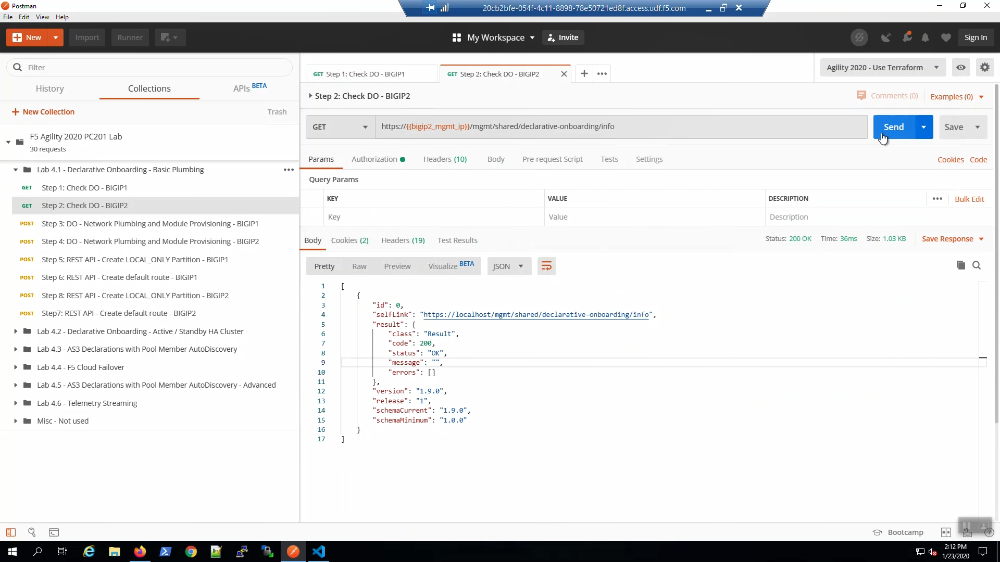
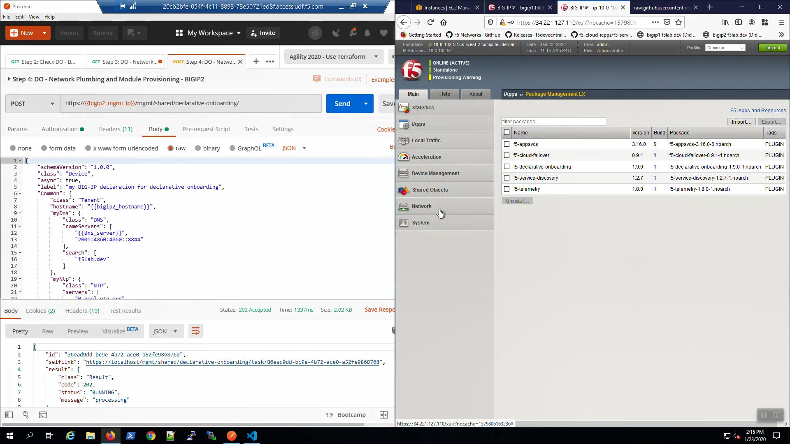
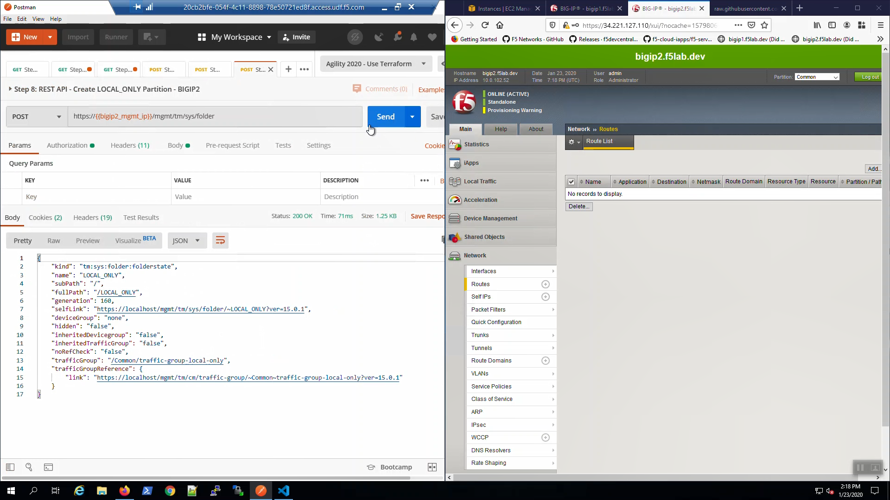

Check Declarative Onboarding (DO) is Ready
------------------------------------------

From Postman, "Lab - Declarative Onboarding - Basic Plumbing" => "Step 1: Check DO - BIGIP1" => [Send].

Status 200 OK response signals that Declarative Onboarding iControl LX is ready on Big-IP1.

.. image:: ./images/1_postman_bigip1_check_do.png
	   :scale: 50%

From Postman, "Lab - Declarative Onboarding - Basic Plumbing" => "Step 2: Check DO - BIGIP2" => [Send].

Status 200 OK response signals that Declarative Onboarding iControl LX is ready on Big-IP2.

Basic network plumbing and services
-----------------------------------

From Postman, "Lab - Declarative Onboarding - Basic Plumbing" => "Step 3: DO - Network Plumbing and Module Provisioning - BIGIP1" => [Send]

.. image:: ./images/3_postman_bigip1_do.png
	   :scale: 50%

Change the HTTP method from POST to GET and click "Send". You can do this often to track the status of the DO declaration in the Response. Status 202 indicates the declaration was successfully submitted and is being processed, Status 200 indicates the declaration has successfully completed.

.. image:: ./images/4_postman_bigip1_get_do_status.png
	   :scale: 50%

Eventually, the status will be 200 OK. Our DO declaration has successfully created the network plumbing on Big-IP1.

.. image:: ./images/5_postman_bigip1_do_completed.png
	   :scale: 50%

From Postman, "Lab - Declarative Onboarding - Basic Plumbing" => "Step 4: DO - Network Plumbing and Module Provisioning - BIGIP2" => [Send]

Change the HTTP method from POST to GET and click "Send". You can do this often to track the status of the DO declaration in the Response. Status 202 indicates the declaration was successfully submitted and is being processed, Status 200 indicates the declaration has successfully completed.

.. image:: ./images/13_postman_bigip2_get_do_status.png
	   :scale: 50%

Eventually, the status will be 200 OK. Our DO declaration has successfully created the network plumbing on Big-IP2.

.. image:: ./images/14_postman_bigip2_do_completed.png
	   :scale: 50%

On Big-IP1, Network => VLANs. traffic VLAN was created via DO.

.. image:: ./images/6_bigip1_do_vlan.png
	   :scale: 50%

On Big-IP1, Network => Self IPs. traffic-self VLAN was created via DO.

.. image:: ./images/7_bigip1_do_self_ip.png
	   :scale: 50%

On Big-IP1, Network => Interfaces. Interface 1.1 is UP.

.. image:: ./images/8_bigip1_do_interfaces.png
	   :scale: 50%

On Big-IP1, System => Configuration => Device => NTP was configured.

.. image:: ./images/9_bigip1_do_ntp.png
	   :scale: 50%

On Big-IP1, System => Configuration => Device => DNS was configured.

.. image:: ./images/10_bigip1_do_dns.png
	   :scale: 50%

On Big-IP1, Network => Routes. No routes.

.. image:: ./images/11_bigip1_do_no_route.png
	   :scale: 50%

On Big-IP2, Network. => Routes. No routes.

.. image:: ./images/13_postman_bigip2_get_do_status.png
	   :scale: 50%

Default route in LOCAL_ONLY partition for Cloud Failover
--------------------------------------------------------

For cloud fail-over we need to create routes in a dedicated "LOCAL_ONLY" partition.

From Postman, "Lab - Declarative Onboarding - Basic Plumbing" => "Step 5: REST API - Create LOCAL_ONLY Partition - BIGIP1" => [Send].

.. image:: ./images/15_postman_bigip1_create_local_only_partition.png
	   :scale: 50%

From Postman, "Lab - Declarative Onboarding - Basic Plumbing" => "Step 6: REST API - Create default route - BIGIP1" => [Send].

.. image:: ./images/16_postman_bigip1_create_default_route.png
	   :scale: 50%

From Postman, "Lab - Declarative Onboarding - Basic Plumbing" => "Step 7: REST API - Create LOCAL_ONLY Partition - BIGIP2" => [Send].

From Postman, "Lab - Declarative Onboarding - Basic Plumbing" => "Step 8: REST API - Create default route - BIGIP2" => [Send].

.. image:: ./images/19_postman_bigip2_create_default_route.png
	   :scale: 50%

On Big-IP1, Network => Routes => Select the "LOCAL_ONLY" partition from the drop down in the upper-right-hand corner. The Default route was created.

.. image:: ./images/17_bigip1_default_route.png
	   :scale: 50%

Confirm the a default route was created in the LOCAL_ONLY partition of Big-IP2 as well.
