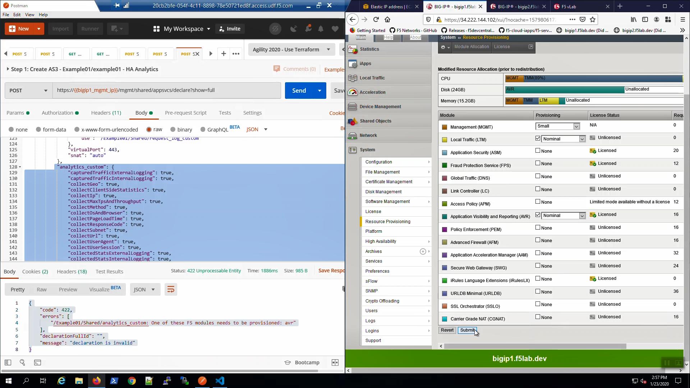
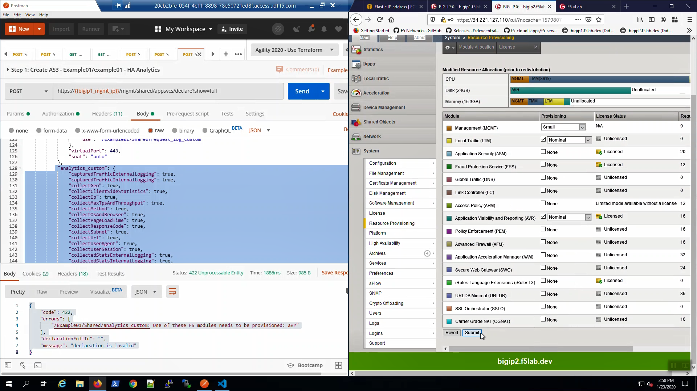
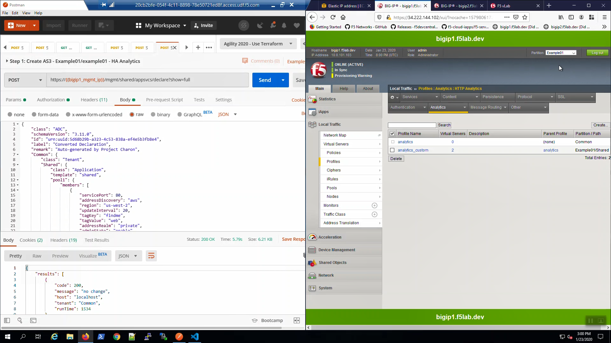
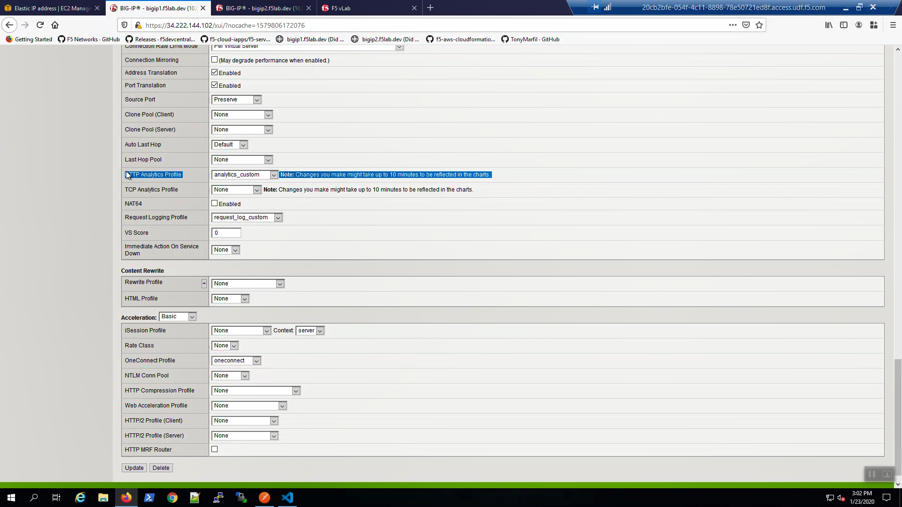
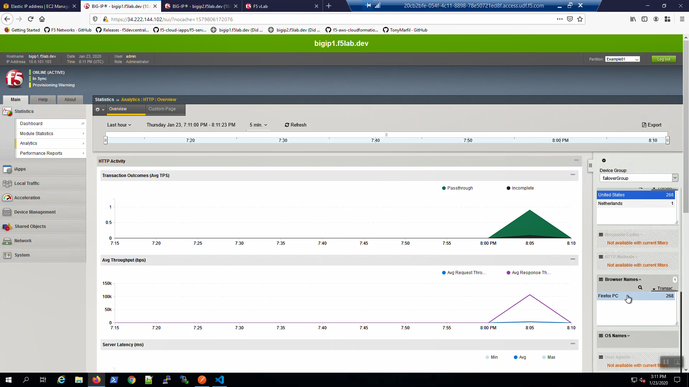

Provision the Application Visibility and Reporting (AVR) Module
---------------------------------------------------------------

From Postman, “Lab - AS3 Declarations with Pool Member AutoDiscovery - Advanced” => “Step 1: Create AS3 - Example01/example01 - HA Analytics” => [Send].

.. image:: ./images/1_postman_analytics_sending.png
	   :scale: 50%

.. image:: ./images/2_postman_analytics_send_error.png
	   :scale: 50%

"Status: 422 Unprocessable Entity" tells us there was a problem with the declaration. AS3 errors are verbose and will help you troubleshoot. Looks like "...One of these F5 modules needs to be provisioned: avr"

That's clear. Let's provision the Application Visibility and Reporting (AVR) module.

From Big-IP1, System => Resource Provisioning => provision "Application Visibility and Reporting (AVR)" [*] Nominal.

Scroll down and click [Submit].

Wait for Big-IP1 to provision AVR and confirm:

.. image:: ./images/5_bigip1_confirm_avr.png
	   :scale: 50%

Do the same for Big-IP2: System => Resource Provisioning => provision "Application Visibility and Reporting (AVR)" [*] Nominal.

Scroll down and click [Submit].

F5 AS3 Declaration for HTTP Analytics
-------------------------------------

From Postman, “Lab - AS3 Declarations with Pool Member AutoDiscovery - Advanced” => “Step 1: Create AS3 - Example01/example01 - HA Analytics” => [Send].

"Status: 200 OK" response signals that the Application Services 3 Extension (AS3) declaration was processed and completed successfully.

.. image:: ./images/6_postman_analytics_sending.png
	   :scale: 50%

.. image:: ./images/6_postman_analytics_completed.png
	   :scale: 50%

From Big-IP1, in the Example01 partition, Local Traffic => Profiles => Analytics. Click on "analytics_custom". A custom analytics profile was created.

...explore the "analytics_custom" settings. Under "Associated Virtual Servers", note the profile was applied to both example01a and example01b virtual servers.

.. image:: ./images/8_bigip1_analytics_profile2.png
	   :scale: 50%

From Local Traffic => Virtual Servers => Click on "example01a". Scroll down to "HTTP Analytics Profile". The "analytics_custom" profile was applied.

On Big-IP2, you can see the Config Sync works and the Analytics profile was created and applied on Big-IP2 as well.

Generate Traffic and Explore HTTP Analytics
-------------------------------------------

From the browser, refresh the tab with the example HTTPS application. We are using self-signed certificates in the lab. If prompted, bypass the TLS warnings. “Accept the Risk and Continue”.

Hit [CTRL] + [F5] a few times to refresh the page and generate some sample traffic.

.. image:: ./images/9_bigip1_analytics_example_app_bypass_warning.png
	   :scale: 50%

.. image:: ./images/10_bigip1_analytics_example_app_generate_traffic.png
	   :scale: 50%

Open the Chrome web browser. Hit the example HTTPS application from the Chrome web browser. We are using self-signed certificates in the lab. If prompted, bypass the TLS warnings. “Accept the Risk and Continue”.

You may generate sample data from a browser outside of the Remote Desktop Session as well.

Hit [CTRL] + [F5] a few times to refresh the page and generate some sample traffic. The reason for using two browsers is to generate sample traffic from two User-Agents to show in the analytics logs later. 

.. attention::

  If you don't hit the example site from a new browser, you won't generate any analytics data.
  
From the active Big-IP (Big-IP1 in the screenshots, but yours might differ), Statistics => Analytics => HTTP. Explore the Analytics dashboard. You may see a few surprises such as traffic not generated by you for the lab!

.. attention::

  Analytics data may take up to five minutes to show up in the Analytics dashboard. You may move on to the next section now and revisit the Analytics dashboard at the end of the lab.