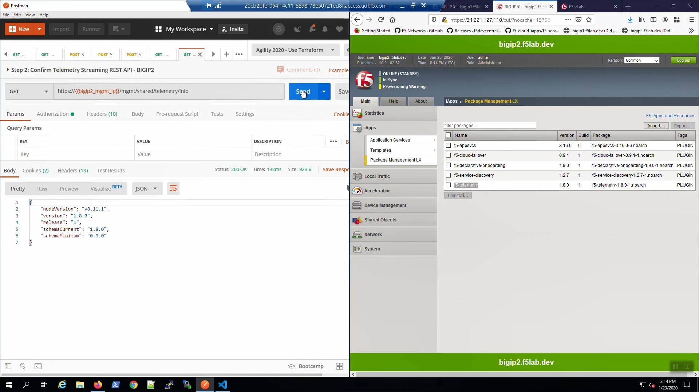
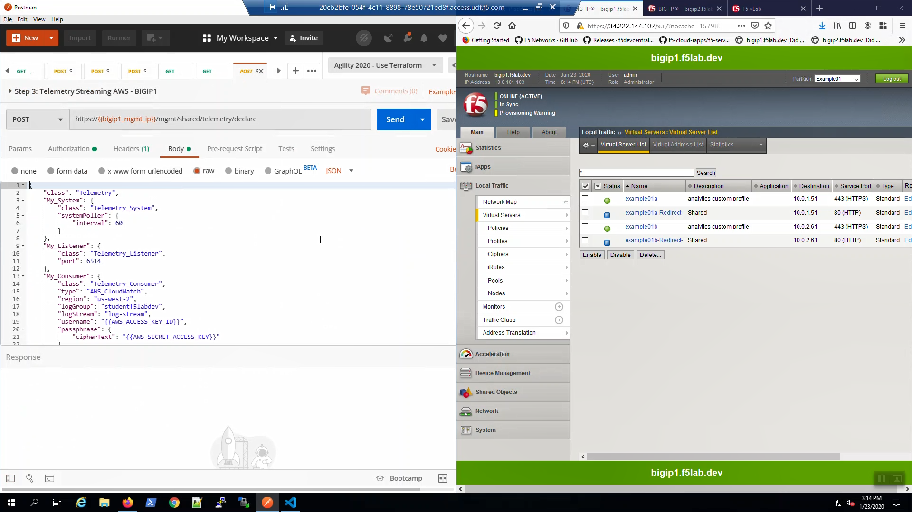

F5 Telemetry Streaming (TS) to AWS CloudWatch
---------------------------------------------

From Big-IP1, iApps => Package Management LX. Note the f5-telemetry package is installed.

Do the same for Big-IP2.

.. image:: ./images/1_bigip1_telemetry_streaming_icontrol_lx_installed.png
	   :scale: 50%

From Postman, “Lab - Telemetry Streaming” => “Step 1: Confirm Telemetry Streaming REST API - BIGIP1” => [Send].

"Status: 200 OK" response signals that the Telemetry Streaming Extension (TS) is ready on Big-IP1.

.. image:: ./images/2_postman_telemetry_streaming_status_bigip1.png
	   :scale: 50%

From Postman, “Lab - Telemetry Streaming” => “Step 2: Confirm Telemetry Streaming REST API - BIGIP2” => [Send].

"Status: 200 OK" response signals that the Telemetry Streaming Extension (TS) is ready on Big-IP2.

From Postman, “Lab - Telemetry Streaming” => “Step 3: Telemetry Streaming AWS - BIGIP1” => [Send].

"Status: 200 OK" response signals that the Telemetry Streaming Extension (TS) declaration successfully completed processing on Big-IP1.

.. image:: ./images/5_postman_telemetry_streaming_completed_bigip1.png
	   :scale: 50%

Do the same for Big-IP2. From Postman, “Lab - Telemetry Streaming” => “Step 4: Telemetry Streaming AWS - BIGIP2” => [Send].

"Status: 200 OK" response signals that the Telemetry Streaming Extension (TS) declaration successfully completed processing on Big-IP2.

.. image:: ./images/6_postman_telemetry_streaming_completed_bigip2.png
	   :scale: 50%

From the AWS Console, Services => type "cloudwatch" in the search box, choose "CloudWatch" from the drop-down results.

.. image:: ./images/7_aws_console_search_cloudwatch.png
	   :scale: 50%

From the AWS Console, CloudWatch => Logs => Log Groups => studentf5labdev => log-stream. Hit the refresh icon frequently.

.. image:: ./images/8_aws_console_cloudwatch_logstream.png
	   :scale: 50%

Eventually you will see telemetry data from hostname: bigip1.f5lab.dev and hostname: bigip2.f5lab.dev appearing in to the log-stream.

.. image:: ./images/9_aws_console_cloudwatch_telemetry_streaming.png
	   :scale: 50%

.. image:: ./images/10_aws_console_cloudwatch_telemetry_streaming2.png
	   :scale: 50%
