Login to F5's lab platform (Unified Demo Framework) and launch a remote desktop session
=======================================================================================

Follow the link in your email invite and login to the lab environment.

Your Deployment => Systems => win2019 => DETAILS. Copy the Administrator password to your clipboard. The password starts immediately after Administrator:

.. image:: ./images/00_admin_pass.png
  :scale: 50%

Click [Done] in the lower right-hand corner.

Under win2019, from the ACCESS drop-down, select RDP and resolution. The lab looks best in FHD (1920 x 1080). This will download the rdp file to your computer. Launch the RDP file and login via RDP using the Administrator credentials. Copy and paste credentials from your clipboard.

.. image:: ./images/01_rdp.png
  :scale: 50%

When prompted with the blue "Networks" message click "Yes".

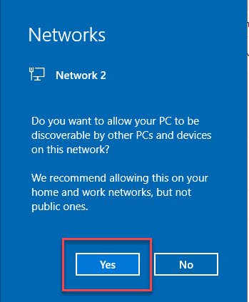

.. attention::

  Before proceeding, wait 30 seconds for the Visual Studio Code and Postman applications to start automatically.

You can run the entire lab from within the Windows jump host.

Visual Studio Code => View => Terminal

You will see:
  - AWS Console URL
  - AWS Console Username
  - AWS Console Password

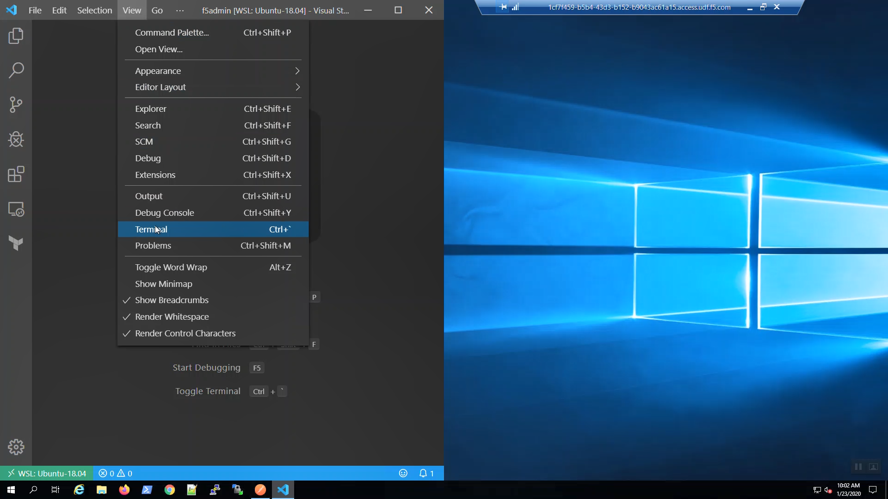

Maximize the Terminal Window by clicking on the ^ in the upper-right-hand corner of the Terminal.

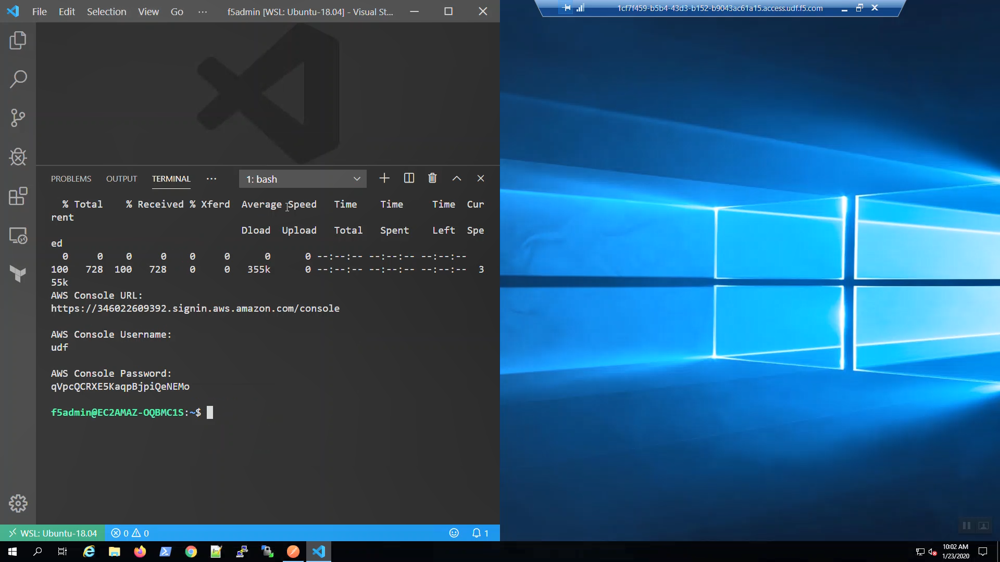

Login to AWS Console
====================

A URL shortcut has been auto-generated on the Windows desktop: "Amazon Web Services Sign-In".

First, launch Firefox from the taskbar, then click on the "Amazon Web Services Sign-In" URL shortcut on the Desktop.

If the Firefox resolution in your RDP session renders components off-screen, try to first launch Firefox from the taskbar *before* you click on the "Amazon Web Services Sign-In" URL shortcut on the Desktop. 

Alternatively, you can CTRL+click the "AWS Console URL:" https shortcut in the Visual Studio Code terminal.

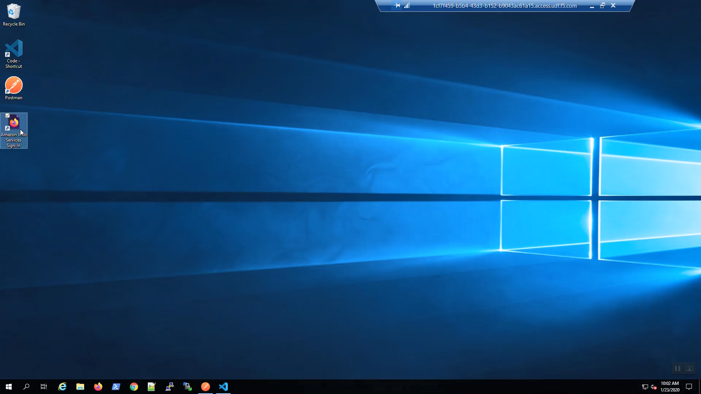

Login to the AWS web console with the credentials shown in your terminal.

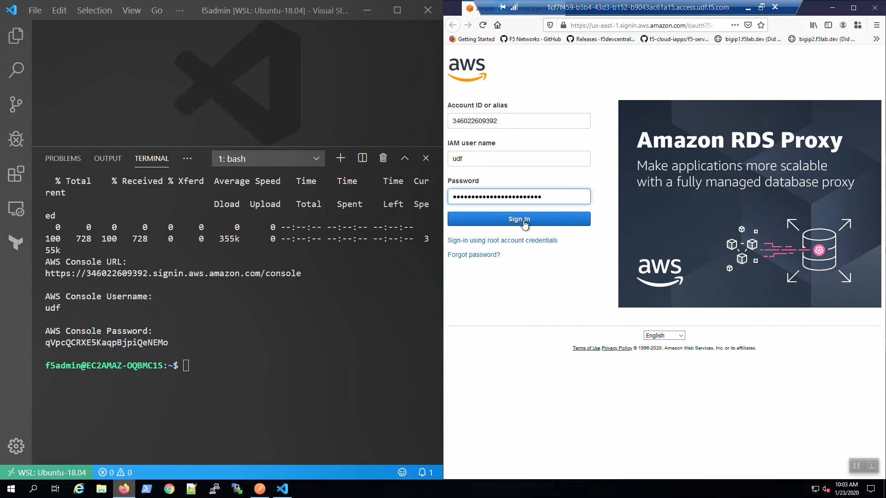

In the upper-right-hand corner, choose US-West (Oregon) us-west-2 region.

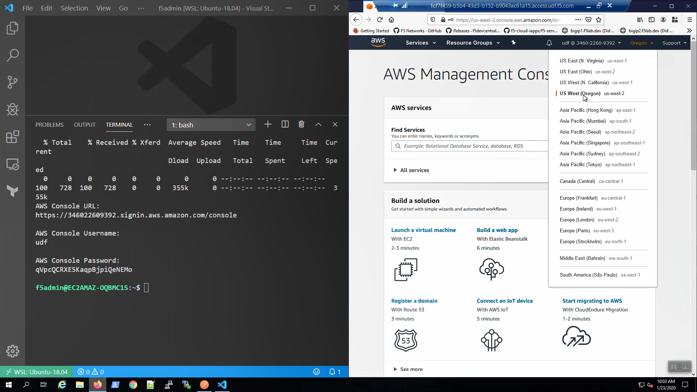

"Services" => type "marketplace" in the search window. Select "AWS Marketplace Subscriptions" from the search results. Right-click on "Manage subscriptions" to open a new tab.
=> "Discover products"
Type "f5 advanced 25mbps" in the search box. => "F5 Advanced WAF (PAYG, 25Mbps)" => "Continue to Subscribe" => "Accept Terms"

.. image:: ./images/6_aws_marketplace_accept_terms_f5.png
  :scale: 50%

Track "Effective date" and "Expiration date". When they are no longer "Pending" you can proceed.

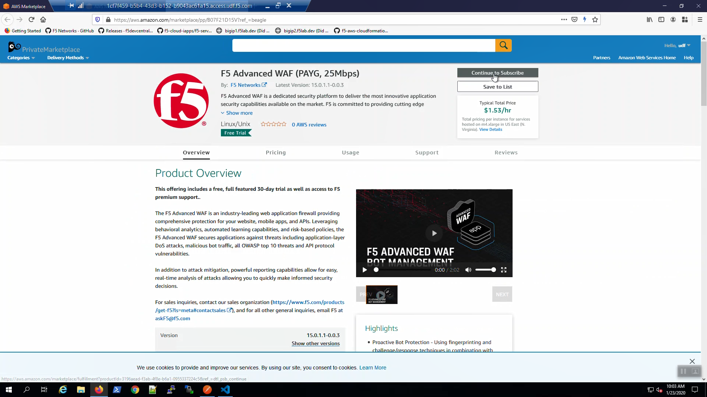

Create an AWS VPC with Terraform
================================

From the Visual Studio Code Terminal, clone the github repository for this lab and change to the working directory.

.. attention::

  For a smooth ride, always invoke commands from inside the cloned git repository (f5agility2020-pc101). To check you're in the right place, you can run the command ``pwd`` and the output should read ``/home/f5admin/f5agility2020-pc101``

.. code-block:: bash

   git clone https://github.com/TonyMarfil/f5agility2020-pc101.git
   cd f5agility2020-pc101/

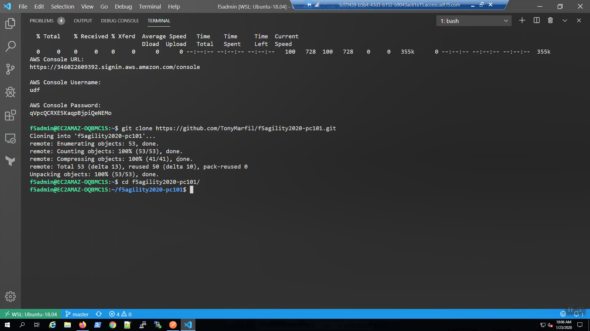

Run the start.sh script to set environment variables and make the ./scripts directory executable

.. code-block:: bash

    source ./start.sh

Create an SSH key and upload to your AWS account. We'll later use this key to connect to our F5 instances.

.. code-block:: bash

  create-ssh-keys.sh

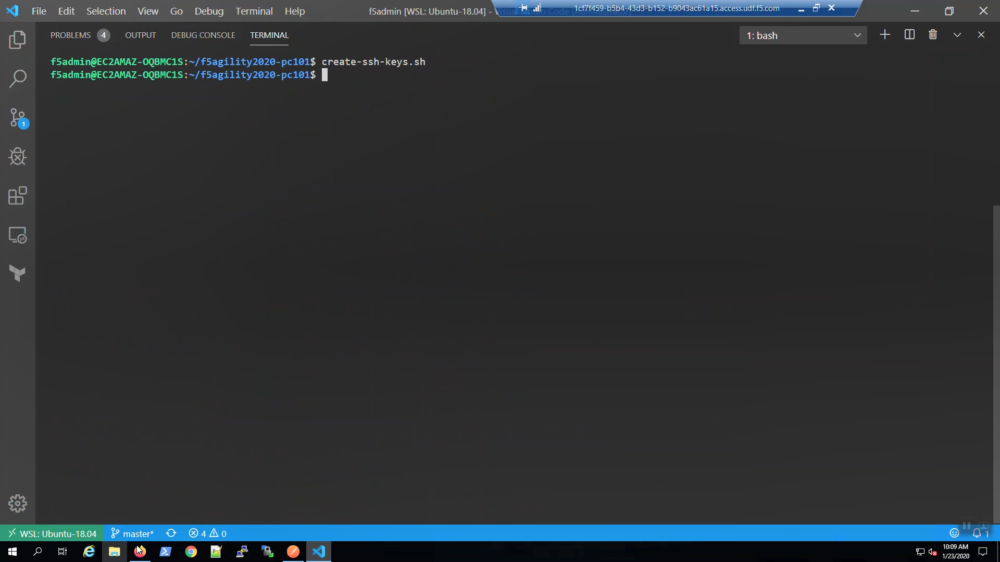

From the AWS Console => Services => EC2 => Key pairs. Confirm your ssh key was created.

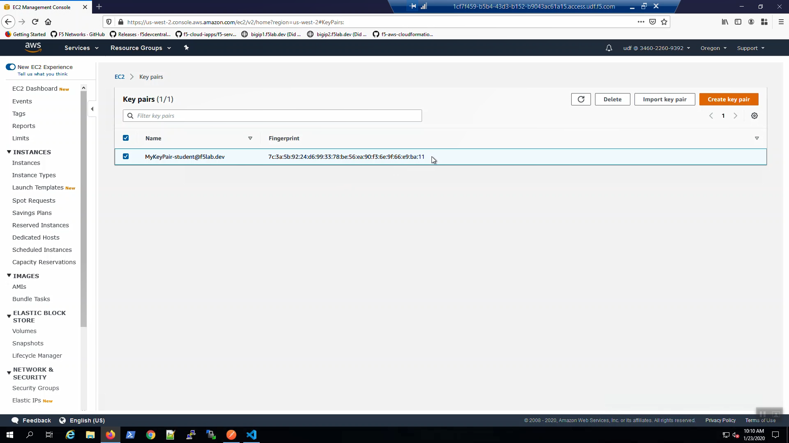

Initialize Terraform modules.

.. code-block:: bash

    terraform init

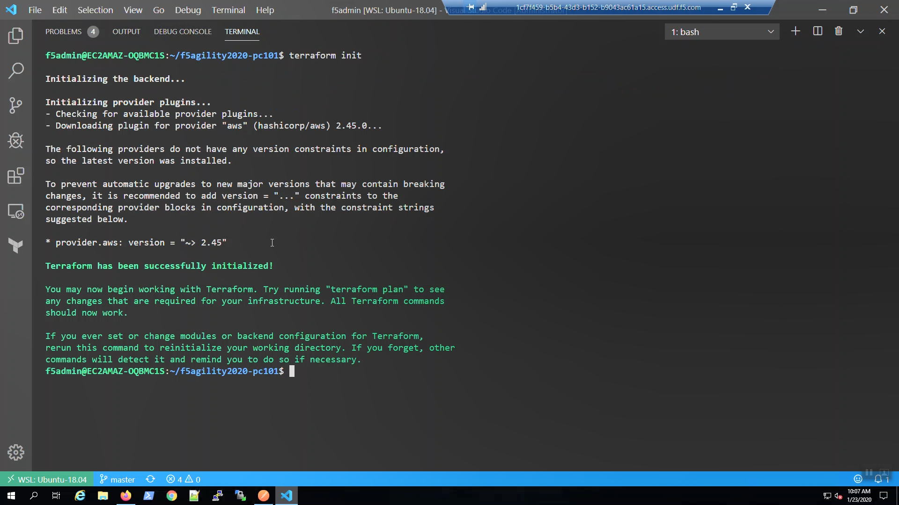

Validate Terraform files and create a terraform dependency graph.

.. code-block:: bash

    terraform validate
    create-terraform-dependency-graph.sh

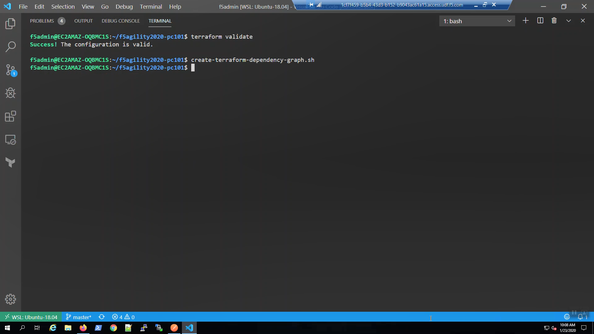

From the Windows desktop, click on the "terraform_dependancy_graph" URL shortcut. Review in your browser. Terraform creates a dependency of all of the objects in your environment. This is one of the major advantages to using a declarative tool for building infrastructure and services.

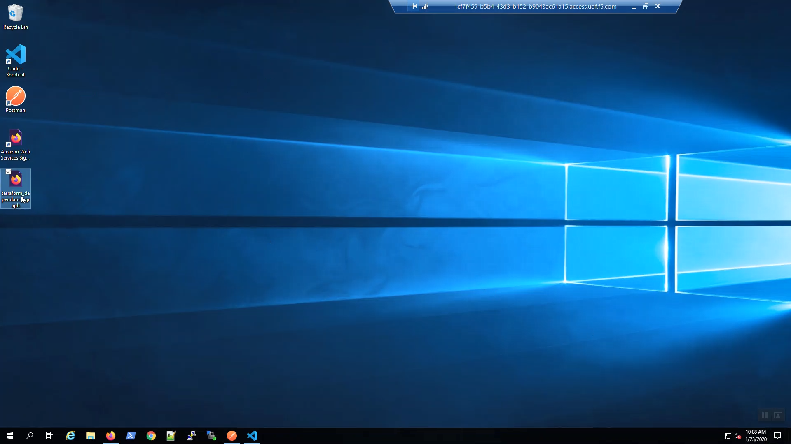

.. image:: ./images/13_terraform_dependency_graph_svg.png
  :scale: 50%

From the Visual Studio Code Terminal

.. code-block:: bash

   terraform plan -var 'bigip_admin_password=f5letme1n'
   terraform apply -var 'bigip_admin_password=f5letme1n' -auto-approve

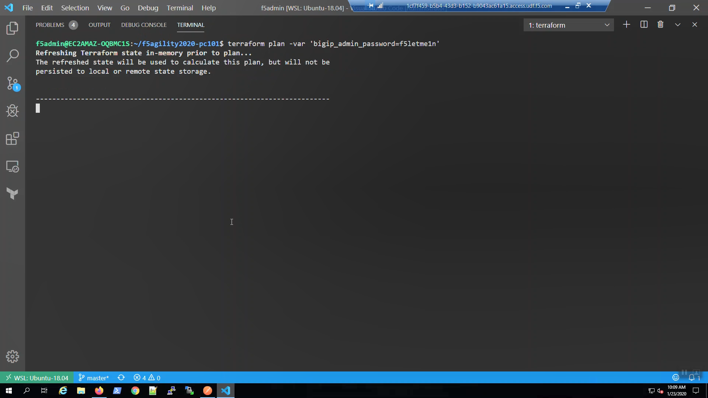

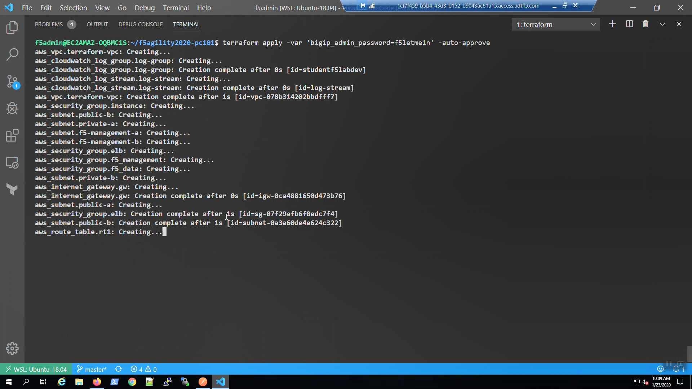

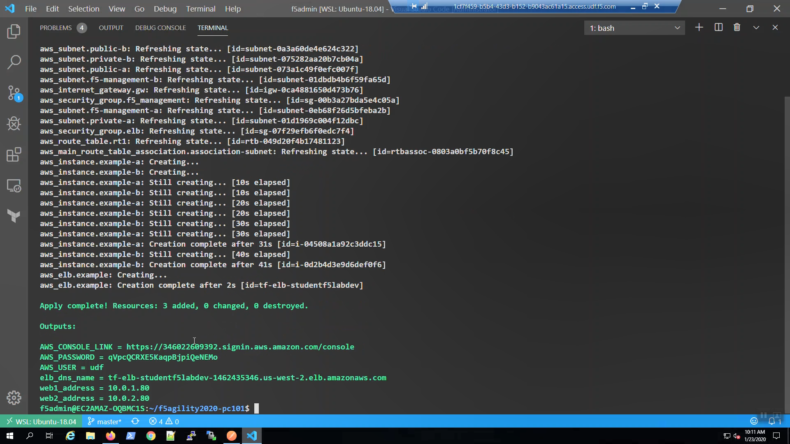

Review the terraform output when complete. You can always get the terraform output details again by invoking from the terminal:

.. code-block:: bash

   terraform output

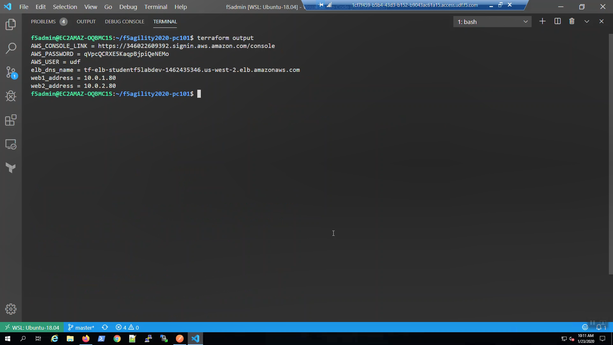
