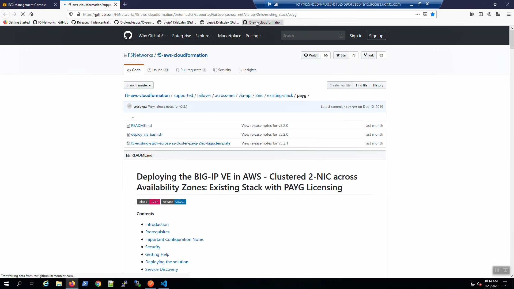
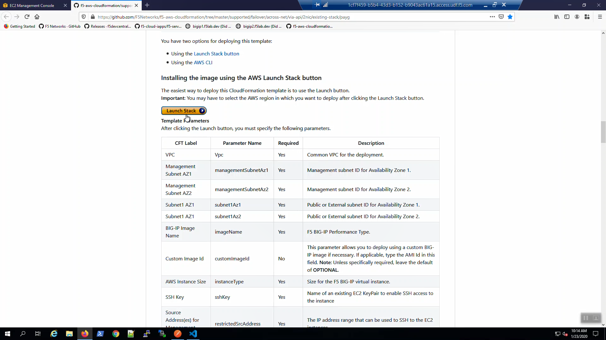
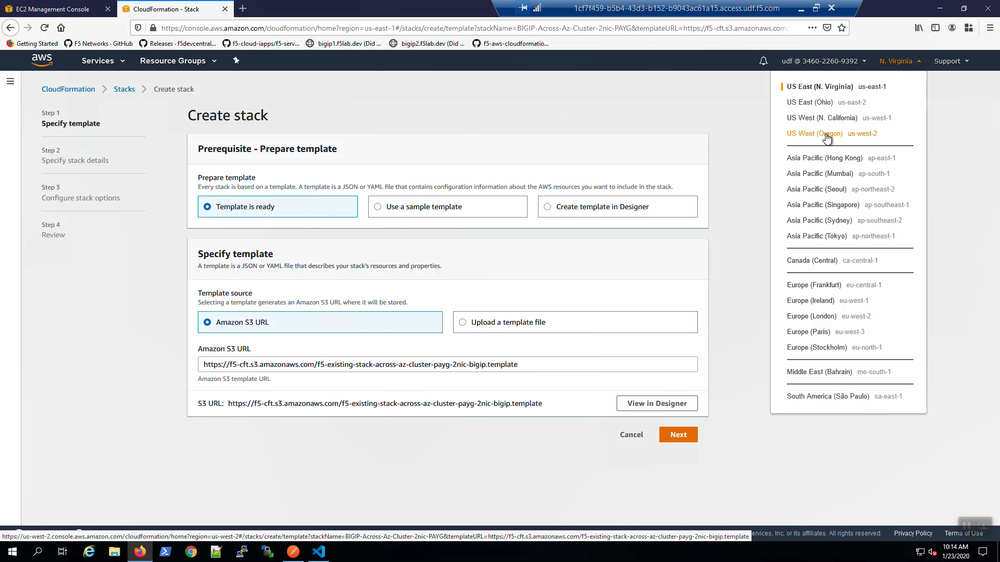
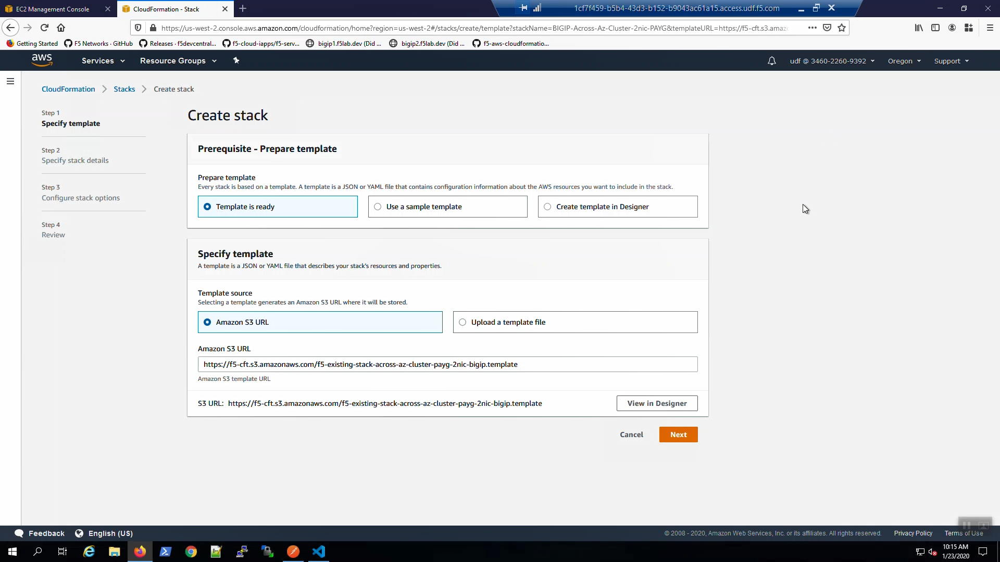
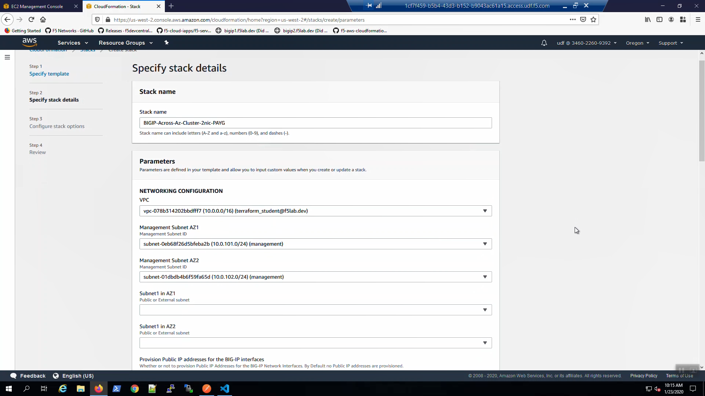
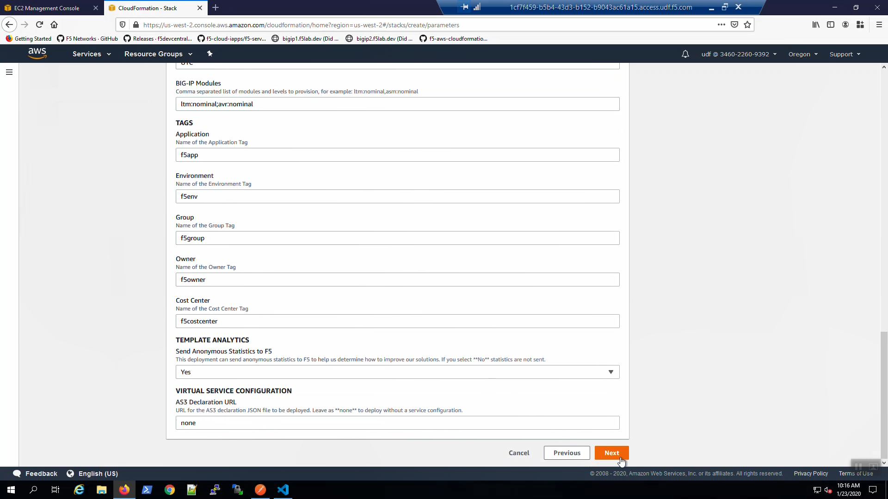
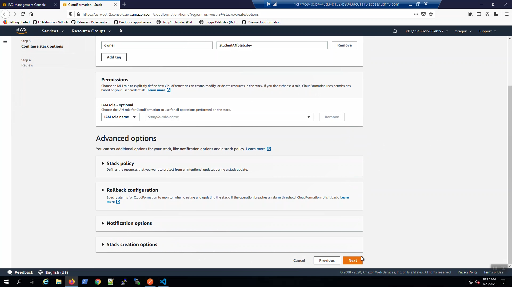
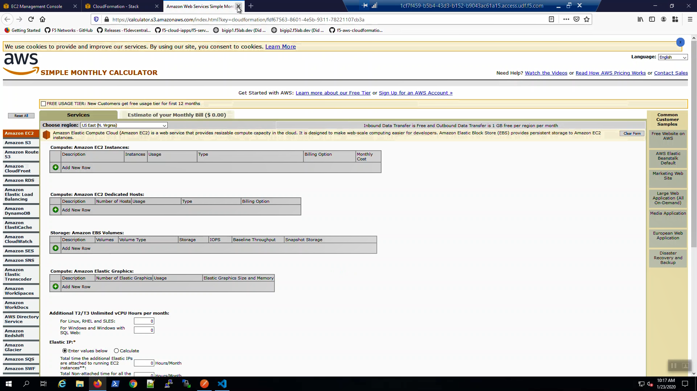
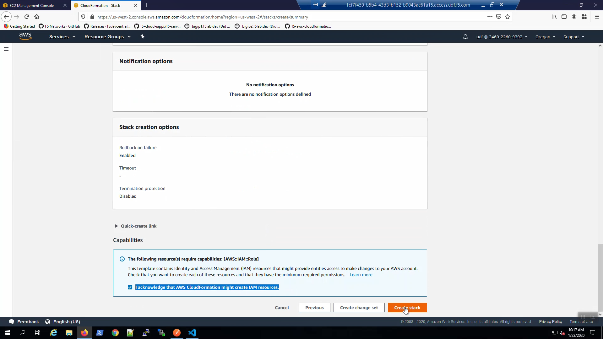
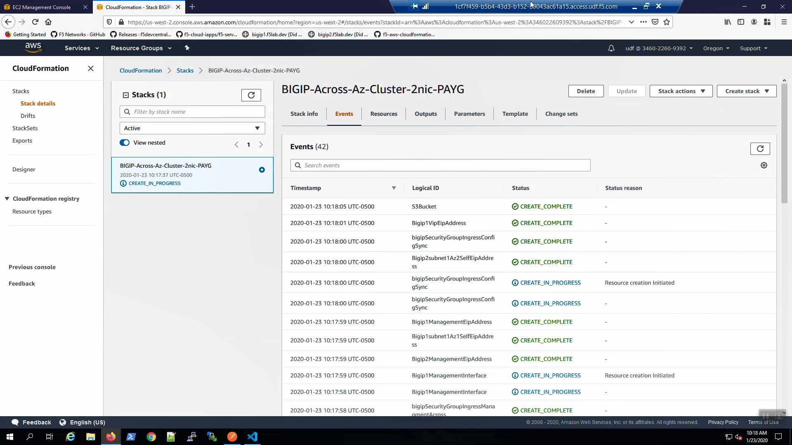

F5 CloudFormation templates on Github
-------------------------------------

Open a new tab in the web browser. Click on the "f5-aws-cloudformation" URL bookmark in the bookmark toolbar. Supported F5 CloudFormation templates are hosted on the official F5 GitHub repo: https://github.com/F5Networks/.

Scroll down and click on "Launch Stack".

Choose "US West (Oregon) us-west-2 from the region drop-down menu in the upper-right-hand side.

Scroll down and click on "Next"

Fill in the CloudFormation template parameters. Leave defaults where not explicitly called out below.

+--------------------------------------------------------+------------------------------------------------------+
| Parameter                                              | Value                                                |
+========================================================+======================================================+
| **NETWORKING CONFIGURATION**                                                                                  |
+--------------------------------------------------------+------------------------------------------------------+
| VPC                                                    | (10.0.0.0/16)(terraform_student@f5lab.dev)           |
+--------------------------------------------------------+------------------------------------------------------+
| Management Subnet AZ1                                  | (10.0.101.0/24)(management)                          |
+--------------------------------------------------------+------------------------------------------------------+
| Management Subnet AZ2                                  | (10.0.102.0/24)(management)                          |
+--------------------------------------------------------+------------------------------------------------------+
| Subnet1 in AZ1                                         | (10.0.1.0/24)(public)                                |
+--------------------------------------------------------+------------------------------------------------------+
| Subnet1 in AZ2                                         | (10.0.2.0/24)(public)                                |
+--------------------------------------------------------+------------------------------------------------------+
| **INSTANCE CONFIGURATION**                                                                                    |
+--------------------------------------------------------+------------------------------------------------------+
| BIG-IP Image Name                                      | AdvancedWaf25Mbps                                    |
+--------------------------------------------------------+------------------------------------------------------+
| SSH Key                                                | MyKeyPair-student@f5lab.dev                          |
+--------------------------------------------------------+------------------------------------------------------+
| Source Address(es) for Management Access               | 0.0.0.0/0                                            |
+--------------------------------------------------------+------------------------------------------------------+
| Source Address(es) for Web Application Access (80/443) | 0.0.0.0/0                                            |
+--------------------------------------------------------+------------------------------------------------------+
| NTP Server                                             | 0.pool.ntp.org                                       |
+--------------------------------------------------------+------------------------------------------------------+
| Timezone (Olson)                                       | UTC                                                  |
+--------------------------------------------------------+------------------------------------------------------+
| BIG-IP Modules                                         | ltm:nominal,avr:nominal                              |
+--------------------------------------------------------+------------------------------------------------------+

Scroll to the bottom of the CloudFormation template and click [Next].

Click on "Estimate cost".

.. image:: ./images/7_f5_aws_cloudformation_estimate_cost1.png
  :scale: 50%

You can estimate the cost of running this CloudFormation stack with the AWS Simple Monthly Calculator. Review and close this screen.

Scroll to the bottom of the CloudFormation template. Acknowledge that AWS CloudFormation might create IAM resources and [Create stack].

Watch as your resources are built in AWS by refreshing the CloudFormation Events screen.

