Explore AWS Environment
-----------------------

Services => VPC => Your VPCs. A VPC (Virtual Private Cloud) was created by Terraform. All of our supporting infrastructure will run inside this VPC.

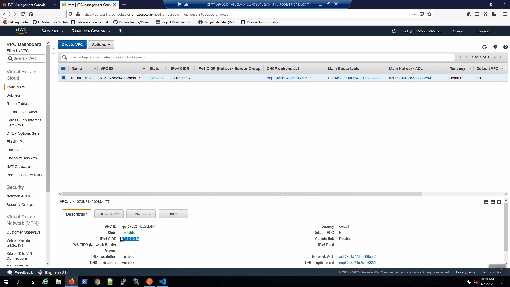

Services => VPC => Internet Gateways. An Internet Gateway was created to allow instances in our VPC to connect to the Internet.

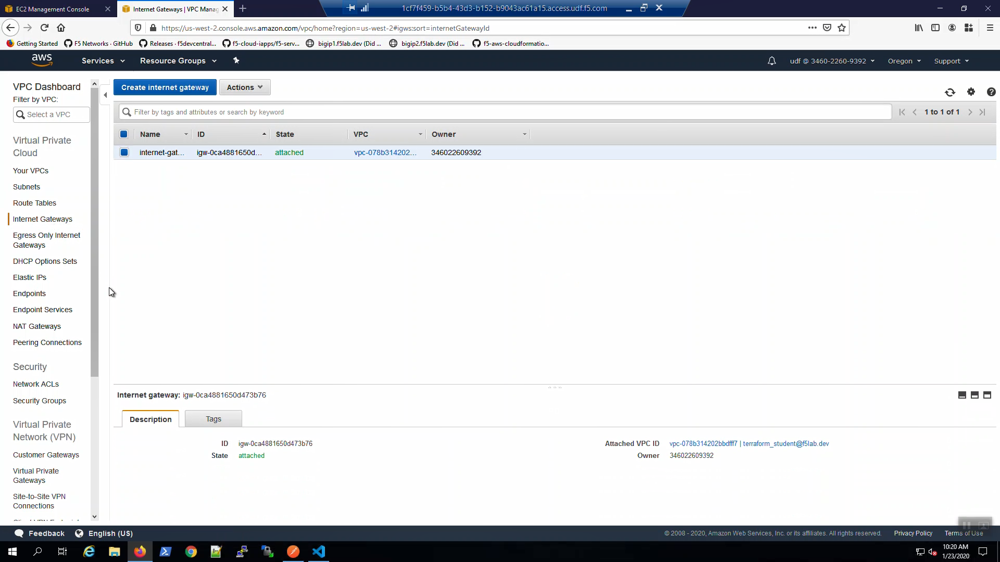

Services => VPC => Subnets. Terraform created management and traffic subnets (both public and private) across two Availability Zones: us-wesst-2a and us-west-2b.

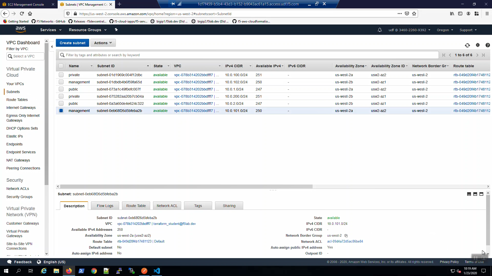

Services => VPC => Elastic IPs. Elastic IPs are public IP addresses assigned to the management and traffic interfaces of the F5 Virtual Editions deployed. 

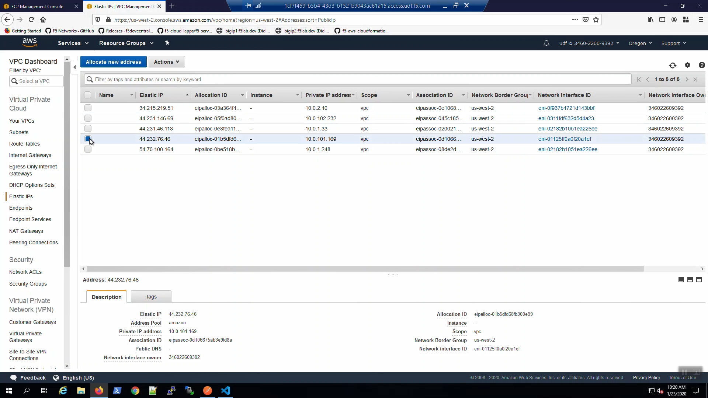

Services => VPC => Security Groups. Security Groups are stateful port filters applied to either instances or network interfaces.

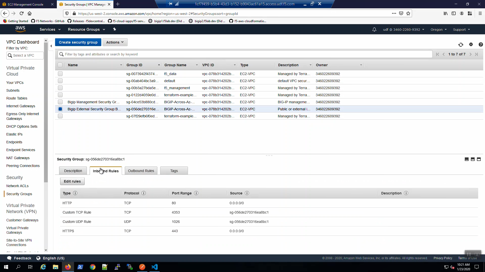

.. image:: ./images/6_aws_console_explore_security_groups_mgmt.png
  :scale: 50%

Services => CloudFormation. The CloudFormation Stack "BIGIP-Across-Az-Cluster-2nic-PAYG" will quickly show status of "CREATE_COMPLETE"

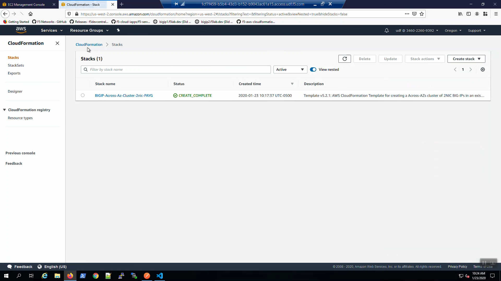

Services => EC2 => Instances. Two example NGINX web servers were deployed: web-az1 and web-az2. The "findme : web" tag will be used later in the lab so that our F5 Virtual Edition can auto-discover its pool members.

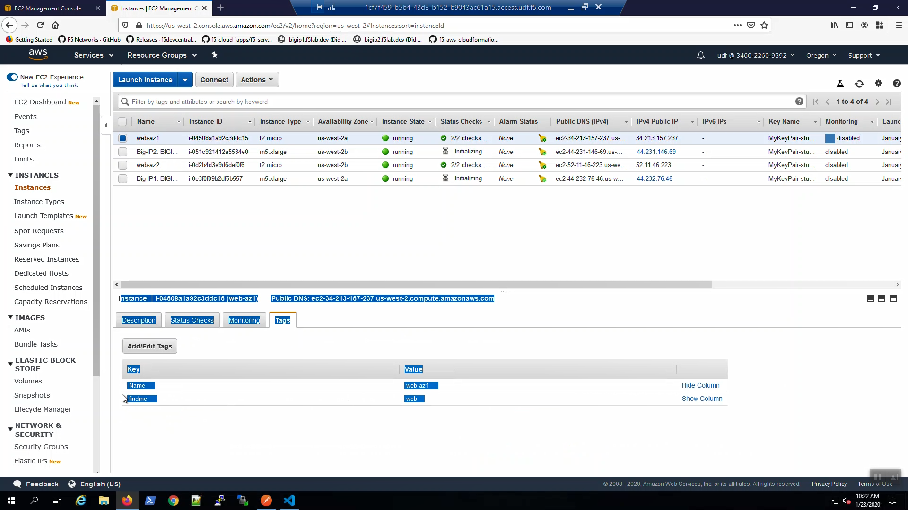

The "Big-IP1" and "Big-IP2" F5 instances are still "Initializing" and will come online shortly.

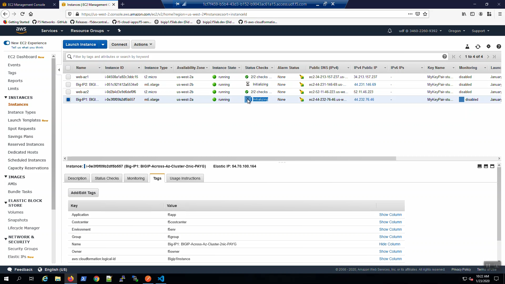

Services => CloudFormation => Stacks => "BIGIP-Across-Az-Cluster-2nic-PAYG" => Events. When you deploy via CloudFormation template, all of the steps to build the F5 in AWS environment are recorded as CloudFormation Events.

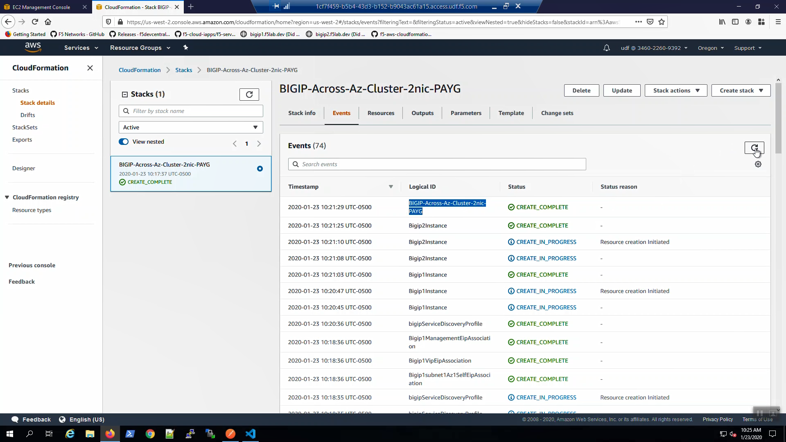

The CloudFormation template created a pair of F5 Virtual Edition instances and many other supporting resources. All of the resources created by CloudFormation are recorded here.

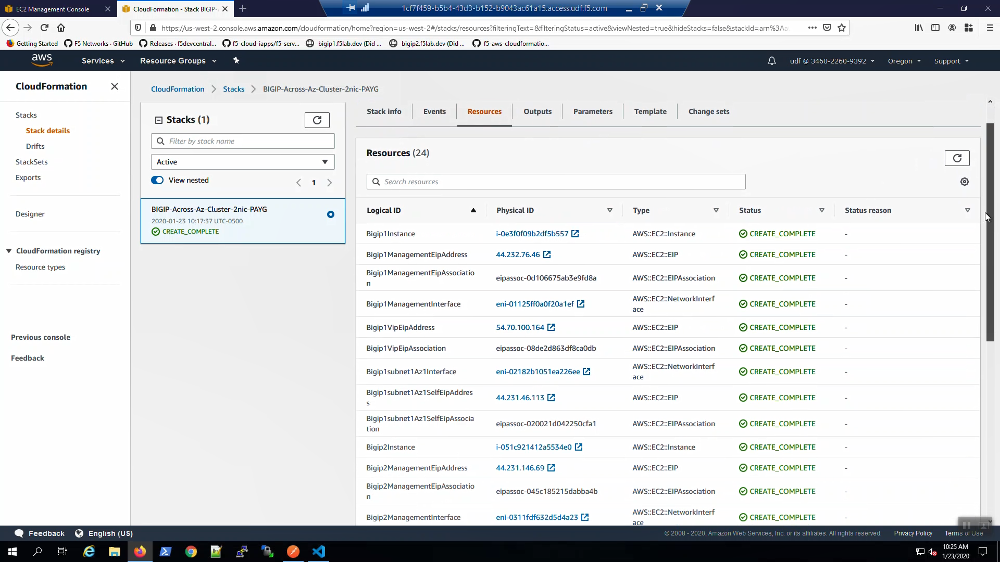

The CloudFormation stack will compute output attributes and report them here. What's the public management IP addresses URL for Big-IP1? What is the Virtual Server Elastic IP address? These sorts of questions can be answered by querying the CloudFormation stack outputs. We make use of this useful convenience in a future lab section.

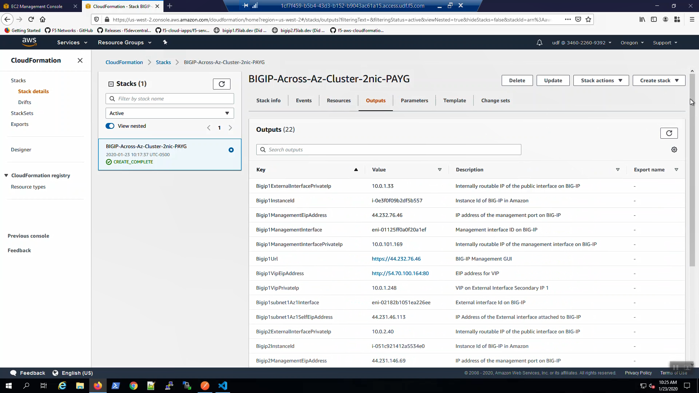

CloudFormation parameters will report on the values fed into the CloudFormation template. Look here to confirm a value or when you suspect an error/typo and want to confirm.

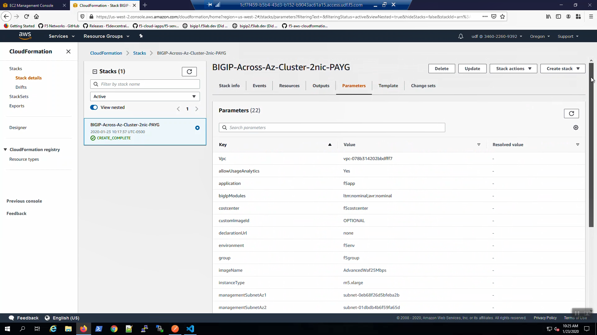

The CloudFormation template can be customized when you need to deviate from the default behavior.

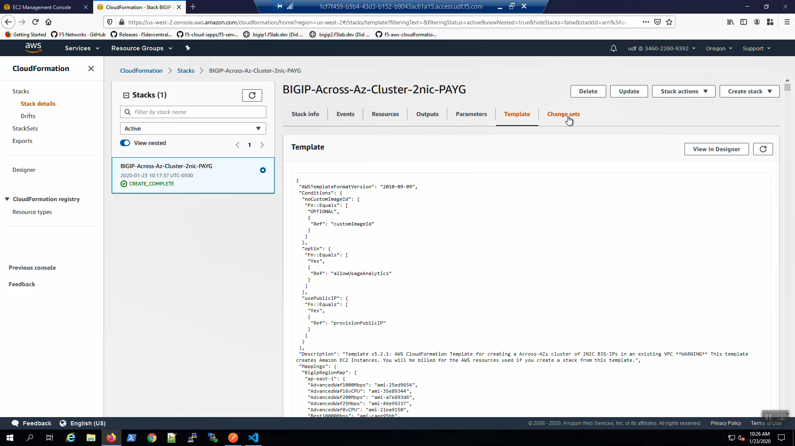
