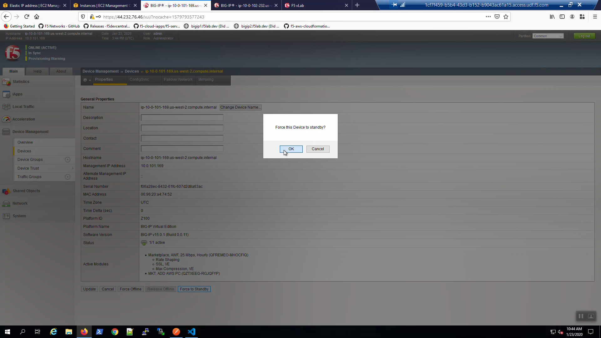

Check example application is running
------------------------------------

From the Visual Studio Code Terminal, invoke `terraform output`.

.. code-block:: bash

   terraform output | grep Bigip1VipEipAddress

...Ctrl + click on the *Bigip1VipEipAddress=*. This is the same Elastic IP we just reviewed in the AWS Console.

.. image:: ./images/11_f5_aws_console_virtual_server.png
  :scale: 50%

We are using self-signed certificates in the lab. Bypass the TLS warnings. "Accept the Risk and Continue".
You will see the example app.

.. image:: ./images/12_f5_example_app.png
  :scale: 50%

Survive a fail-over event across Availability Zones
---------------------------------------------------

From the AWS Console, Services => EC2 => NETWORK & SECURITY => Elastic IPs.
Note the Elastic IP address (public IPv4 address) mapping for the Secondary IP address of our **Active** Big-IP1 (10.0.1.x).

.. image:: ./images/13_f5_aws_console_elastic_ip_before_failover.png
  :scale: 50%

Big-IP1 => Device Management => Devices => Self => [Force to Standby]. Click [OK] to confirm.

Big-IP2 is now active.

.. image:: ./images/15_f5_bigip2_confirm_now_active.png
  :scale: 50%

From the AWS Console, Services => EC2 => NETWORK & SECURITY => Elastic IPs.
Note the Elastic IP address (public IPv4 address) mapping for the Secondary IP has changed to the new **Active** Big-IP2 (10.0.2.x).
Hit the refresh icon in the upper-right-hand side a few times until you notice the change.

.. image:: ./images/16_f5_bigip2_confirm_elastic_ip_moved.png
  :scale: 50%

Back to the example app screen. We are using self-signed certificates in the lab. Bypass the TLS warnings. "Accept the Risk and Continue".
You will see the example app now behind the new active Big-IP2.

.. image:: ./images/17_f5_bigip2_confirm_example_app.png
  :scale: 50%

.. attention::

  The example application reports which Availability Zone is serving up the content (pool member), *not* which Availability Zone is hosting the active Big-IP.