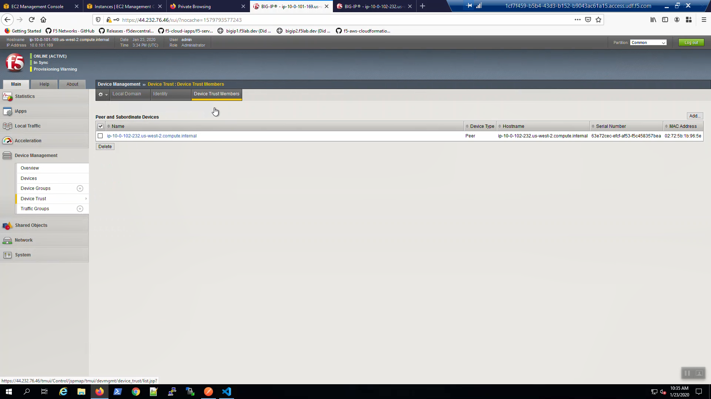
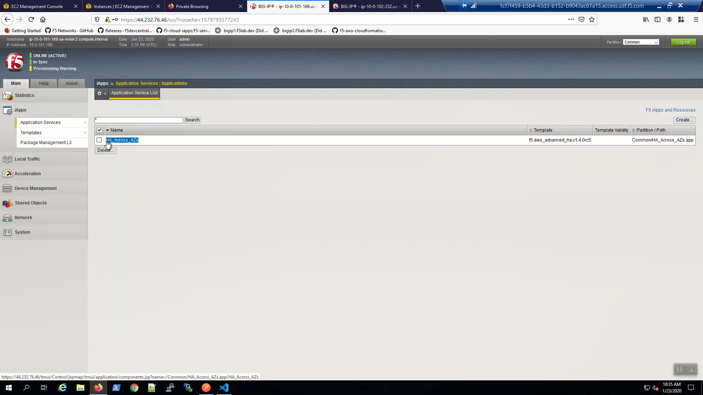
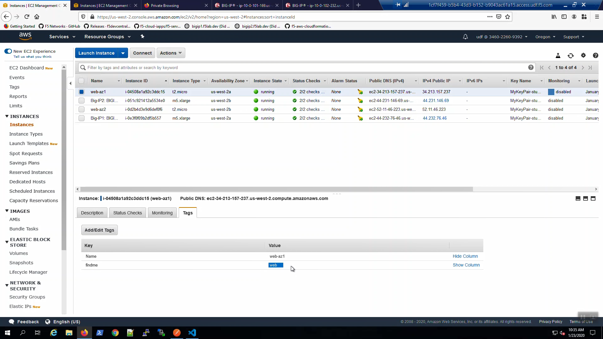
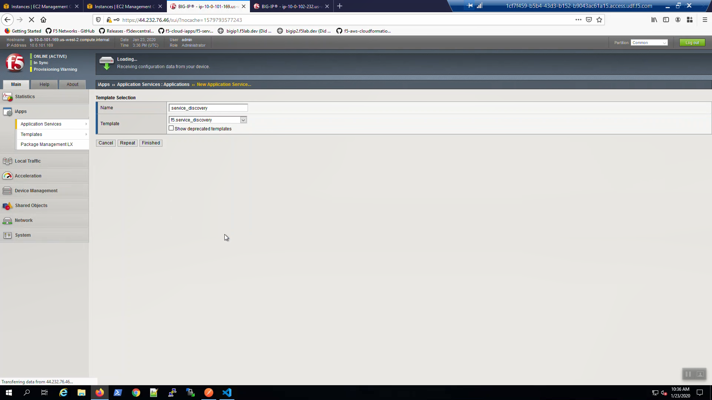
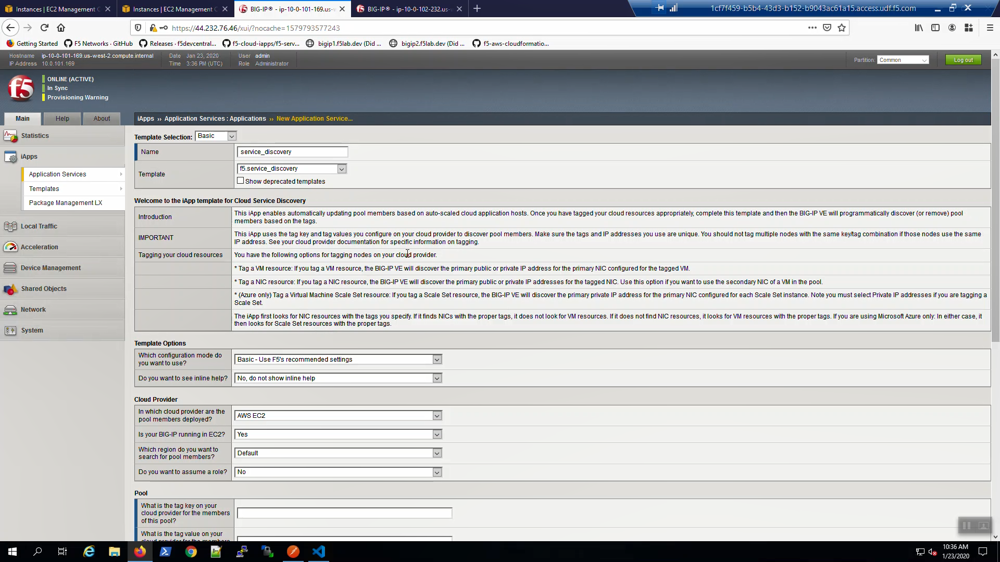
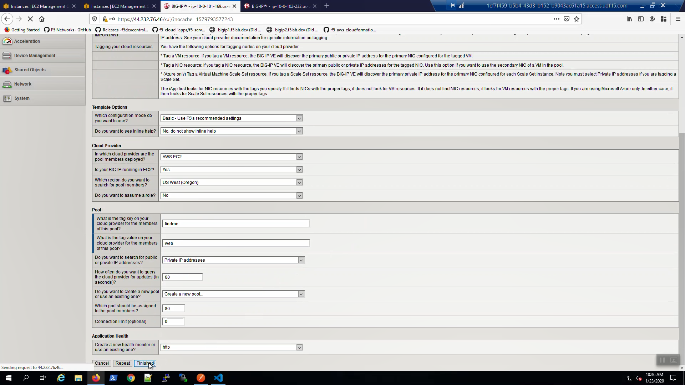
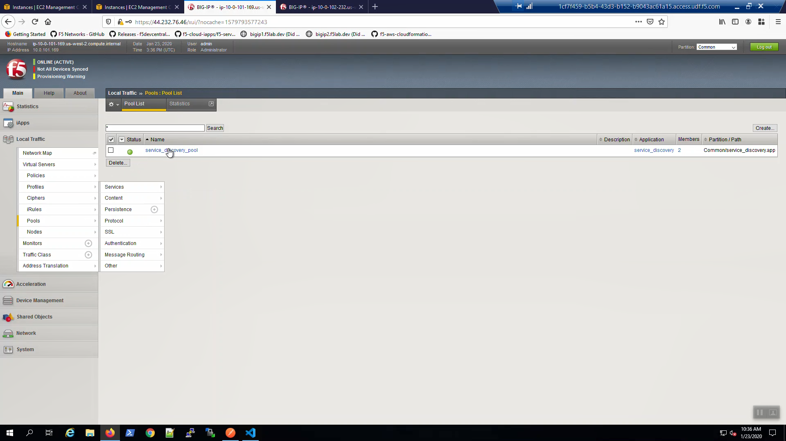
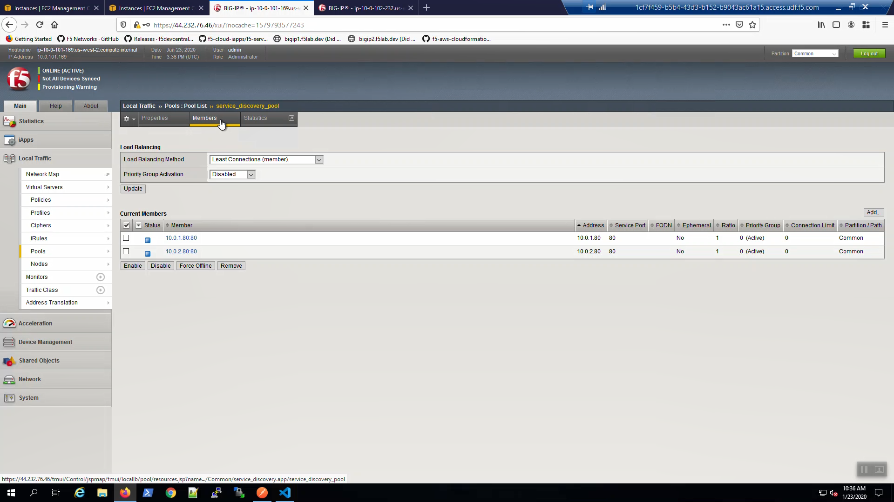
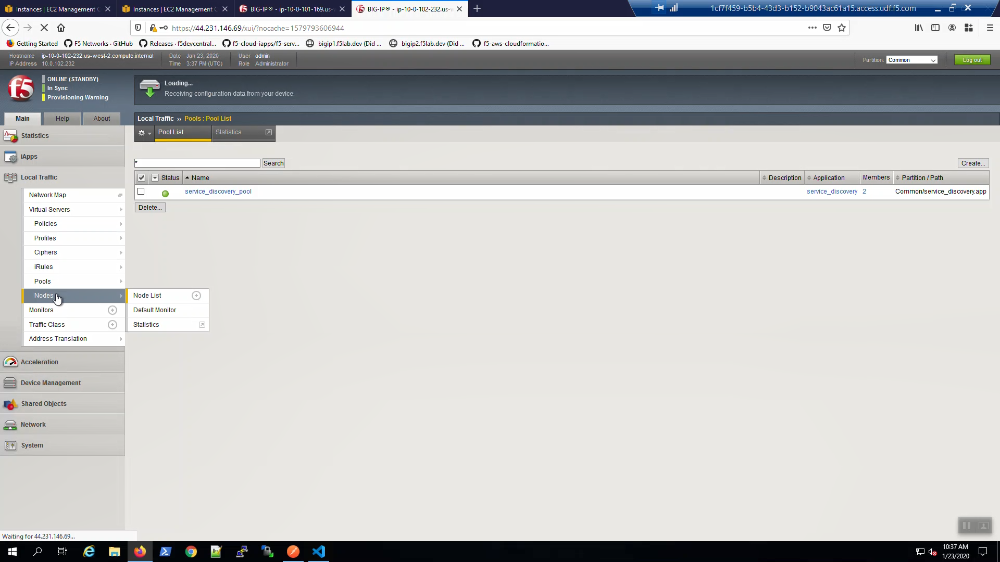

Confirm HA Across AZ iApp
-------------------------

The CloudFormation template will automatically create a device trust between Big-IP1 in Availability Zone #1 and Big-IP2 in Availability Zone #2, resulting in a working HA f5 cluster in AWS. To confirm: Device Management => Device Trust.

From the Big-IP1 Configuration Utility (WebUI), iApps => Application Services => Applications => HA_Across_AZ. The F5 CloudFormation template has automatically installed and configured the HA_Across_AZ iApp that maps a shared Elastic IP to the active Big-IP. This elastic IP is ready to automatically attach to the standby unit (thus making it active) if there is a problem/outage in the AZ.

Explore instance tags for web servers
-------------------------------------

Services => INSTANCES => Instances => web-az1. Select the "Tags" tab below. Note the "findme : web" tag.
Do the same for web-az2.
Services => INSTANCES => Instances => web-az2. Select the "Tags" tab below. Note the "findme : web" tag.
We'll use these tags to auto-discover these NGINX web servers as pool members.

Dynamically discover and populate web server pools with the Service Discovery iApp
----------------------------------------------------------------------------------

On Big-IP1, iApps => Application Services => Applications => Create New Application Service.

  Name: service_discovery

  Template: f5.service_discovery

Fill in the iApp template parameters. Leave defaults where not explicitly called out below.

+--------------------------------------------------------+------------------------------------------------------+
| Parameter                                              | Value                                                |
+========================================================+======================================================+
| **Cloud Provider**                                                                                            |
+--------------------------------------------------------+------------------------------------------------------+
| In which cloud provider are the pool members deployed? | US West(Oregon                                       |
+--------------------------------------------------------+------------------------------------------------------+
| Pool                                                                                                          |
+--------------------------------------------------------+------------------------------------------------------+
| What is the tag key on your cloud provider             | findme                                               |
| for the members of this pool?                          |                                                      |
+--------------------------------------------------------+------------------------------------------------------+
| What is the tag value on your cloud provider           | web                                                  |
| for the members of this pool?                          |                                                      |
+--------------------------------------------------------+------------------------------------------------------+

Scroll down and click [Finished].

Local Traffic => Pools => service_discovery_pool has been created.

Local Traffic => Pools => service_discovery_pool => members. Pool members have been auto-populated.

On the standby Big-IP, Local Traffic => Pools => service_discovery_pool. The service_discovery_pool is ready on the standby unit as well. Config sync works.

