Install the TCP iApp
--------------------

On Big-IP1, iApps => Templates => [Browse...] => \\This PC \\Downloads\\iApps\\f5.tcp.v1.0.0rc5\\f5.tcp.v1.0.0rc5.tmpl => [Open]. Click [Upload].

.. image:: ./images/1_f5_tcp_iapp1.png
  :scale: 50%

Confirm the iApp template upload was successful.
iApps => Templates => "Show All" in the lower right hand corner.
Locate the f5.tcp... iApp template at the bottom.

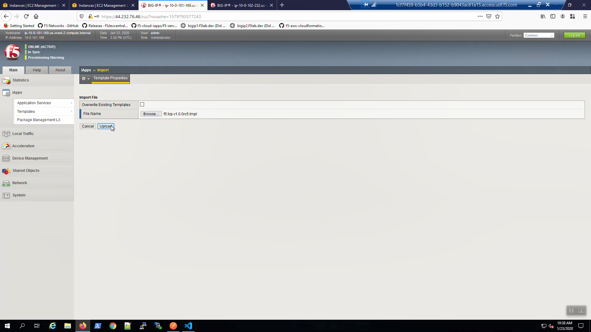

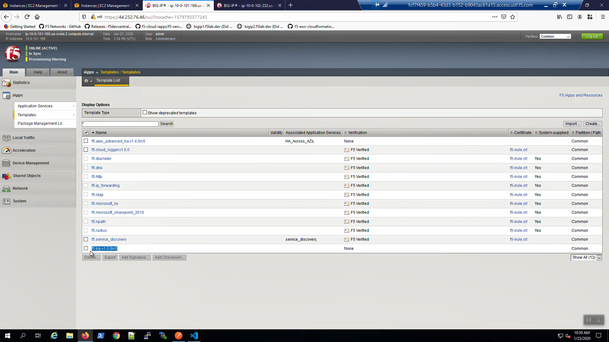

Note the Secondary IP addresses assigned to Big-IP1 and Big-IP2
---------------------------------------------------------------

In order to configure the TCP iApp we'll need to record the Secondary private IPs of both Big-IP1 and Big-IP2.
From the AWS Console, Services => EC2 => INSTANCES => Instances => **Big-IP1**. Select the [Description] tab below. Copy the Secondary private IP and paste in Notepad. We'll refer to this shortly.

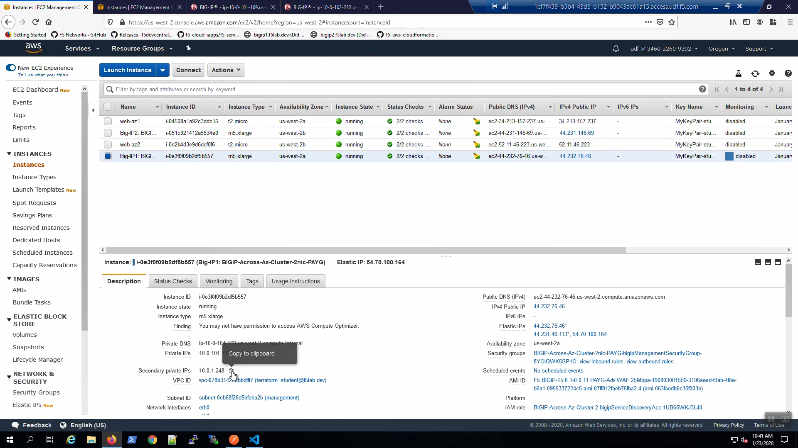

From the AWS Console, Services => EC2 => INSTANCES => Instances => **Big-IP2**. Select the [Description] tab below. Copy the Secondary private IP and paste in Notepad. We'll refer to this shortly.

.. image:: ./images/6_aws_console_secondary_ip2.png
  :scale: 50%

Create a High Availability Virtual Server with the TCP iApp
-----------------------------------------------------------

From Big-IP1, iApps => Application Services => Create a new iApp.

  Name: example01

  Template: f5.tcp.v1.0.0rc5.tmpl

.. image:: ./images/4_f5_tcp_iapp4.png
  :scale: 50%

Fill in the iApp template parameters. Leave defaults where not explicitly called out below.

+--------------------------------------------------------+------------------------------------------------------+
| Parameter                                              | Value                                                |
+========================================================+======================================================+
| **High Availability**                                                                                         |
+--------------------------------------------------------+------------------------------------------------------+
| What IP address do you want to use                     | Secondary IP of Big-IP1                              |
| for the virtual server?                                |                                                      |
+--------------------------------------------------------+------------------------------------------------------+
| What IP address do you wish to use                     | Secondary IP of Big-IP2                              |
| for the TCP virtual server in the other data center    |                                                      |
| or availability zone?                                  |                                                      |
+--------------------------------------------------------+------------------------------------------------------+
| What is the associated service port?                   | HTTP(80)                                             |
+--------------------------------------------------------+------------------------------------------------------+
| Do you want to create a new pool                       |                                                      |
| or use and existing one?                               | Choose "service_discovery_pool" from drop-down.      |
+--------------------------------------------------------+------------------------------------------------------+

Scroll down and click [Finished].

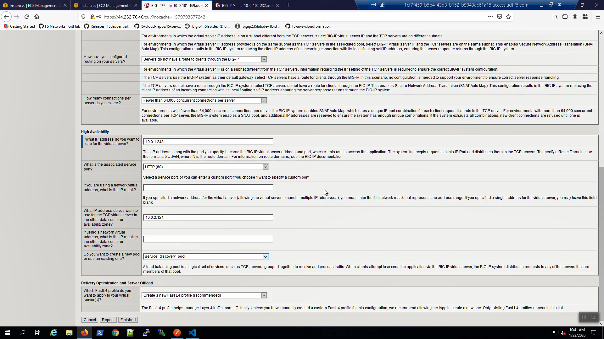

On Big-IP1, check that the virtual servers were created on the active unit.

.. image:: ./images/8_f5_ha_virtual_servers_created.png
  :scale: 50%

On Big-IP2, check that the virtual servers were also created on the standby unit.

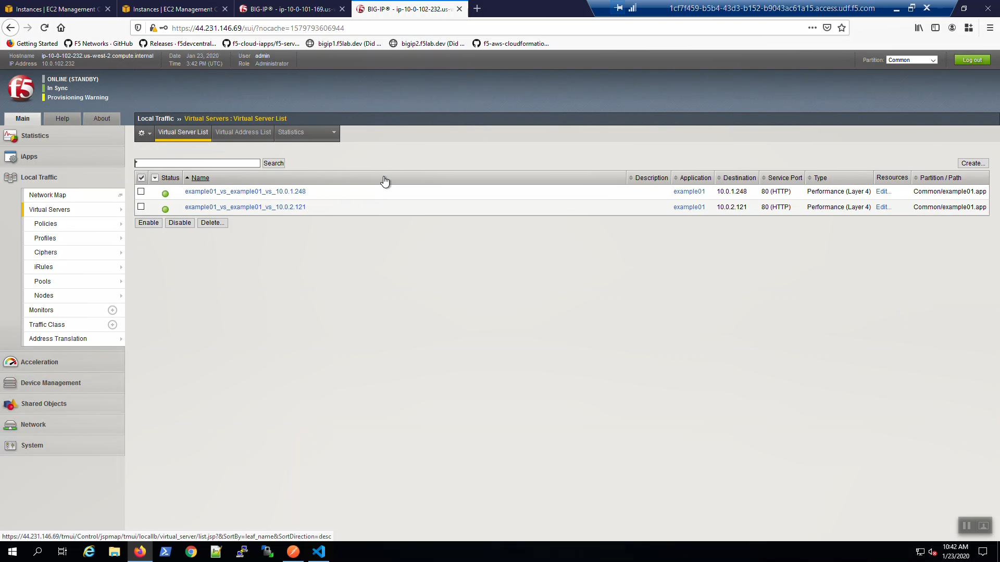

From the AWS Console, Services => EC2 => NETWORK & SECURITY => Elastic IPs.
Note the Elastic IP address (public IPv4 address) mapping for the Secondary IP address of our **Active** Big-IP1 (10.0.1.x).

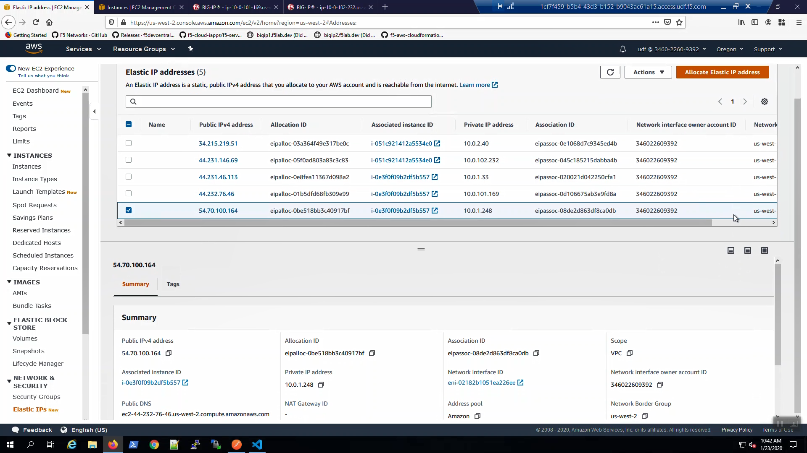

From the Visual Studio Code Terminal, invoke `terraform output`.

.. code-block:: bash

   terraform output | grep Bigip1VipEipAddress

...Ctrl + click on the *Bigip1VipEipAddress=*. This is the same Elastic IP we just reviewed in the AWS Console.

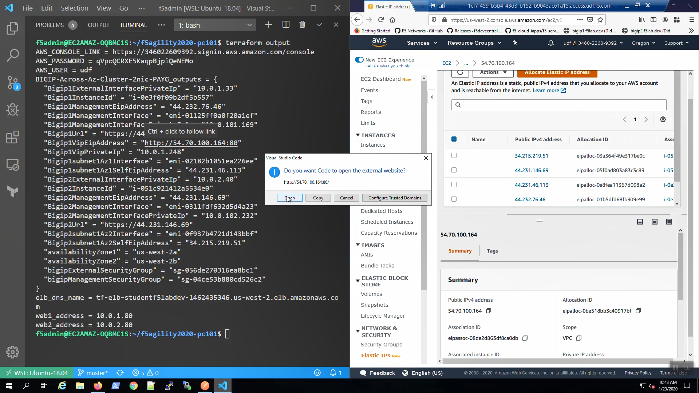

We are using self-signed certificates in the lab. Bypass the TLS warnings. "Accept the Risk and Continue".
You will see the example app.

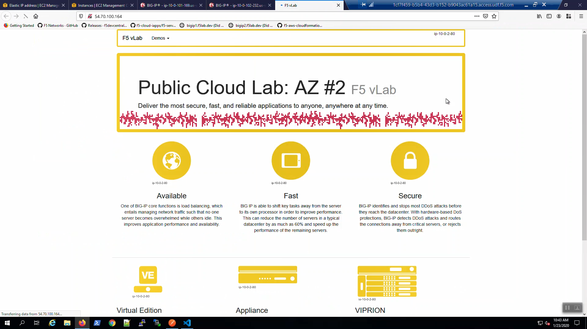

Survive a fail-over event across Availability Zones
---------------------------------------------------

From the AWS Console, Services => EC2 => NETWORK & SECURITY => Elastic IPs.
Note the Elastic IP address (public IPv4 address) mapping for the Secondary IP address of our **Active** Big-IP1 (10.0.1.x).

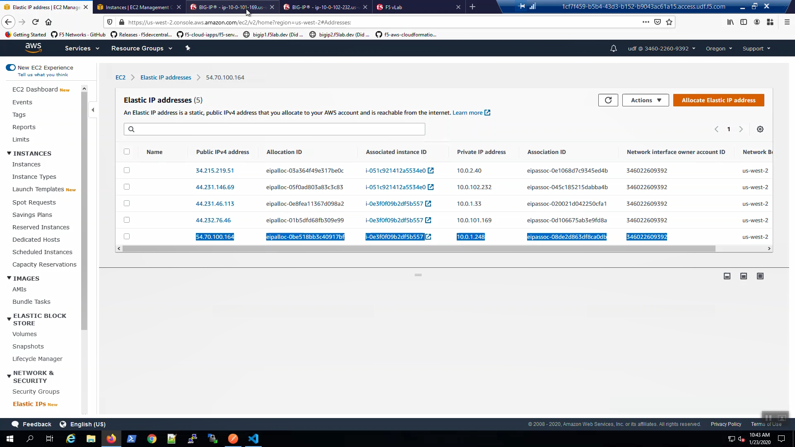

Big-IP1 => Device Management => Devices => Self => [Force to Standby]. Click [OK] to confirm.

.. image:: ./images/14_f5_bigip1_force_to_standby.png
  :scale: 50%

Big-IP2 is now active.

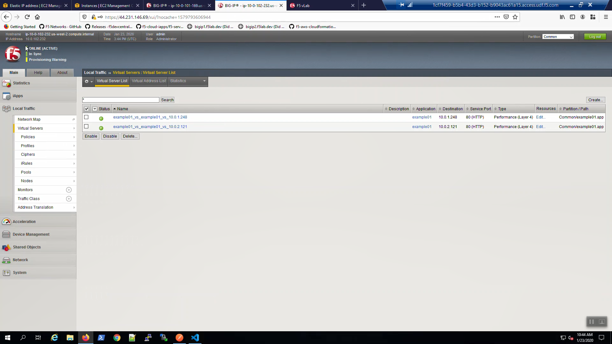

From the AWS Console, Services => EC2 => NETWORK & SECURITY => Elastic IPs.
Note the Elastic IP address (public IPv4 address) mapping for the Secondary IP has changed to the new **Active** Big-IP2 (10.0.2.x).
Hit the refresh icon in the upper-right-hand side a few times until you notice the change.

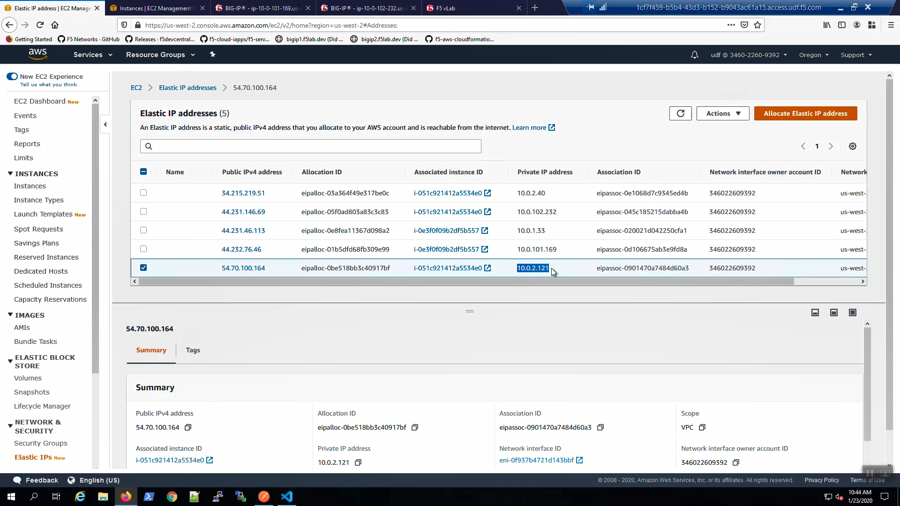

Back to the example app screen. We are using self-signed certificates in the lab. Bypass the TLS warnings. "Accept the Risk and Continue".
You will see the example app now behind the new active Big-IP2.

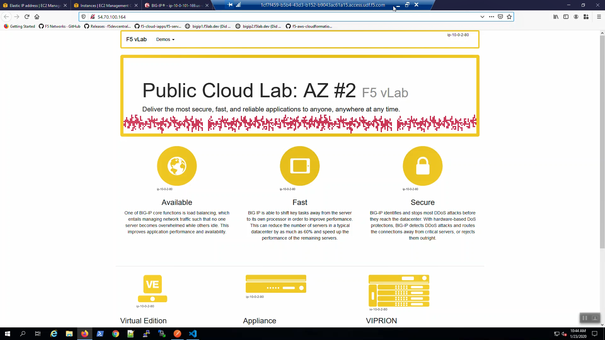

.. attention::

  The example application reports which Availability Zone is serving up the content (pool member), *not* which Availability Zone is hosting the active Big-IP.