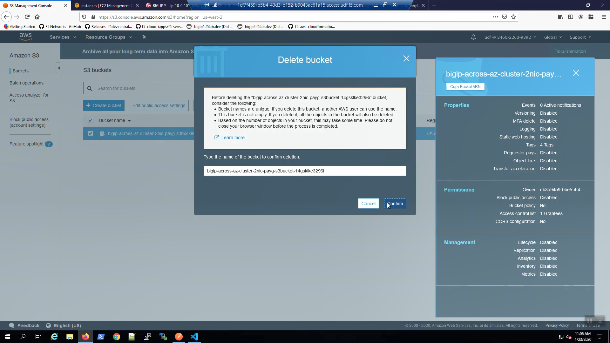
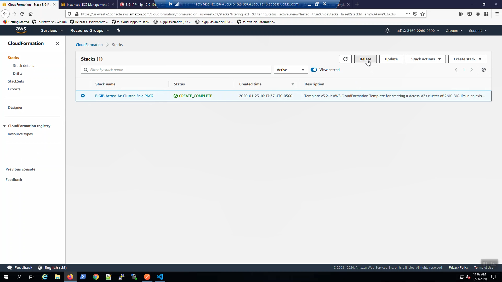
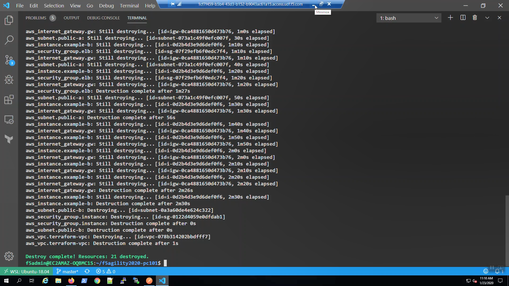

Cleanup
-------

Delete the S3 Bucket.

Delete the CloudFormation Stack.

Terraform destroy
-----------------

From the Visual Studio Code Terminal, invoke `terraform destroy`.

.. code-block:: bash

   terraform destroy --force
   f5letme1n

.. image:: ./images/3_terraform_destroy.png
	   :scale: 50%

Fin