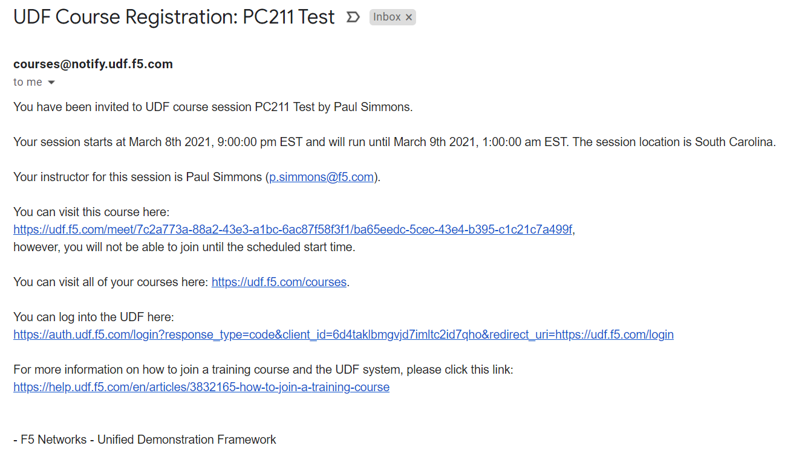
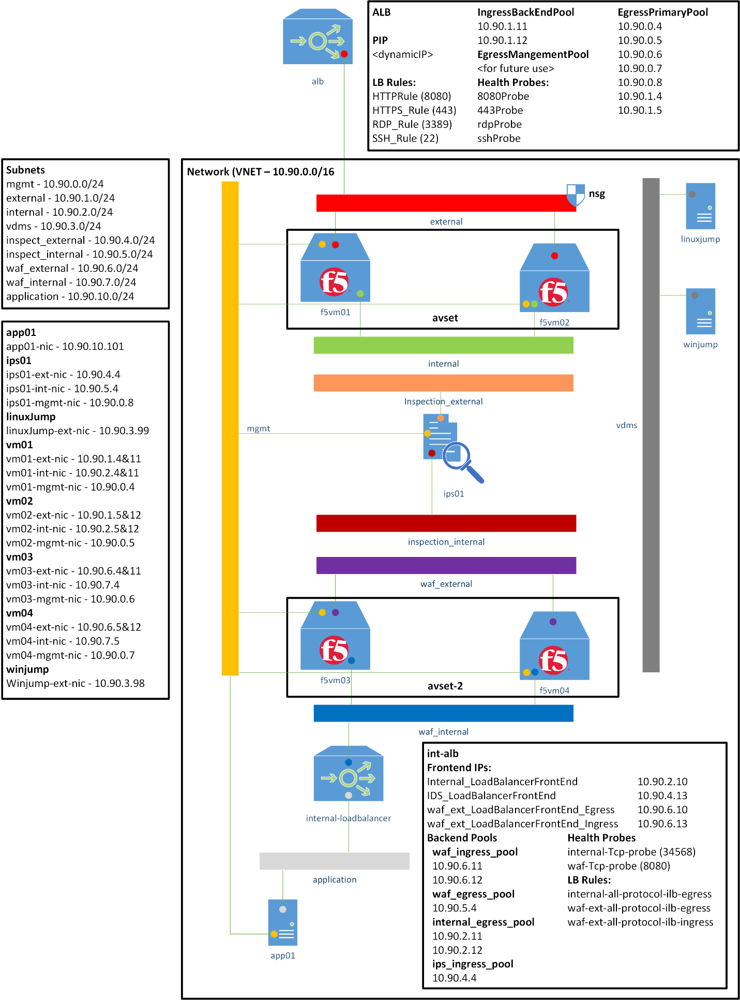
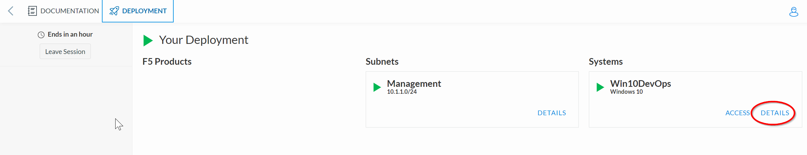

Lab Guide PC211

0.0 Getting Started
===================

This lab is an overview of how to deploy an automated version of the
Secure Azure Computing Architecture (SACA). One of many Secure Cloud
Architectures available from F5. This lab will use Azure Resource
Manager (ARM) Templates to deploy a Highly Available Pair of BIG-IPs.

0.1 General information 
-----------------------

This lab is hosted directly in Microsoft Azure. Each student should
receive an email sent to their agility registration address before the
lab begins. This email will contain the following information:

Logon URL: https://portal.azure.com

Username: SCAStudent______\_ (Example: SCAStudent37)

Password: \_________________\_ (The initial password will be in the
email, and you will be required to change it.)

You will have the ability to deploy Virtual Resources, that is the point
of the lab. Please only deploy the resources you are directed to deploy
in the lab guide.

0.2 Lab Topology
----------------

|A screenshot of a cell phone Description automatically generated|
------------------------------------------------------------------

The lab when deployed will consist of an HA pair of 2 BIG-IPs, A Linux
Jump Box, a Windows Jump Box and a host of Azure configuration items we
will explore as part of Module 3.

0.3 Lab Module Overview
-----------------------

Lab Module 1 
~~~~~~~~~~~~

Module 1 is done together with the Lab Instructor. It is an exploration
of Azure, its main components, and the automation option that are
available to us. Estimated Time 10 Minutes.

Lab Module 2
~~~~~~~~~~~~

Module 2 is on your own. This lab launches an ARM template to deploy an
HA pair of BIG-Ips. The Instructor will demo the deployment and the key
options and configurations items to be aware of. Then you can complete
module 2 on your own.

Lab Module 3
~~~~~~~~~~~~

Module 3 is done together with the Lab Instructor. Lab 3 is an
exploration of all the components deployed in the ARM Template. We will
ensure functionality and that the Management Plane is accessible via SSH
and RDP.

Lab Module 4
~~~~~~~~~~~~

Module 4 is done on your own. Module 4 enables access to the data plane
via the second public IP address deployed in the ARM Template. You will
configure Azure Network Security Groups and Load Balancers to ensure
traffic can reach a referenced web server iRule running on a VIP.

0.4 Initial Login for Azure
---------------------------

Go to https://portal.azure.com/

You may need to log out of your existing Azure Account to log in with
the test account. Using an incognito mode browser window should work as
well.

Enter the Username and password from the email. It should be similar to:
SCAStudent##@f5custlabs.onmicrosoft.com where ## is your student number.

|image1|

Click Next.

You will be prompted to change your password

|image2|

Enter your old password and a new password of your choice twice.

Once completed you should be at the Azure Home Page for the F5 Customer
Labs Subscription. It should say so in the upper right-hand corner:

|image3|

If you have an issue logging in, need a password reset, or are in the
wrong subscription please let a lab assistant know immediately!

.. _section-1:

.. |image1| image:: media/image2.png
   :width: 2.86691in
   :height: 2.83775in

