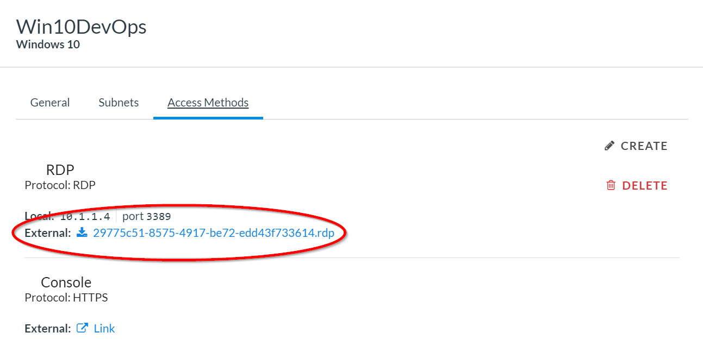
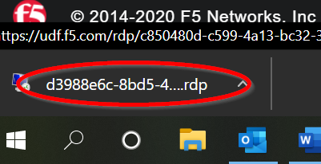
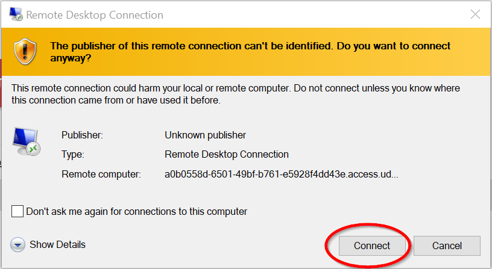
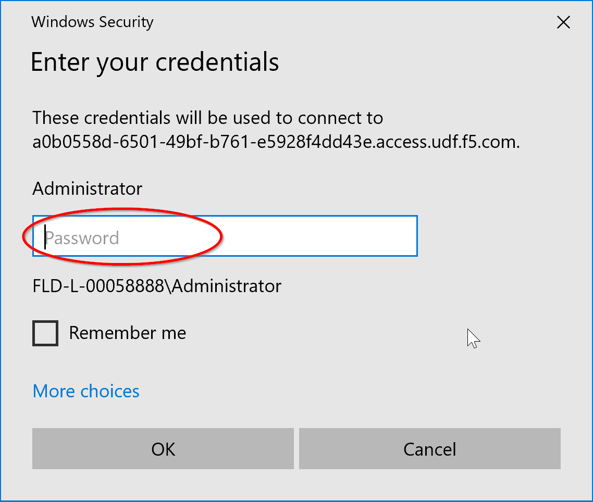

1.0 Lab Module 1 Exploring Our Deployment Options
=================================================

(We will do this together so just follow along with the Instructor, the
below info is for your later reference).

Open a browser and navigate to
https://github.com/f5devcentral/f5-azure-saca

This is the Github repository for the Secure Azure Computing
Architecture.

Scroll down the page until you get to the **Installation** Section.

There are 12 different versions of this ARM Template and they break down
as follows:

-  Azure for Government or Azure Commercial (we will be deploying in
   Azure **Commercial**)

-  1 Tier or 3 Tier use case. We will cover both in the lab, but we will
   be deploying the **1 Tier** for cost, time and simplicity purposes.

-  Lastly there are three licensing types: Bring Your Own License
   (BYOL), Pay As You Go (PAYG) or BIG-IQ Licensing that can utilize a
   preexisting BIG-IQ license manager and leverage ELA or Subscription
   based licensing. We will be deploying the **PAYG** version, so we
   don’t have to type out license keys by hand!

..

   Find the SACA v2 Azure Commercial Section (light blue not dark blue).

   Under that, find the 1 Tier 3-Nic use case

   Under that Find the PAYG Option. **Do not click it yet!**

|image4|

Once you have identified your target, scroll back up to the top and
let’s look at the repository itself.

|image5|

Find and click on the SACAv2 Folder, then inside of that Find and Click
on the AS3 folder.

|image6|

You should see 3 .json files. Click on the **paygsccaBaseline.json** and
let’s look at what’s inside.

|image7|

This is an AS3 template, which is a declarative API call for a set of
configurations we want to deploy to the BIG-IP. Take a look around and
notice we are setting up 3 Virtual Servers, 2 pools and one iRule.

Can you tell what partition they were deployed into?

|image8|

It is all being deployed into a partition called **mgmt**, this will be
important later.

**End of Module 1**

.. _lab-module-2-1:

.. |image4| image:: media/image5.png
   :width: 4.14619in
   :height: 2.97526in

