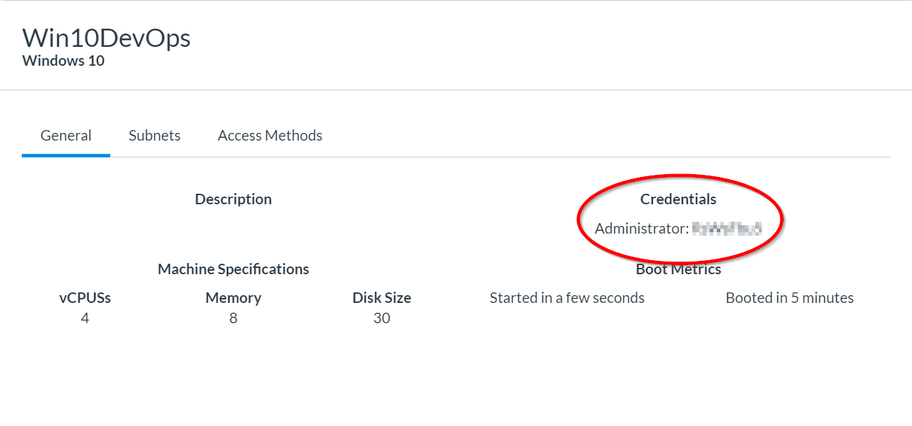
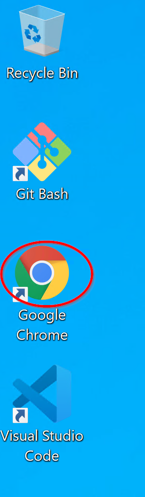
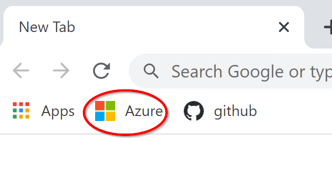
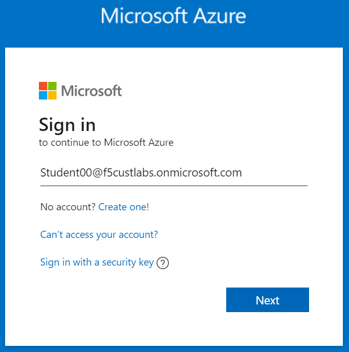
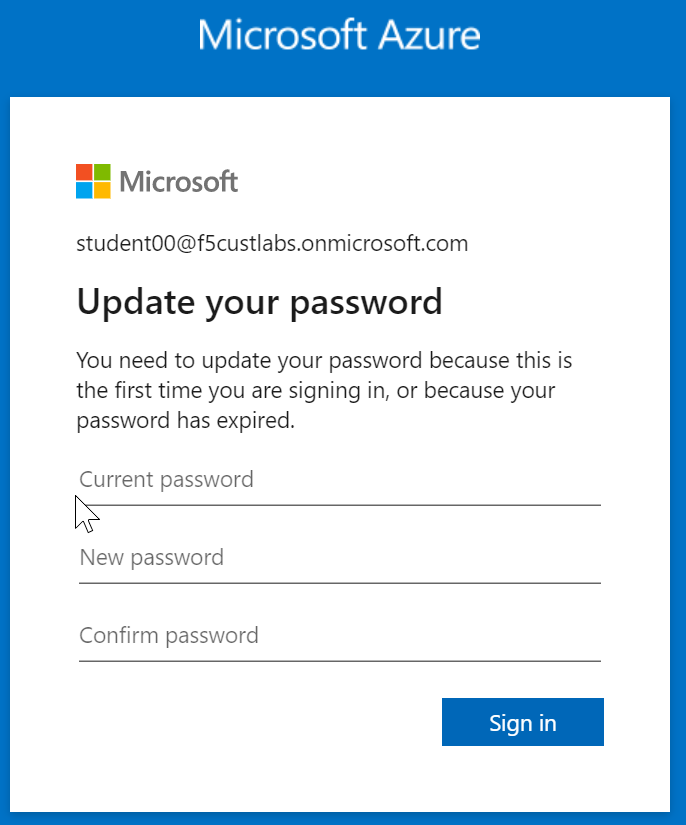
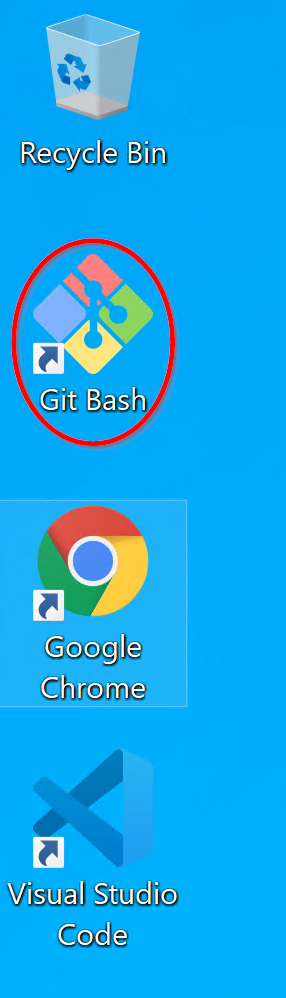
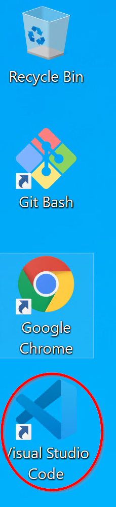

2.0 Lab Module 2
================

Ensure you are logged into the LF5 Customer Labs Azure Subscription. It
should say so in the upper right-hand corner.

|image9|

Open a second browser tab and navigate to
https://github.com/f5devcentral/f5-azure-saca if you are not there
already.

Scroll down the page until you get to the **Installation** Section.

   Find the SACA v2 Azure Commercial Section (light blue not dark blue).

   Under that, find the 1 Tier 3-Nic use case

   Under that Find the PAYG Option.

|image10|

Click the PAYG option! A new tab should open containing an ARM template
in Azure.

Ensure the subscription is **f5-AZR_4261_SALES_LAB_01**

Create a New Resource Group by clicking Create New.

|image11|

Then type “RG” and your student number, then click ok.

|image12|

Next enter the password: **Password11!!** For both the BIG-IP Admin and
Windows Admin password. There are restricted password characters in
Azure, so it is easier to use a password we know does not contain
restricted characters.

|image13|

Change the **DNS label** to be RG\ *firstname*\ ## where ## matches your
student number. Example: RGPaul60. **It is critical that this value is
unique.**

|image14|

Change the **Number of External IPs** to 2.

|image15|

Change the **BIG-IP version** to **15.0.100000.**

|image16|

Change **STIG Device** to **False.**

|image17|

**Click the checkbox** next to **I agree to the terms and conditions
stated above,** and then **click Purchase**

|image18|

.. |image9| image:: media/image4.png
   :width: 2.36842in
   :height: 0.57692in

.. |image17| image:: media/image16.png
   :width: 4.50872in
   :height: 0.25836in

