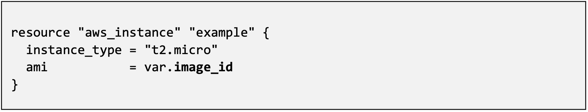

2.0 Lab Module 2 Exploring The SACA 
====================================

**Lab 2** will focus on the GitHub page were the F5 Azure SACA Terraform
scripts reside. There will no commands entered into GitBash or VS Code.

Go to: https://github.com/f5devcentral/f5-azure-saca

You should see something like this:

|image35|

Take a moment, scroll down and read the information available. Pay
attention to the section where the inputs are documented:

|image36|

Now let’s find and click on the **variables.tf** file:

|image37|

This is where we defined variables for the root module. They are defined
with a **variable** block:
|image53|

But they are referenced from within an object named **var**:
|image54|

The variables.tf file has the definitions and default values of the
variables used in the repository. If a variable is not defined via
another method, then the default value specified here will be used.

Other ways of defining variables:

From the command line using -var:
|image55|

Or in a file (.tfvars or .tfvars.json)
|image56|

Or automatically with:

-  Files named exactly **terraform.tfvars** or
   **terraform.tfvars.json**.

-  Any files with names ending in **.auto.tfvars** or
   **.auto.tfvars.json.**

In the next lab we will be creating and using an auto.admin.tfvars file.

These types of variable files are useful for predefining multiple
configurations. For example if you had a SACA stack in Azure Commercial
and in Azure for Government you could have **saca.com.tfvars** and
**saca.gov.tfvars** and use the same github repository with a different
command line switch to deploy whichever one you wanted.

|image34| 
**Stop, this is the end of Module 2.**

.. |image34| image:: media/image34.png
.. |image35| image:: media/image35.png
.. |image36| image:: media/image36.png
.. |image37| image:: media/image37.png
.. |image53| image:: media/image53.png

