3.0 Lab Module 3 Exploring the SACA components
==============================================

(We will do this together so just follow along with the Instructor, the
below info is for your later reference).

**Go to**\ https://portal.azure.com/

You may need to log out of your existing Azure Account to log in with
the test account. Using an incognito mode browser window should work as
well.

**Enter the Username and password** from the email. It should be similar
to: **SCAStudent##@f5custlabs.onmicrosoft.com** where ## is your student
number.

|image19|

**Click Next.**

You should now be at the Azure Home Page. Find and **click on the
Resource Groups Icon** at the top of the screen.

|image20|

Find and **click on the Resource Group that matches the name of the
resource group you deployed in Lab 2**. It should be named RG## where ##
is your student number.

|image21|

Inside the Resource group, you should see 30 objects. Then **click on
“Deployments: 1 Succeeded”** at the top right, to validate that the
deployment was successful.

|image22|

How long did it take for the deployment to finish?

|image23|

Deployments normal take between 10 and 15 minutes depending on how busy
the cloud service provider is.

**Click on overview** to go back to the list of objects.

|image24|

Next find and **click on RGXX-ext-pip0**

|image25|

This is the external IP address used for the management plane. Please
record this for future use.

|image26|

You can copy the IP address to the clipboard by **clicking on the icon
to the right of the IP address**, do this now.

|image27|

Open your RDP application. On windows this can be done by pressing the
**Windows Key +** **R and** typing **mstsc,** then **clicking OK**

|image28|

Enter the IP address for **pip0** and **select connect**.

|image29|

**Enter the credentials from the ARM template**

Username: **xadmin**

Password: **Password11!!**

Then **click ok**

|image30|

When prompted **select the checkbox next to “Don’t ask me again for
connections to this computer”** then click **Yes.**

|image31|

Since this is the first time this windows server has been logged into
you will be bombarded with dialog boxes. Manage them thusly:

**Click yes or no**, it really does not matter, just make it go away.

|image32|

At the server manager prompt, **select the checkbox next to “Don’t show
this message again”** and **close the message box.**

|image33|

**Exit out of server manager.**

**Open internet explorer.**

**Select Use recommended settings** and **click Ok.**

|image34|

Navigate to https://192.168.1.4

**Click More information.**

**Click Go on to the webpage.**

|image35|

When prompted you will need to add websites to the trusted sites zone.

|image36|

**Enter the credentials from the ARM template**

Username: **xadmin**

Password: **Password11!!**

|image37|

Verify that you are working on the active BIG-IP. By checking the status
in the upper left-hand corner.

|image38|

If this device is not the active device log into https://192.168.1.9 and
repeat the logon process there.

**Go to Local Traffic…Virtual Servers**. How many Virtual Servers do you
see?

|image39|

Remember that the AS3 Template deployed objects into the **mgmt
partition.**

In the upper right-hand corner next to partition, **select mgmt.**

|image40|

You should now see 3 virtual servers.

|image41|

Feel free to explore some more. This is the end of Module3.

.. |image19| image:: media/image2.png
   :width: 2.86691in
   :height: 2.83775in
.. |image20| image:: media/image18.png
   :width: 6.5in
   :height: 0.86667in
.. |image21| image:: media/image19.png
   :width: 2.78358in
   :height: 2.22936in
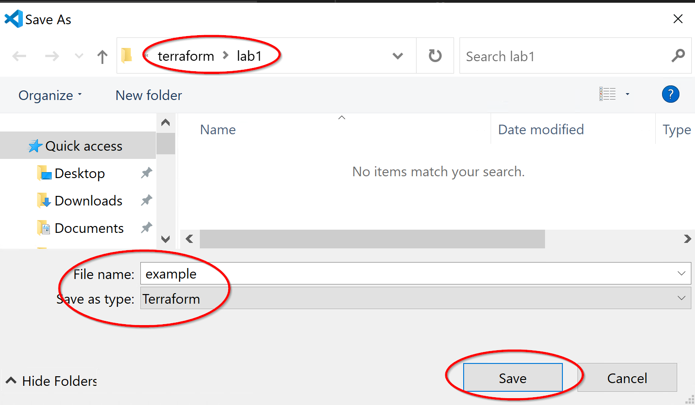
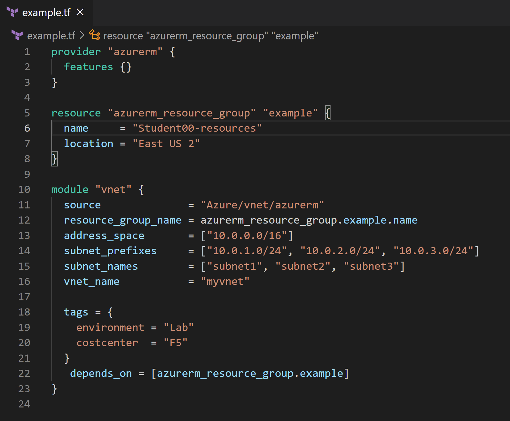
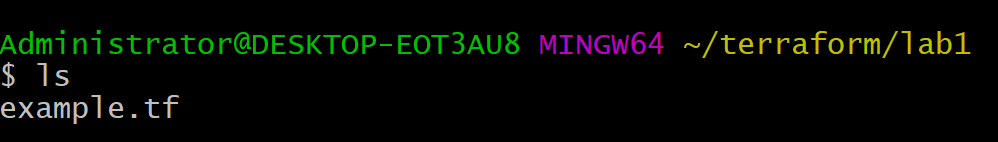
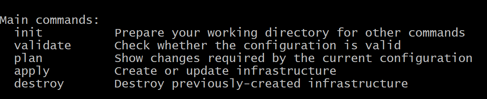
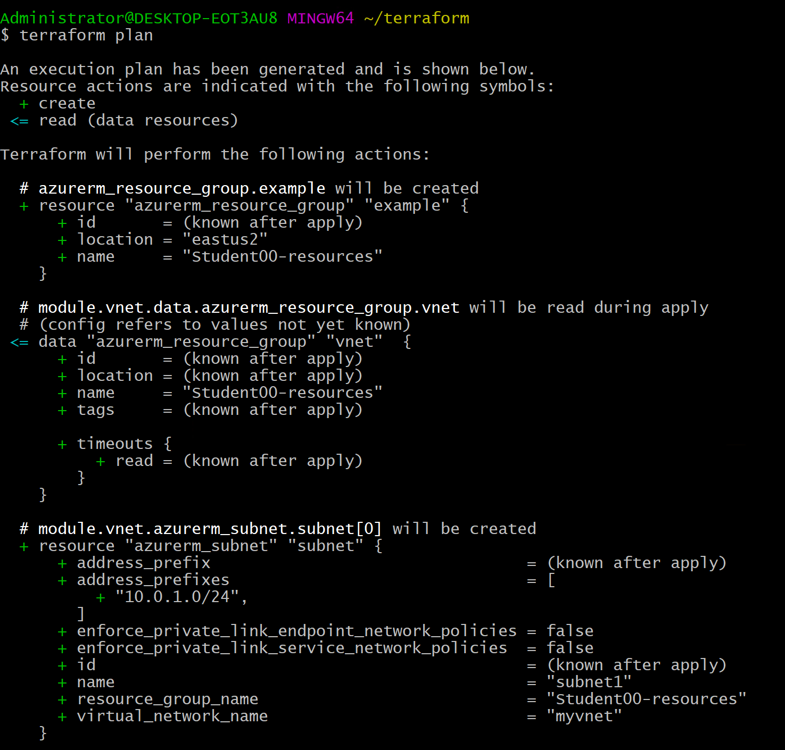
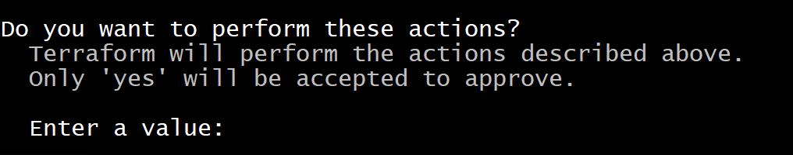
.. |image28| image:: media/image26.png
   :width: 4.04618in
   :height: 2.30437in
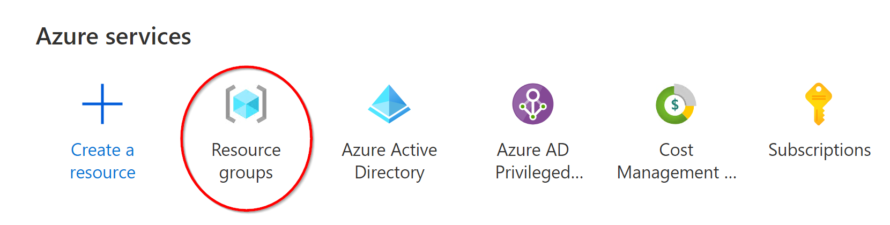
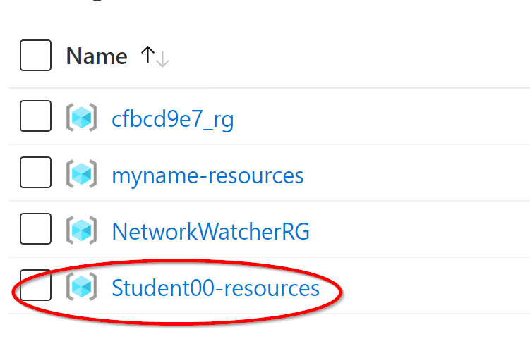
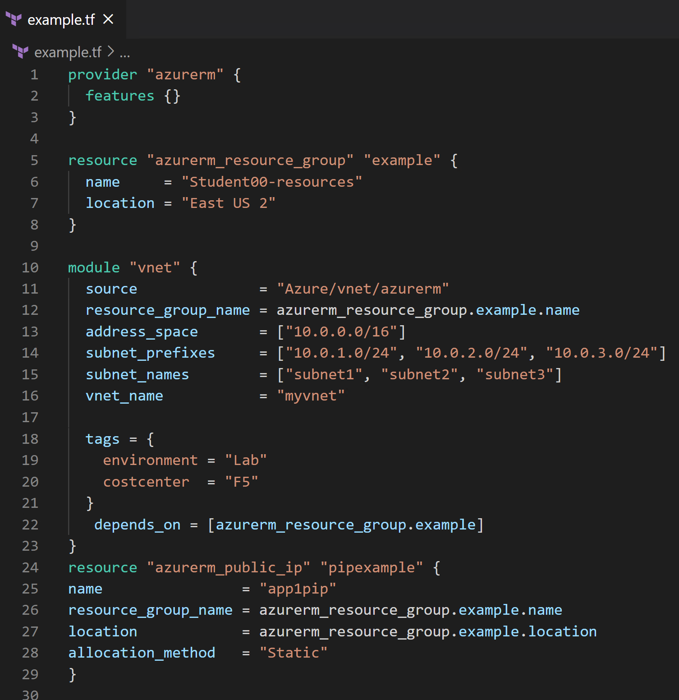
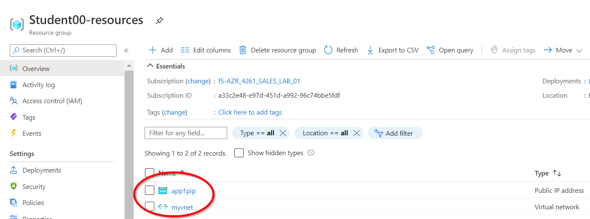
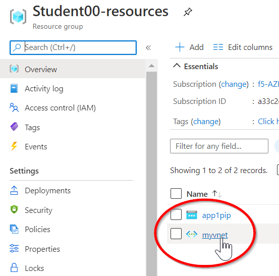
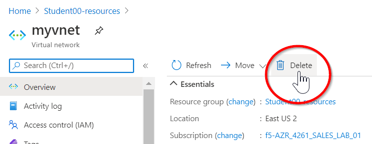
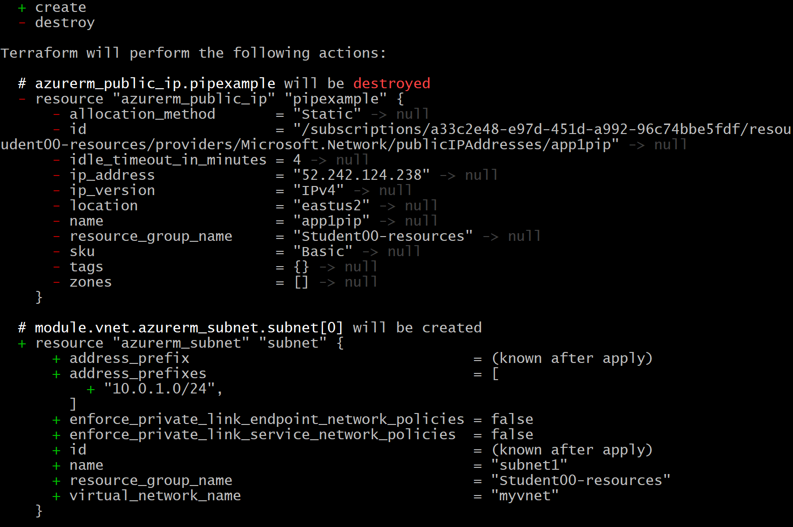

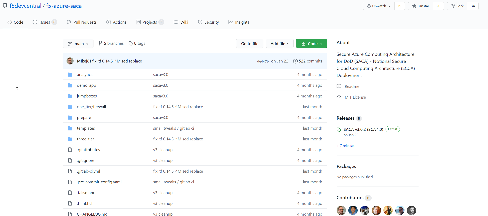
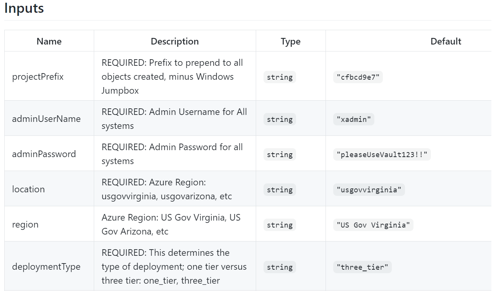
.. |image39| image:: media/image37.png
   :width: 1.48763in
   :height: 0.61255in
.. |image40| image:: media/image38.png
   :width: 1.05009in
   :height: 0.25836in
.. |image41| image:: media/image39.png
   :width: 6.5in
   :height: 0.68333in
