4.0 Lab Module 4 Testing Data Plane Traffic
===========================================

pip0 is intended for Management plane traffic, we have connected via
RDP, you can also connect via SSH if you have an SSH terminal and want
to test that as well.

pip1 in this exercise is intended to represent Data Plane Traffic. We
will

-  Configure the Network Security Group ACLs to allow port 80 traffic.

-  Add LB Rule for port 80 on rgXX-ext-alb to send traffic to the IPs on
   the external VLAN

-  The port 80 Virtual server (mgmt_http) will then accept he traffic
   and trigger an iRule which will send an http response.

**Log onto the Active BIG-IP**

**Go to Local Traffic…Virtual Servers**. How many Virtual Servers do you
see?

|image42|

Remember that the AS3 Template deployed objects into the **mgmt
partition.**

In the upper right-hand corner next to partition, **select mgmt.**

|image43|

You should now see 3 virtual servers.

|image44|

**Click on the mgmt_http virtual server.**

Observe that it is listening on Port 80. This support health check from
the ext-alb.

|image45|

**Select Resources…**

|image46|

Then in the iRules section **select /mgmt/mgmt_http/health_irule**

|image47|

The iRule triggers on any http request and responds with a custom http
response. In this case a simple web page that says, “System is online.”

|image48|

Try to reach this webpage over the internet.

**Go to**\ https://portal.azure.com/

You may need to log out of your existing Azure Account to log in with
the test account. Using an incognito mode browser window should work as
well.

**Enter the Username and password** from the email. It should be similar
to: **SCAStudent##@f5custlabs.onmicrosoft.com** where ## is your student
number.

|image49|

**Click Next.**

You should now be at the Azure Home Page. Find and **click on the
Resource Groups Icon** at the top of the screen.

|image50|

Find and **click on the Resource Group that matches the name of the
resource group you deployed in Lab 2**. It should be named RG## where ##
is your student number.

|image51|

Find and **click on RGXX-ext-pip1.**

|image52|

Find and **record** the IP address and DNS name of **rgXX-ext-pip1**.
Also notice that this pip is associated with **rgXX-ext-alb.**

|image53|

Open a web browser and navigate to
http://rgxx1.eastus.cloudapp.azure.com or whatever the DNS name or IP is
of pip1. This could differ if you deployed to a different region.

|image54|

Navigate back to RGXX, then find and click on

|image55|

Notice that we have 2 custom inbound ACLs to go along with the default
ones.

|image56|

**Click on Inbound Security Rules**\ …

Then **Click +Add**

Change Destination port ranges to **80**

Change name to **http_allow_80**

**Click Add**

|image57|

Navigate back to RGXX and then find and click on rgXX-ext-alb.

|image58|

Notice that we have 3 load balancing rules. We will be adding an http
rule that is identical to the RDP and SSH rules.

**Click Load balancing rules** then click **+ Add**

|image59|

For name type **http_vs**

For Frontend IP address select the **IP address corresponding to
loadbalancerFrontEnd2**. This is **pip1.**

For port choose **80.**

For Backend Port choose **80**

Leave Backend pool as **loadBalancerBackEnd**

For Health Probe choose **http_alive (HTTP:80)**

Click **ok.**

Open a web browser and navigate to
http://rgxx1.eastus.cloudapp.azure.com or whatever the DNS name or IP is
of pip1. This could differ if you deployed to a different region.

You should now see an http response.

|image60|

This is the end of Module 4!

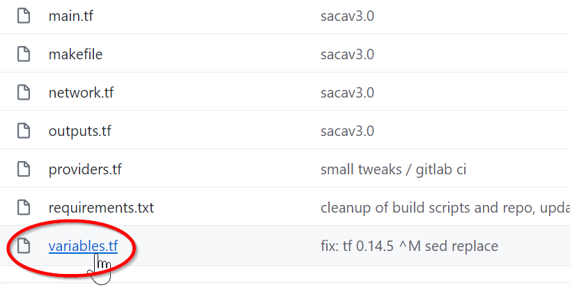

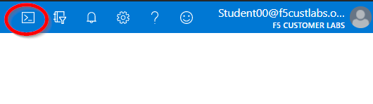

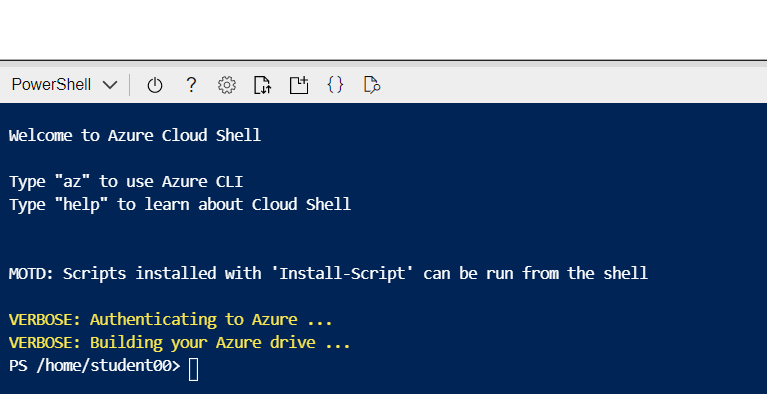

.. |image45| image:: media/image40.png
   :width: 2.2877in
   :height: 1.68348in

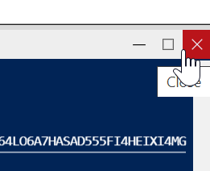

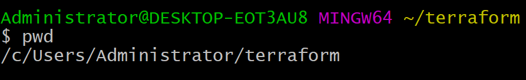

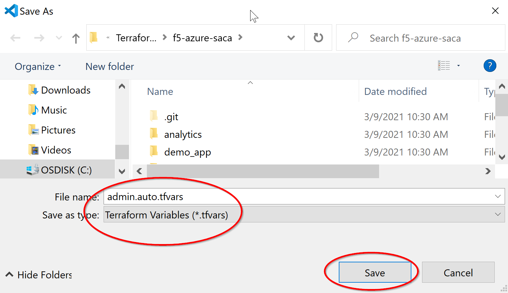

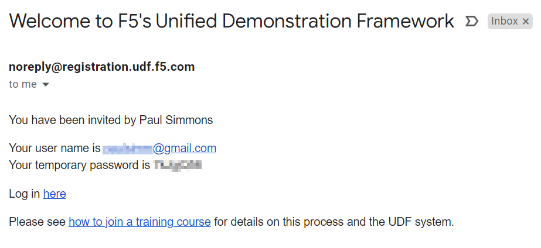

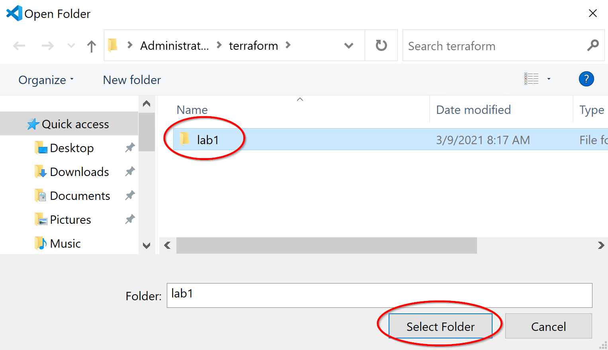

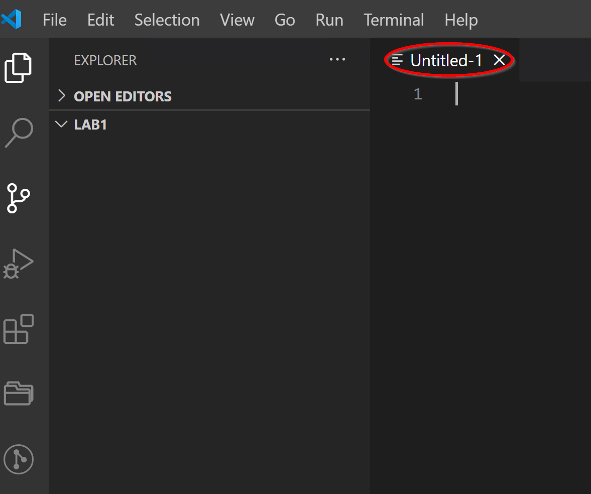

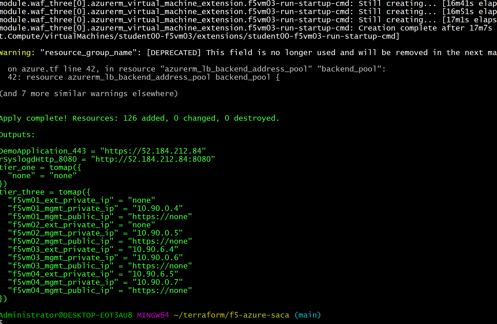

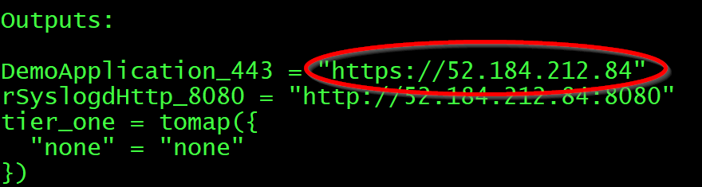

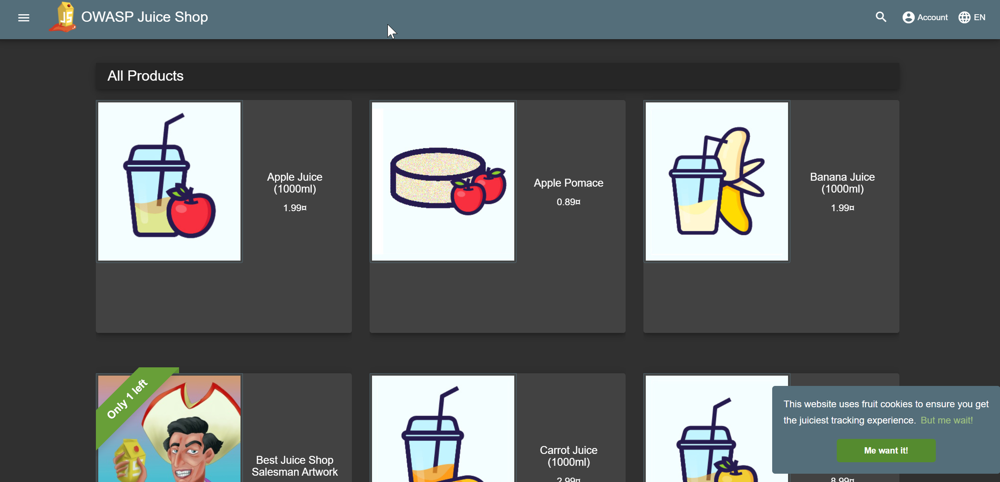

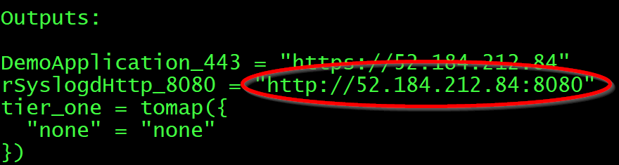

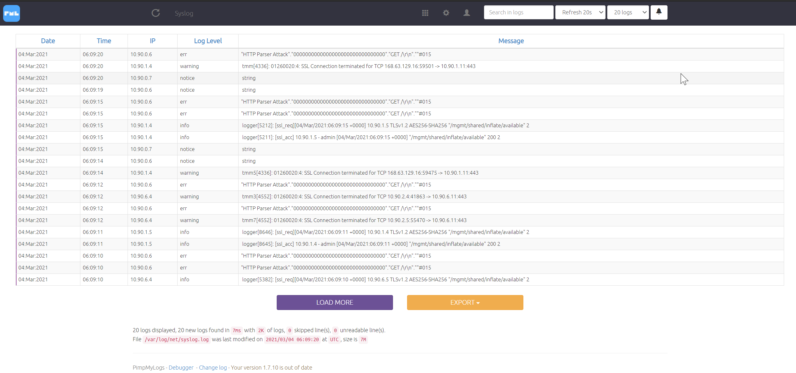

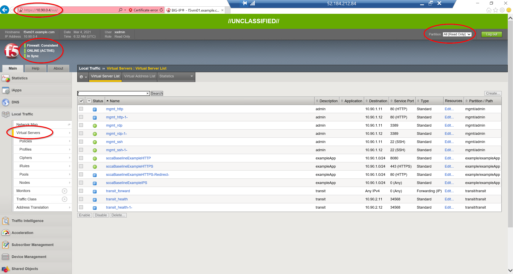

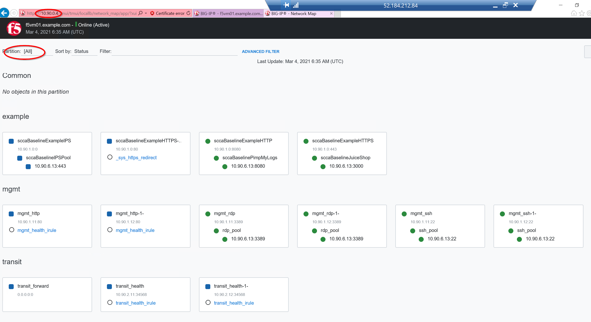

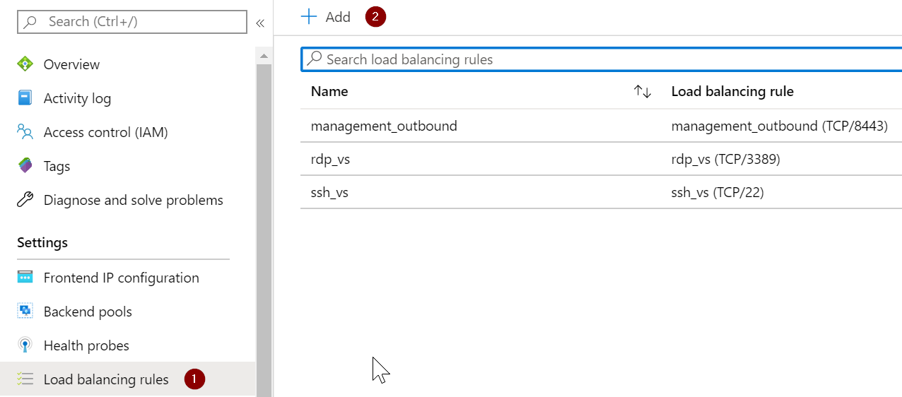

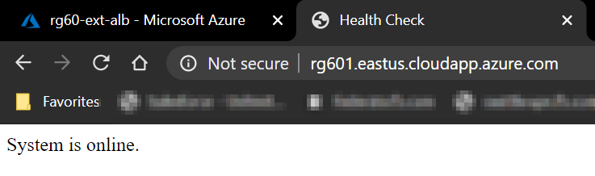
