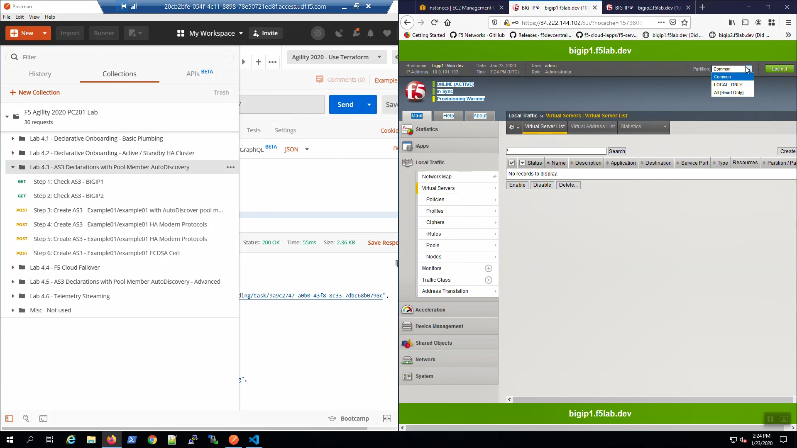
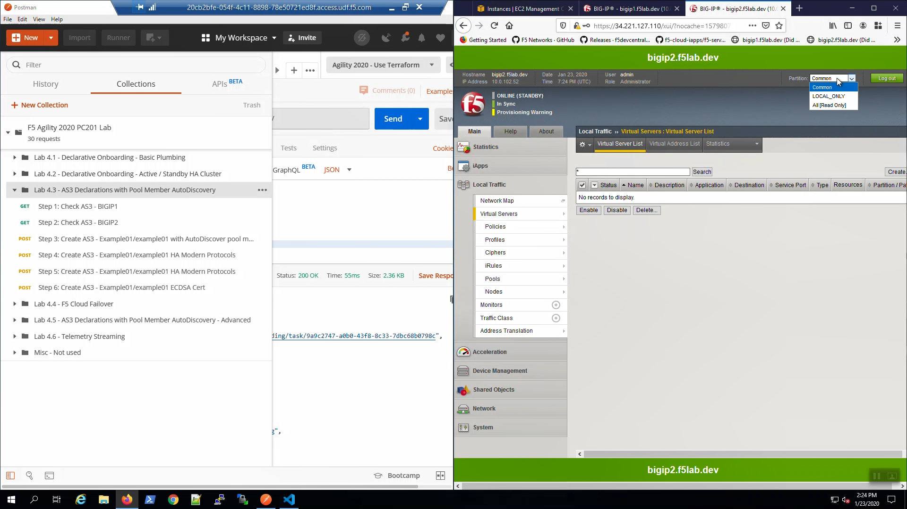
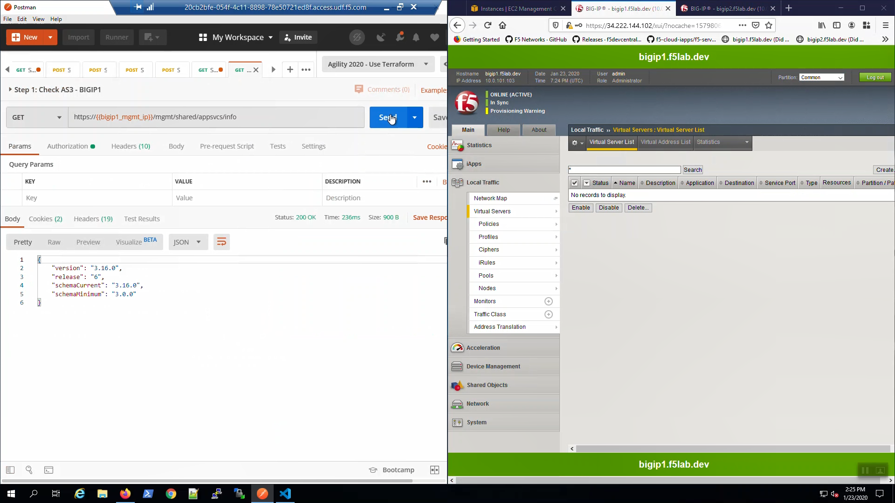
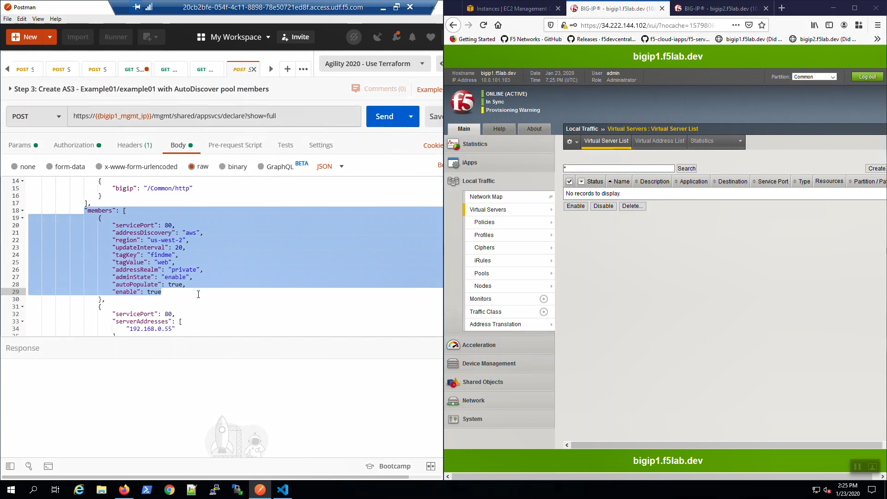
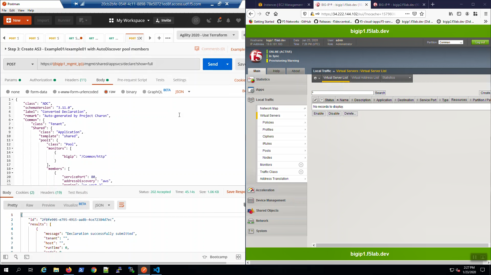
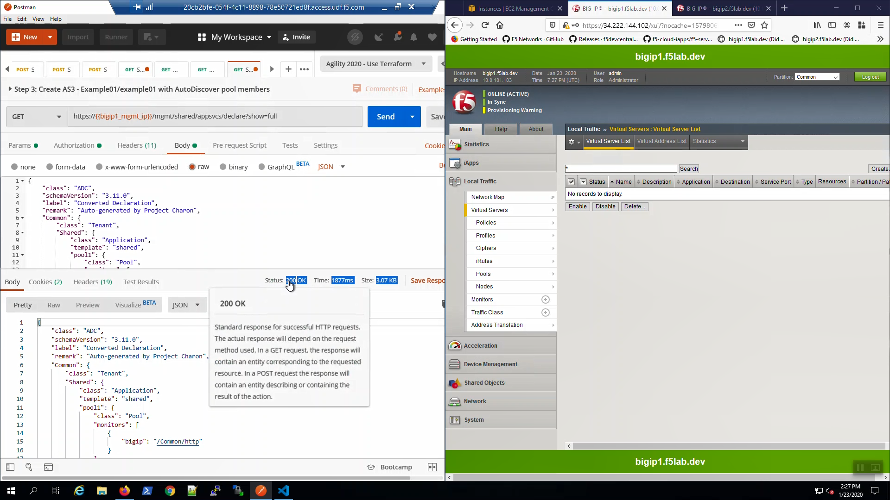
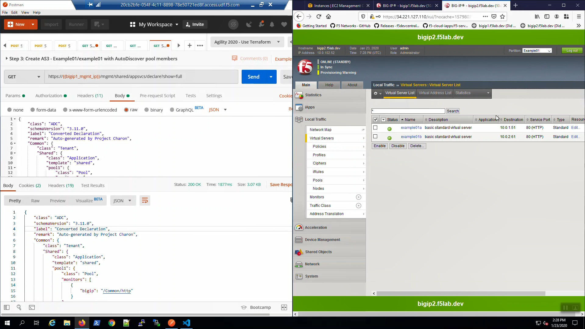
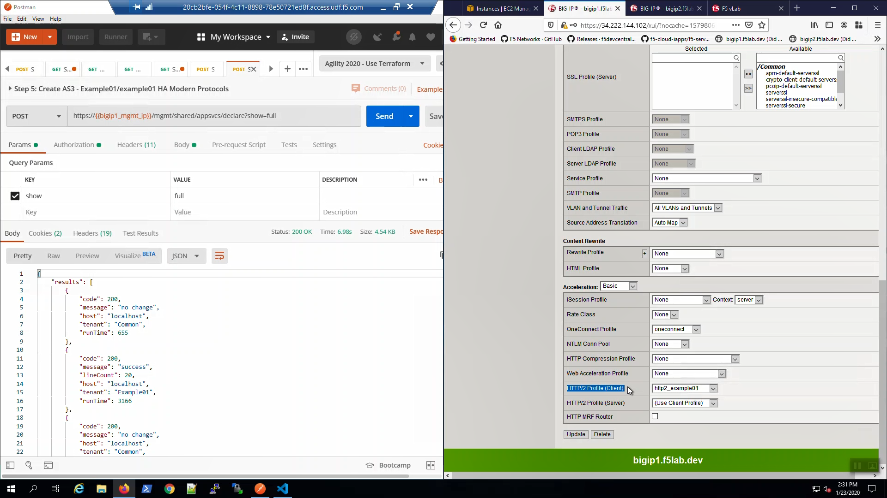
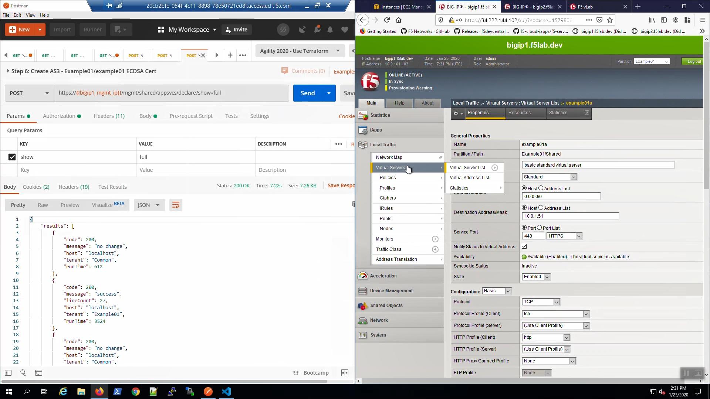
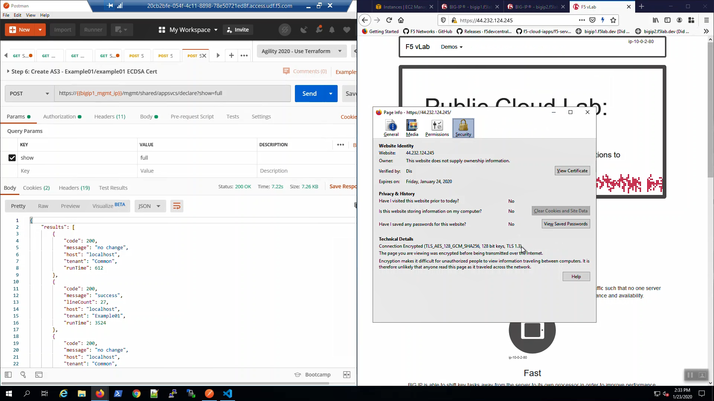

Clean config - No Partitions or Virtual Servers
-----------------------------------------------

Big-IP1 => Local Traffic => Virtual Servers. There are no Virtual Servers configured in any partition.

Big-IP2 => Local Traffic => Virtual Servers. There are no Virtual Servers configured in any partition.

Check AS3 is ready
------------------

From Postman, “Lab 4.3 - AS3 Declarations with Pool Member AutoDiscovery” => “Step 1: Check AS3 - BIGIP1” => [Send].

Status 200 OK response signals that Application Services 3 Extension (AS3) is ready on Big-IP1.

From Postman, “Lab 4.3 - AS3 Declarations with Pool Member AutoDiscovery” => “Step 2: Check AS3 - BIGIP2” => [Send].

Status 200 OK response signals that Application Services 3 Extension (AS3) is ready on Big-IP2.

.. image:: ./images/4_postman_bigip2_check_as3.png
	   :scale: 50%

Create HTTP Virtual Servers with AS3 and Service Discovery
----------------------------------------------------------

From Postman, “Lab 4.3 - AS3 Declarations with Pool Member AutoDiscovery” => “Step 3: Example01/example01 with AutoDiscover pool members”. Review the Body of the declaration. The AS3 declaration is configured to discover pool members based on AWS tags.

From Postman, “Lab 4.3 - AS3 Declarations with Pool Member AutoDiscovery” => “Step 3: Example01/example01 with AutoDiscover pool members” => [Send].

Change the HTTP method from POST to GET and click "Send". You can do this often to track the status of the AS3 declaration in the Response. Status 202 indicates the declaration was successfully submitted and is being processed, Status 200 indicates the declaration has successfully completed.

Eventually, the status will be 200 OK. Our AS3 declaration has successfully created a pair of HTTP virtual servers.

Big-IP1 => Local Traffic => Virtual Servers. Choose the "Example01" Partition from the Drop-down in the upper-right-hand corner. AS3 created two HTTP virtual servers: example01a and example01b.

.. image:: ./images/8_bigip1_virtual_servers_created.png
	   :scale: 50%

Big-IP1 => Local Traffic => Pools. Note "pool1". AS3 used AWS instance tags to discover and auto-populate pool1 with two web servers.

.. image:: ./images/9_bigip1_autodiscover_pool_created.png
	   :scale: 50%

Big-IP2 => Local Traffic => Virtual Servers. Choose the "Example01" Partition from the Drop-down in the upper-right-hand corner. Even though you only POSTED an AS3 declaration to Big-IP1, Config Sync replicated the Virtual Servers and all supporting configuration objects (pools, profiles, etc.) to Big-IP2.

From the Visual Studio Code Terminal, note the value of ``virtual_server01_elastic_ip``.

.. code-block:: bash

   terraform output virtual_server01_elastic_ip

Open a new browser tab. Connect via HTTP to ``virtual_server01_elastic_ip``.

.. image:: ./images/11_elastic_ip_example_app.png
	   :scale: 50%

Enable modern protocols such as HTTP/2 and TLS 1.3 with AS3 and Service Discovery
---------------------------------------------------------------------------------

From Postman, “Lab 4.3 - AS3 Declarations with Pool Member AutoDiscovery” => “Step 4: Create AS3 - Example01/example01 HA Modern Protocols”. => [Send].

.. image:: ./images/13_postman_modern_protocols1.png
	   :scale: 50%

Big-IP1 => Local Traffic => Virtual Servers => Click on "example01a". Scroll down to the SSL Profile (Client). AS3 created and applied a custom SSL profile to our HTTPS virtual servers.

.. image:: ./images/14_bigip1_https_clientssl.png
	   :scale: 50%

Open a new browser tab. Connect via HTTPS to ``virtual_server01_elastic_ip``. We are using self-signed certificates in the lab. Bypass the TLS warnings. “Accept the Risk and Continue”.

.. image:: ./images/15_example_app_https_bypass_warning.png
	   :scale: 50%

.. image:: ./images/16_example_app_https.png
	   :scale: 50%

From the browser, note the ciphers used: TLS 1.2. We'll upgrade to TLS 1.3 with ECDSA certs shortly.

.. image:: ./images/17_example_app_https_tls_1.2.png
	   :scale: 50%

From Postman, “Lab 4.3 - AS3 Declarations with Pool Member AutoDiscovery” => “Step 5: Create AS3 - Example01/example01 HA Modern Protocols”. => [Send].

Big-IP1 => Local Traffic => Virtual Servers => Click on "example01a". Scroll down to the HTTP/2 Profile (Client). Note we have enabled HTTP/2.

From the browser, in the tab with the example HTTPS application, hit [CTRL] + [F5] a few times to refresh the page. Hover over the lightning bolt icon on the right-hand side of the URL bar. Note: "HTTP/2 is active for the top-level document".

.. image:: ./images/20_example_app_http2.png
	   :scale: 50%

.. attention::

  In the following examples, the cert and keys are stored as Postman environment variables. This is for illustrative purposes only. In a secure production environment you must incorporate a proper secrets management solution.

From Postman, “Lab 4.3 - AS3 Declarations with Pool Member AutoDiscovery” => “Step 6: Create AS3 - Example01/example01 ECDSA Cert”. => [Send].

Big-IP1, "Local Traffic" => "Profiles" => "SSL" => "Client". Note "clientssl_secure_example01a" "clientssl_secure_example01b" profiles created and applied to the example01a and example01b virtual servers.

.. image:: ./images/22_bigip1_clientssl_created.png
	   :scale: 50%

From the browser, in the tab with the example HTTPS application, hit [CTRL] + [F5] a few times to refresh the page. We are using self-signed certificates in the lab. Bypass the TLS warnings. “Accept the Risk and Continue”.

.. image:: ./images/23_example_app_https_bypass_warning.png
	   :scale: 50%

Click on the padlock icon on the left-hand side of the URL bar and note the ciphers used: ECDSA enabled and protocol is now TLS1.3

