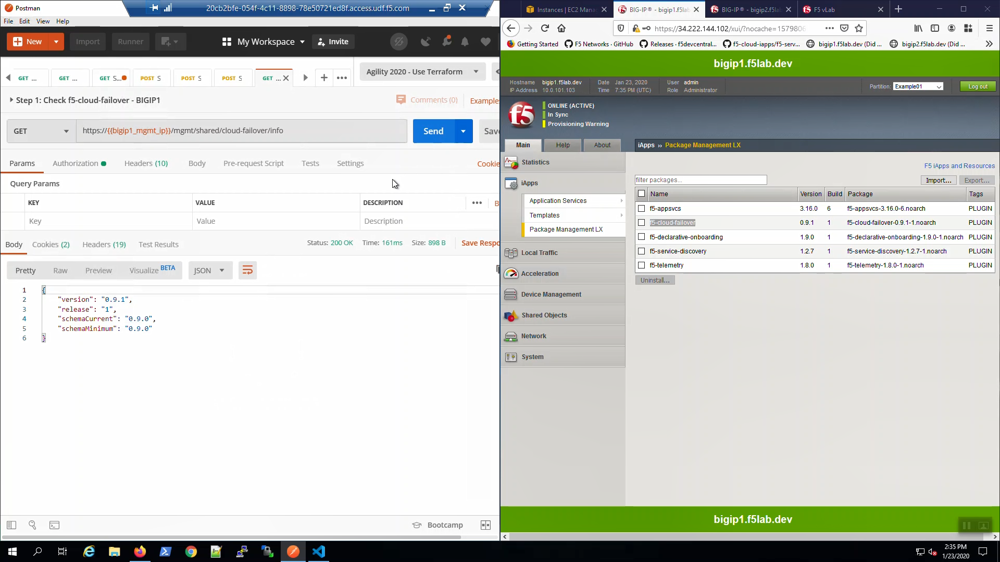
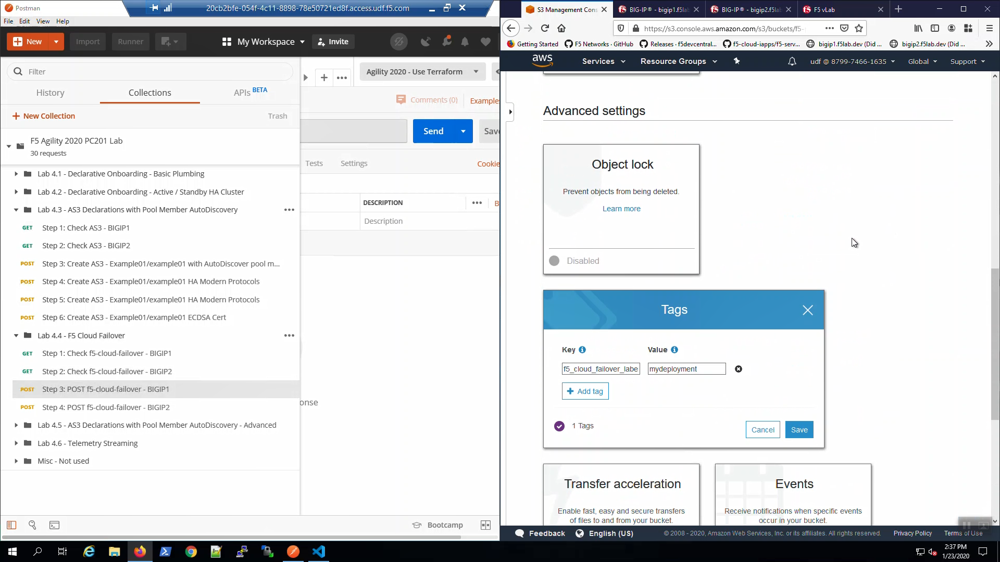

Check F5 Cloud Failover is Ready
--------------------------------

Big-IP1 => iApps => Package Management LX => note "f5-cloud_failover" package has been installed. 

.. image:: ./images/1_cloud_failover_installed.png
	   :scale: 50%

Do the same for Big-IP2.

From Postman, “Lab - F5 Cloud Failover" => “Step 1: Check f5-cloud-failover - BIGIP1”. => [Send].

A "200 OK" response indicates the f5-cloud-failover extension is ready.

From Postman, “Lab - F5 Cloud Failover" => “Step 2: Check f5-cloud-failover - BIGIP2”. => [Send].

A "200 OK" response indicates the f5-cloud-failover extension is ready.

.. image:: ./images/3_postman_check_cloud_failover_status_bigip2.png
	   :scale: 50%

AWS Tags to Track Cloud Failover Objects
----------------------------------------

From the AWS Console, Services => EC2 => NETWORK & SECURITY => Elastic IPs. Select the Elastic IP (public IP) mapped to 10.0.1.51. Select the “Tags” tab below. Note the Elastic IP has been tagged for use by the f5-cloud-failover extension

.. image:: ./images/4_aws_console_elastic_ip.png
	   :scale: 50%

From the AWS Console, Services => VPC => Route Tables. Select the Default route table. Select the "Tags" tab below. Note the route table has been tagged for use by the f5-cloud-failover extension.

.. image:: ./images/5_aws_console_route_table_tag.png
	   :scale: 50%

From the AWS Console, Services => S3. Note the S3 bucket has been tagged for use by the f5-cloud-failover extension.

POST F5 Cloud Failover Declaration
----------------------------------

From Postman, “Lab - F5 Cloud Failover" => “Step 3: POST f5-cloud-failover - BIGIP1”. => [Send]. A "200 OK" response indicates the declaration was successfully posted.

.. image:: ./images/7_postman_cloud_failover_post_bigip1.png
	   :scale: 50%

From Postman, “Lab - F5 Cloud Failover" => “Step 4: POST f5-cloud-failover - BIGIP2”. => [Send]. A "200 OK" response indicates the declaration was successfully posted.

.. image:: ./images/8_postman_cloud_failover_post_bigip2.png
	   :scale: 50%

Test Failover
-------------

From the AWS Console, Services => NETWORK & SECURITY => Elastic IPs. Select the Elastic IP (public IP) mapped to 10.0.1.51. Select the "Tags" tab below.

.. image:: ./images/9_aws_console_elastic_ip.png
	   :scale: 50%

From the Visual Studio Code Terminal, note the value of ``virtual_server01_elastic_ip``.

.. code-block:: bash

   terraform output virtual_server01_elastic_ip

Open a new browser tab. Connect via HTTPS to ``virtual_server01_elastic_ip`` or if you already have a tab open to the example application from a previous section, use that.

.. image:: ./images/9_example_app_bigip1.png
	   :scale: 50%

From Big-IP1, Device Management => Devices => bigip1.f5lab.dev.

.. image:: ./images/11_device_bigip1.png
	   :scale: 50%

Force bigip1.f5lab.dev to standby. Click [Force to Standby].

.. image:: ./images/12_device_bigip1_force_to_standby.png
	   :scale: 50%

On Big-IP1, in the upper-left-hand corner, note "ONLINE (STANDBY)".

.. image:: ./images/13_device_bigip1_standby.png
	   :scale: 50%

From Big-IP2, in the upper-left-hand corner, note "ONLINE (ACTIVE)". Big-IP2 was immediately promoted to active and Big-IP1 demoted to standby.

.. image:: ./images/14_device_bigip2_active.png
	   :scale: 50%

From the AWS Console, Services => NETWORK & SECURITY => Elastic IPs. Select the Elastic IP (public IP) previously mapped to 10.0.1.51. Hit the refresh icon until you see the new mapping to 10.0.1.61 (Big-IP2).

.. image:: ./images/15_aws_console_elastic_ip_moved_to_bigip2.png
	   :scale: 50%

Back to the browser tab with the example application. [CTRL] + [F5] a few times to refresh the browser. We are using self-signed certificates in the lab. Bypass the TLS warnings. “Accept the Risk and Continue”.

.. image:: ./images/16_example_app_bigip2_bypass_warning.png
	   :scale: 50%

.. attention::

  The example application reports which Availability Zone is serving up the content (pool member), *not* which Availability Zone is hosting the active Big-IP.

.. image:: ./images/17_example_app_bigip2.png
	   :scale: 50%

From Big-IP2, Device Management => Devices => bigip2.f5lab.dev.

Force bigip2.f5lab.dev to standby. Click [Force to Standby].

.. image:: ./images/18_device_bigip2_force_to_standby.png
	   :scale: 50%

On Big-IP2, in the upper-left-hand corner, note "ONLINE (STANDBY)".

.. image:: ./images/19_device_bigip2_standby.png
	   :scale: 50%

From Big-IP1, in the upper-left-hand corner, note "ONLINE (ACTIVE)". Big-IP1 is now back to active.

.. image:: ./images/20_device_bigip1_active.png
	   :scale: 50%

From the AWS Console, Services => NETWORK & SECURITY => Elastic IPs. Select the Elastic IP (public IP) previously mapped to 10.0.1.61. Hit the refresh icon until you see the new mapping back to 10.0.1.51 (Big-IP1).

.. image:: ./images/21_aws_console_elastic_ip_moved_to_bigip1.png
	   :scale: 50%

Back to the browser tab with the example application. [CTRL] + [F5] a few times to refresh the browser. We are using self-signed certificates in the lab. Bypass the TLS warnings. “Accept the Risk and Continue”.

.. image:: ./images/22_example_app_bigip1_bypass_warning.png
	   :scale: 50%

.. image:: ./images/23_example_app_bigip1.png
	   :scale: 50%
