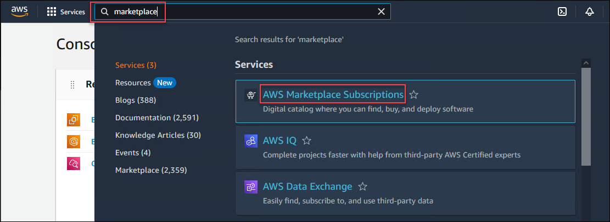

Subscribe to EC2 Instances
================================================================================

Before you can deploy EC2 virtual machine instances, you must **subscribe** to the instances that you want to use.

Type ``marketplace`` in the AWS Console search box at the top of the page.

Click on **AWS Marketplace Subscriptions** from the search results.

In the menu to the left, click on **Discover products**. If you do not see this menu, click on the |hamburger| (*hamburger*) menu icon first.

Enter ``f5 all byol`` in the **AWS Marketplace products** search box.

Click on **F5 BIG-IP VE - ALL (BYOL, 2 Boot Locations)**.

Click on **Continue to Subscribe**.

Click on **Accept Terms**.

.. note::

   If you see an error message, click on **Accept Terms** again.

   .. image:: ./images/aws-mkt-error.png
      :align: left

|

When you are subscribed, you will see the **Effective Date** change from **Pending** to the current date.

For future reference, this is the link to the same EC2 subscription: |ec2-bigip|

Subscribe to these additional EC2 instances (open each of them in new browser tabs so you can easily check the status of all 3):

- |ec2-wordpress|
- |ec2-snort|

.. image:: ./images/aws-mkt-6.png
   :align: left

|

.. image:: ./images/aws-mkt-7.png
   :align: left

.. attention::

   Ensure that all 3 subscriptions are successful (not **pending**) before proceeding to the next section.

Keep your browser window open. You will need to return to it later.

In the next section, you will use Terraform to build the AWS network infrastructure for this lab.

.. |ec2-bigip| raw:: html

      <a href="https://aws.amazon.com/marketplace/pp?sku=5n807t93duw392y7t8v7nb1zv" target="_blank"> F5 BIG-IP VE - ALL (BYOL, 2 Boot Locations) </a>

.. |ec2-wordpress| raw:: html

      <a href="https://aws.amazon.com/marketplace/pp?sku=758gbcgh7wafwchsq40cmj18j" target="_blank"> Link: WordPress with NGINX and SSL Certified by Bitnami and Automattic </a>

.. |ec2-snort| raw:: html

      <a href="https://aws.amazon.com/marketplace/pp?sku=9jk8duinsir94459457myhn4q" target="_blank"> Link: Snort pre-configured by Miri Infotech Inc. on Ubuntu </a>

