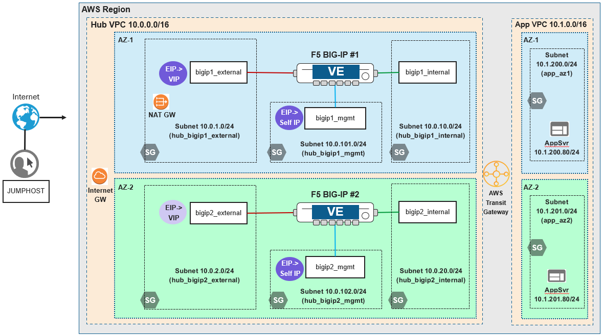

Lab Scenario
================================================================================

.. _scenario:

Two AWS VPCs are connected to an AWS Transit Gateway, which routes traffic between the VPCs. The **app** VPC contains two application server instances (each in a different availability zone). The **hub** VPC contains two BIG-IP VE instances (each in a different availability zone). Users will connect to a Virtual Server on a BIG-IP to access the application.

Target Infrastructure End-State
================================================================================

The Terraform configuration that you will use in this lab module deploys the following:

- AWS networking resources
- Application server instances
- BIG-IP VE instances

**Network Diagram**

The BIG-IP VE interfaces are configured as follows:

.. list-table:: **Interface Descriptions**
   :header-rows: 1
   :widths: auto

   * - Interface
     - Description
   * - MGMT
     - Dedicated out-of-band management interface
   * - 1.1
     - Connected to the Internet-facing subnet
   * - 1.2
     - Connected to the application-facing subnet

.. todo:: 

   more editing to come

Virtual Lab Infrastructure Details (and Credentials)
--------------------------------------------------------------------------------

The following tables provide device/service network configuration details. Login credentials are also provided for use as directed in the lab exercises.

.. list-table:: **BIG-IP VE Instances**
   :header-rows: 0
   :widths: 300 700 700

   * - 
     - BIG-IP #1 (AZ-1)
     - BIG-IP #2 (AZ-2)

   * - Management IP
     - 10.0.101.x - Associated Public IP address is provided in Terraform outputs
     - 10.0.102.x - Associated Public IP address is provided in Terraform outputs

   * - Login
     - Username: admin
  
       Password: <randomly-generated>

       The **root** account is disabled.

     - Username: admin

       Password: <randomly-generated>

       The **root** account is disabled.

   * - System DNS
     - 169.254.169.253 (AWS DNS)
     - 169.254.169.253 (AWS DNS)

   
.. list-table:: **Windows Jump Host (win2019)**
   :header-rows: 0
   :widths: 300 400

   * - Login
     - Username: user

       Password: user

.. warning::
   Simple passwords may be used in this lab environment in order to make it easier for students to access the infrastructure. The jump host in this lab environment is only accessible to you after successfully authenticating to the UDF portal.

   If deploying in your own lab, please follow recommended security practices of using strong passwords and restricting network access.
