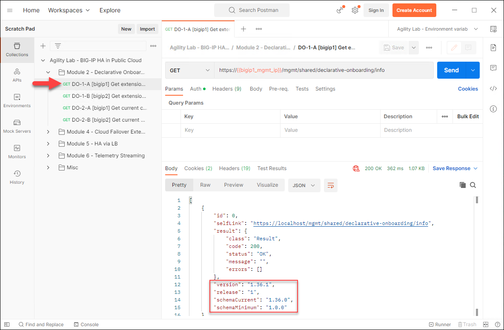

Check Status of F5 Automation Toolchain Extensions
================================================================================
You will configure and use the Postman client to query the F5 ATC extension APIs.

Retrieve the Postman Configuration Files
-------------------------------------------------------------------------------

The ``~/f5lab/postman`` folder contains two files:
- f5lab_postman_collection.json
- f5lab_postman_environment.json

The collection file contains a set of API calls for this lab.
The environment variables file was created by Terraform using current deployment information.

In the VS Code terminal, copy the these files to the jump host desktop.

	.. code-block:: bash

		cp ~/f5lab/postman/* /mnt/c/Users/user/Desktop/

|

You should now see two additional icons on the Windows desktop.

Postman Configuration
-------------------------------------------------------------------------------

Switch to the Postman window (re-launch it from the desktop shortcut if you closed it earlier).

Click on the **gear** button (left of the **Sign In** button) and select **Settings**.

Ensure that "SSL certificate verification" is turned "OFF" and then close the Settings dialog.

|

In the left-panel, click on the **Import** button. 

|

Shift-click to select both Postman JSON files and drag them to the **import** dialog.

|

The files will be listed in a table. Click on the **Import** button to continue.

|

Confirm that the **Agility Lab - BIG-IP HA in Public Cloud** collection has been imported.

|

Confirm the environment was successfully imported by selecting "**Agility Lab - Environment var...**" from the Environment drop-down menu in the upper-right-hand corner.

|

Check F5 ATC Extensions
-------------------------------------------------------------------------------

Send API calls from Postman to check the status of the F5 ATC extensions on each BIG-IP.

In the left panel, expand the collection. Navigate to **Check F5 ATC Status**  > **Step 1-A: bigip1 - DO - Get extension status**

Click on the **Send** button to make an API call to the DO endpoint on **BIG-IP #1**. You should receive a response (JSON format) containing a status of **OK** and version information.

|

.. note::

   Only the DO extension will return a **status**. The others will return only version information.

|

Select **Step 1-B** and click on the **Send** button to check the status of **BIG-IP #2**.

Select **Step 2-A** to retrieve the current DO configuration settings for **BIG-IP #1**. Review the response body JSON and note the settings. These should be the same as that defined in the **f5_onboard_3nic_custom.tmpl** template file for **BIG-IP Runtime Init**. They should also correspond to the settings that you reviewed in the BIG-IP TMUI and AWS EC2 (BIG-IP) instances.

Send the remaining 'steps' in the **Check F5 ATC STatus** folder to check the status of the AS3, CFE, and TS extensions.

This is the end of the module.
