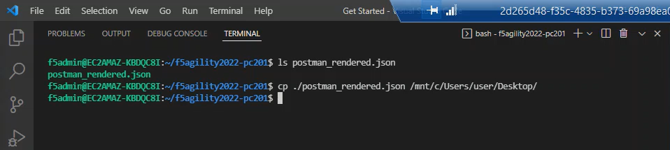
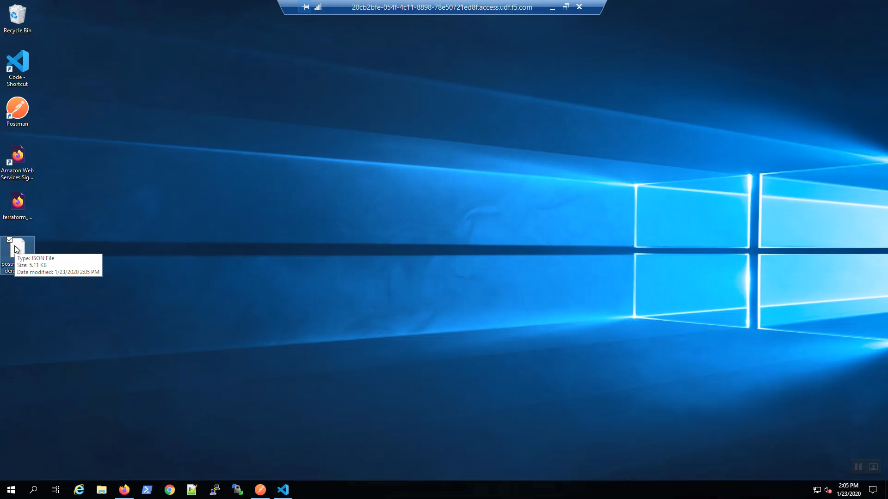
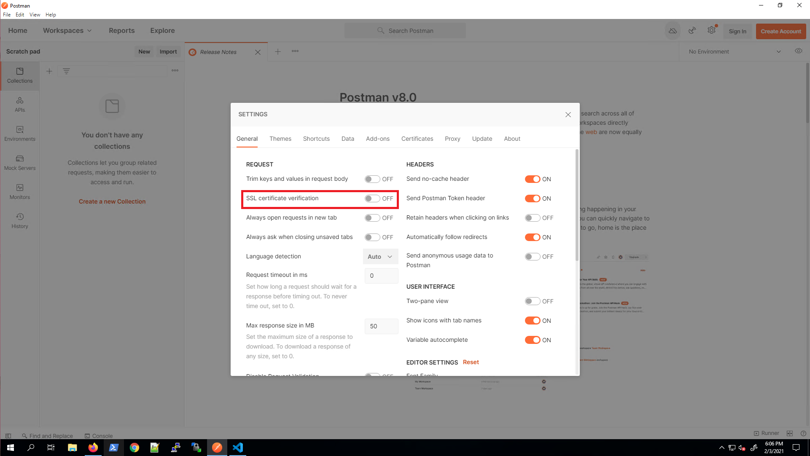
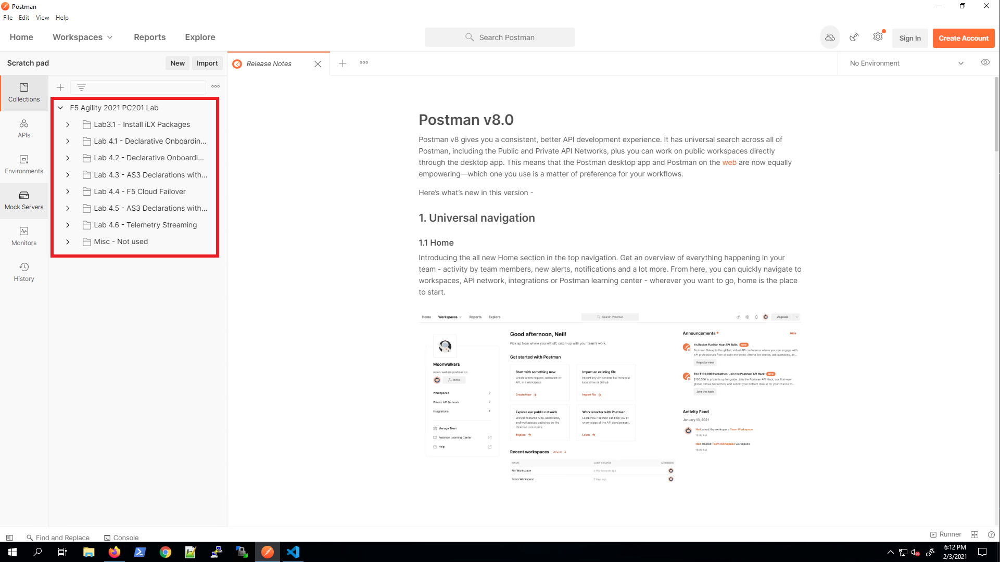
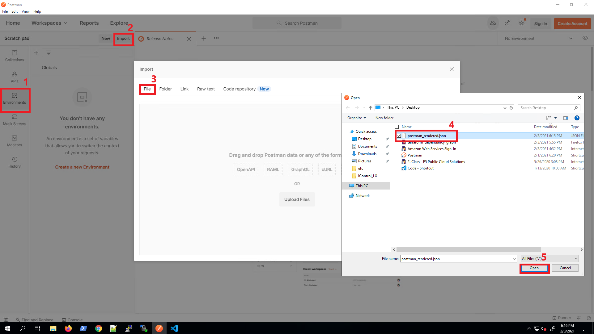
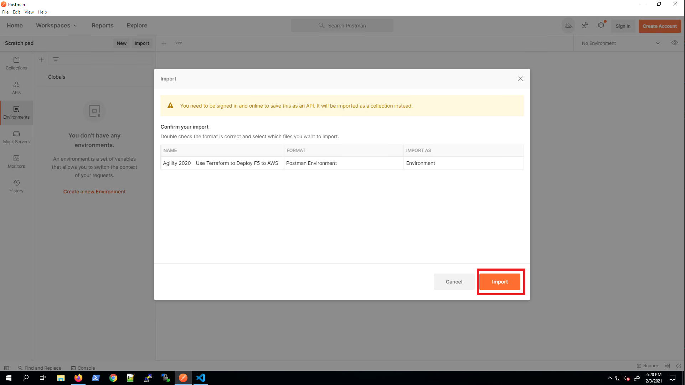
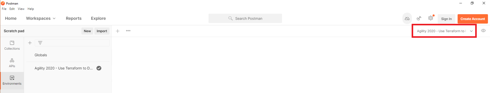

Lab Scenario
================================================================================

Two AWS VPCs are connected to an AWS Transit Gateway, which routes traffic between the VPCs. The **app** VPC contains two application server instances (each in a different availability zone). The **hub** VPC contains two BIG-IP VE instances (each in a different availability zone).

You will configure an application deployment via AS3.

.. todo:: 

   WIP

**Network Diagram**

.. image:: ./images/aws-lab-diagram.png
   :align: left

Prepare Postman
================================================================================

From the Visual Studio Code Terminal, copy the postman_rendered.json file to the desktop. This file contains the environment variables for a Postman collection.

.. code-block:: bash

   cp ./postman_rendered.json /mnt/c/Users/user/Desktop/

The postman_rendered.json file was copied to the Windows desktop.

Open Postman. Click the gear icon in the upper-right-hand corner to review Settings. Ensure that "SSL certificate verification" is turned "OFF". Close Settings.

In the left-pane tab, select "Collections" and click "Import" above. Choose "Link" as the source to import from and Import the collection using the URL below:

.. code-block:: bash

   https://raw.githubusercontent.com/tmarfil/f5agility2022-pc201/master/postman/f5agility2022-pc201-postman-collection.json
.. image:: ./images/3_postman_import_collection.png
	   :scale: 50%

Confirm the **F5 Agility 2021 PC201 Lab** Collection has been imported.

In the left-pane tab, sellect "Environments" and click "Import" above. Choose "File" as the source to import from and navigate to **This PC\\Desktop\\postman_rendered.json** and click "Open".

Click on "Import" to import the environment.

Confirm the environment was successfully imported by selecting the "**Agility 2020 - Use Terraform to...**" environment from the Environment drop-down menu in the upper-right-hand corner.

Install The F5 Extension and the F5 ACC Chariot extension
================================================================================
Open VS Code and navigate to the Extensions menu.  You may either press the Extensions icon or use the CTL + Shift + X shortcut.
Search for F5, select the extension “The F5 Extension”, then Install.

.. image:: ./images/installWithinCode_11.04.2020.gif
   :alt: Animated GUI
   :align: left
   :width: 80%

In the list of extensions related to F5, you should also see F5 ACC Chariot, click Install.

Overview of the F5 Extension
================================================================================

Enhance your abilities to write (A)utomated (T)ool(C)hain declarations with snippets, examples and declaration 
schema validation, and also assist with connecting, deploying, retrieving and updating declarations on F5 devices.

It can also help with iRules/iApps, BIG-IQ, and regular configuration/migration .

- GET/POST/DELETE of all ATC services, including FAST/AS3/DO/TS/CF
- links to quickly open related ATC documentation
- Direct access to ATC examples from git repo
- Install/UnInstall of ATC rpms
- Convert JSON <-> YAML
- Hovers to view decoded information for (certificates/base64)
- Extract TMOS applications (per virtual server)
- Write, deploy and modify iRules/iApps (with vscode-irule extension for language support)

**GUI Essentials**
On the left hand tool bar/menu, select/click on the F5 logo.  This will launch the F5 Extension.
You should see three panels on the left, one for BIG-IP Hosts, Documentation/Examples, and Config Explorer.

**Create a device and connect**

Select `Add Host` in the `F5: Hosts` view.  Then type in device details in the \<user\>@x.x.x.x format, hit `Enter` to submit

 .. image:: ./images/addDeviceConnect_11.04.2020.gif
   :alt: Animated GUI
   :align: left
   :width: 80%

Perform manual app VS config
================================================================================
Placeholder - Manual config via GUI 

Use VS Code F5 Extension to convert a configuration to AS3 format
================================================================================
Placeholder

Review AS3 declaration
================================================================================
Placeholder

Deploy AS3 configuration
================================================================================
Placeholder

Test application access
================================================================================
Placeholder

Updating F5 Automation Toolchain Extensions
================================================================================
Placeholder

